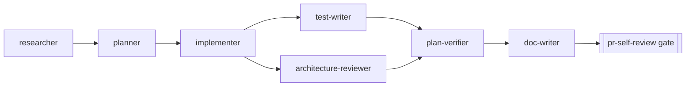

# DevDigest project subagents

Map of the agent set in `.claude/agents/`. Each file is the single source of
truth for its agent — this README only describes how the set fits together.

Intended chain: **researcher** (facts) → **planner** (plan) → **implementer**
(code) → **test-writer** ∥ **architecture-reviewer** (independent parallel
passes: one writes test files, the other reads production code — write zones
never overlap) → **plan-verifier** (verifies the full picture: code PLUS
tests) → **doc-writer** (docs) → `pr-self-review` gate. Review passes are
deliberately NOT part of implementer — each runs in a fresh context.

| Agent | Responsibility | Tools | permissionMode | Model |
| --- | --- | --- | --- | --- |
| `researcher` | Read-only investigations: repo facts + external docs, with citations | Read, Glob, Grep, Bash, WebFetch, WebSearch | default | `sonnet` (pinned) |
| `planner` | Structured, skill-aware Development Plans; never implements | Read, Glob, Grep, Bash | `plan` | inherit |
| `implementer` | Executes an approved plan (frontend + backend); verifies within implementation scope only | Read, Edit, Write, Glob, Grep, Bash, Skill | default | inherit |
| `test-writer` | Vitest tests: client RTL (colocated) + server (hermetic / `*.it.test.ts` split); test files ONLY | Read, Edit, Write, Glob, Grep, Bash, Skill | default | inherit |
| `architecture-reviewer` | Read-only onion-boundary review, `pnpm arch` delta, do-not-touch audit; findings only with `file:line` | Read, Glob, Grep, Bash | `plan` | inherit |
| `plan-verifier` | Read-only plan↔code compliance: done/partial/not-done per item + evidence; runs verification commands | Read, Glob, Grep, Bash | default | inherit |
| `doc-writer` | Docs with Mermaid diagrams; writes ONLY to `docs/**` + READMEs; every claim verified in code | Read, Edit, Write, Glob, Grep, Bash | default | inherit |

## researcher

- **In:** a concrete question (repo, external, or mixed). Vague input triggers
  interview mode instead of research.
- **Out:** structured research report (Conclusions / Evidence / Not found) or
  a `CLARIFICATION NEEDED` question list. Every claim is cited
  (`file:line` or fetched URL); gaps are stated, never guessed.

## planner

- **In:** a feature/task description; optionally a researcher report. Grounds
  itself in in-scope `INSIGHTS.md`, `specs/*.md`, per-package `CLAUDE.md`.
- **Out:** a Development Plan (`Result / Context / Scope / Constraints /
  Tasks / Skills applied / Verification / Out-of-scope · Follow-ups`). Each
  task names the exact skills implementer will apply, via the skill routing
  table shared verbatim between both agents.
- **Skills:** 10 preloaded via frontmatter (onion-architecture,
  frontend-ui-architecture, next/fastify best practices, drizzle, postgres,
  zod, react best practices, react-testing-library, mermaid-diagram). No
  `Skill` tool — preloaded content only.

## implementer

- **In:** an approved Development Plan (no plan → stops and asks). Reads the
  per-package `CLAUDE.md`/`INSIGHTS.md` of every touched package.
- **Out:** an Implementation Report (`Result / Changed / Skills applied /
  Verification / Out-of-scope · Follow-ups`); failures reported verbatim.
- **Skills:** 11 preloaded — planner's set minus mermaid, plus
  typescript-expert and `security` (secure CODING while writing auth/input/
  endpoint code — not a review pass). Review skills (`security-review`,
  `pr-self-review`, `aif-review`, `code-review`) are explicitly forbidden;
  never pushes or opens PRs.

## test-writer

- **In:** an Implementation Report / plan tasks lacking coverage, or a direct
  request to add tests. Runs in parallel with architecture-reviewer.
- **Out:** a Test Report (`Result / Added tests / Skills applied /
  Verification / Gaps & needed seams`). Needed production-code changes (test
  seams, exports) are reported as findings, never made.
- **Skills:** 5 preloaded (react-testing-library, react-best-practices,
  fastify-best-practices, zod, onion-architecture §10 for the hermetic vs
  `*.it.test.ts` decision). Embeds RTL query priority, `userEvent` over
  `fireEvent`, "fewer, longer tests", and red-green discipline.

## architecture-reviewer

- **In:** a diff after implementer touched `server/`, `reviewer-core/` or
  `client/`. Runs in parallel with test-writer (read-only, no write overlap).
- **Out:** an Architecture Review (`Verdict / Findings / pnpm arch delta /
  Not checked`). A finding without `file:line` is not a finding; reports only
  the delta introduced by the change, never pre-existing baseline debt.
- **Skills:** 9 preloaded — onion-architecture + frontend-ui-architecture as
  the boundary rules, plus next/react/fastify/drizzle/zod/postgres/typescript
  as a RULEBOOK for checking placement and patterns. Explicitly not a general
  code reviewer: no style advice, no security (separate passes).

## plan-verifier

- **In:** the approved Development Plan (no plan → stops and asks), optionally
  the Implementation and Test reports. Runs AFTER test-writer and
  architecture-reviewer, so "covered by tests" items are verified factually.
- **Out:** a Plan Verification Report (`Overall verdict / plan-item table
  (done / partial / not done + file:line) / verbatim command outputs /
  Deviations / Not verifiable`). Never substitutes verification with generic
  advice — out-of-plan work gets one line in Deviations, zero recommendations.
- **Design notes:** deliberately NO preloaded skills (its job is mechanical
  plan↔code comparison; skills would pull it toward advice) and NO
  `permissionMode: plan` (it must actually run `pnpm typecheck`/`pnpm test`,
  including testcontainers `*.it.test.ts`; without Docker those items are
  `not verified`, never `done`).

## doc-writer

- **In:** implemented + verified features (after plan-verifier passes), or a
  direct request to document existing functionality.
- **Out:** a Documentation Report (`Result / Changed docs / Diagrams / Claims
  verified (file:line) / Not documented`). Writes ONLY to `docs/**`, root
  `README.md` and package READMEs; never touches code, `specs/`, `CLAUDE.md`,
  `INSIGHTS.md` or `.claude/`. Classifies each piece via Diátaxis
  (tutorial / how-to / reference / explanation) before choosing the target.
- **Skills:** 1 preloaded (mermaid-diagram) — sequence for API flows,
  flowchart for pipelines, ER for schemas, ≤20 nodes, style matched to
  `docs/architecture.md`.

## Sources for planner/implementer rules

- [Subagents — Claude Code docs](https://code.claude.com/docs/en/sub-agents) —
  frontmatter schema, description-based delegation ("use proactively"),
  least-privilege tool allowlists, `skills:` preload semantics, and the
  canonical planner/implementer split (read-only + `permissionMode: plan` vs
  read + Edit/Write/Bash).
- [Skills — Claude Code docs](https://code.claude.com/docs/en/skills) —
  how preloaded skills interact with subagent context and the `Skill` tool.
- [Claude Code best practices](https://code.claude.com/docs/en/best-practices)
  — Explore → Plan → Implement → Commit separation; adversarial review as a
  SEPARATE fresh-context step (why implementer does no arch/security review).
- [Agent Skills best practices](https://platform.claude.com/docs/en/agents-and-tools/agent-skills/best-practices)
  — concise, third-person descriptions; on-demand context over duplication.

## Sources for test-writer / reviewer / doc-writer rules

- [Building multi-agent systems (Anthropic blog)](https://claude.com/blog/building-multi-agent-systems-when-and-how-to-use-them)
  — verification-subagent pattern, the "early victory" problem ("MUST run the
  complete test suite before marking as passed"), narrow focused toolsets.
- [Claude Code best practices — adversarial review](https://code.claude.com/docs/en/best-practices)
  — verify a diff against PLAN.md in a fresh context; "report gaps, not style
  preferences" (plan-verifier's anti-advice rule).
- [Testing Library query priority](https://testing-library.com/docs/queries/about/#priority) ·
  [guiding principles](https://testing-library.com/docs/guiding-principles/) ·
  [user-event](https://testing-library.com/docs/user-event/intro/) — selector
  rules and interaction simulation for test-writer.
- [Common mistakes with RTL](https://kentcdodds.com/blog/common-mistakes-with-react-testing-library) ·
  [Write fewer, longer tests](https://kentcdodds.com/blog/write-fewer-longer-tests)
  — test-writer's lint checklist and workflow-oriented test scoping.
- [TDD — Martin Fowler](https://martinfowler.com/bliki/TestDrivenDevelopment.html)
  — red-green discipline: a new test must fail against pre-change code.
- [Testcontainers Node: usage](https://node.testcontainers.org/quickstart/usage/) ·
  [global setup](https://node.testcontainers.org/quickstart/global-setup/) —
  container lifecycle for `*.it.test.ts`.
- [Diátaxis](https://diataxis.fr/) — doc-writer's tutorial / how-to /
  reference / explanation classification.
- [Mermaid in GitHub markdown](https://github.blog/developer-skills/github/include-diagrams-markdown-files-mermaid/) ·
  [mermaid.js.org](https://mermaid.js.org/intro/) — native rendering, doc-rot
  argument for diagrams-as-code.
