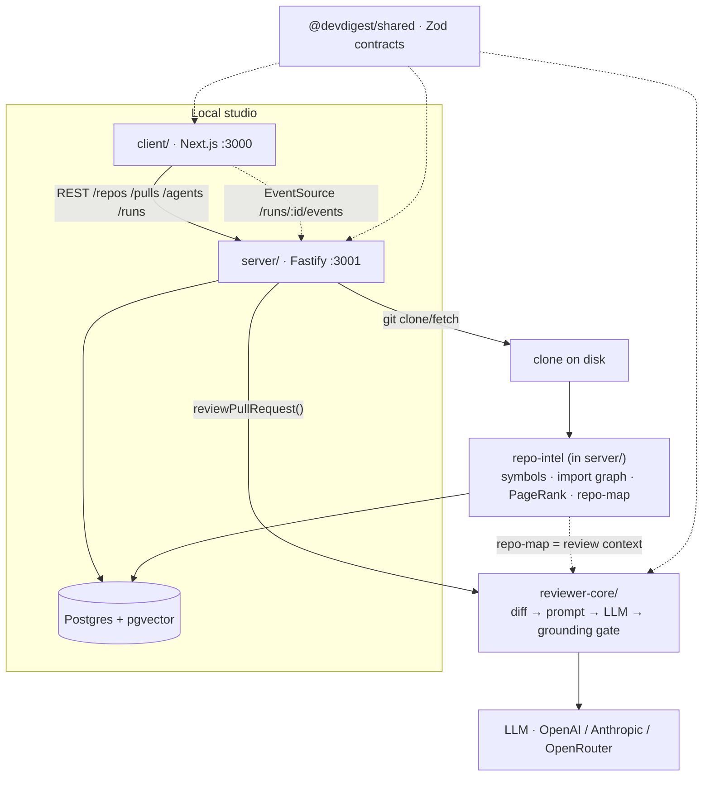
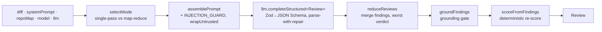

# DevDigest — architecture

Deep-dive companion to the thin map in `/CLAUDE.md`. This is the single place for
cross-package wiring, the review pipeline, and repo-intel. Package-level detail
lives in each `<package>/README.md`.

## Packages & how they connect

**Not a monorepo workspace.** Each package has its own `package.json` + lockfile.
Shared code is wired via **tsconfig path aliases**, not npm publish:
- `@devdigest/shared` → canonical at `server/src/vendor/shared`; `client/` keeps
  its own vendored copy; `reviewer-core/` reads the server copy via alias.
- `@devdigest/reviewer-core` → consumed as **TS source** (`../reviewer-core/src`);
  it emits no JS (its `build` is a typecheck).

## Review flow (end to end)

add repo → server clones + repo-intel indexes it (the **Indexed** badge) →
import PRs from GitHub → open a PR → **Review** → `reviewer-core` assembles a
prompt from the diff + repo map, calls the LLM, drops hallucinated line
references (the **grounding gate**), persists structured findings (severity +
deterministic score). All local; only outbound calls are GitHub + LLM.

### reviewer-core pipeline (`reviewer-core/src`, entry `review/run.ts`)

- **Grounding gate** (`grounding.ts`): a finding survives only if its
  `[start_line, end_line]` intersects a real hunk in the diff for that file.
  Full-file kinds (`secret_leak`, `phantom`, `hook`, `lethal_trifecta`) only
  require the file to be present.
- **Score** is recomputed from surviving findings — the model's number is ignored.
- **Purity**: no DB/GitHub/FS; the only side effect is the injected `LLMProvider`.

## Server internals (`server/src`)

- **Modules** `modules/<name>/` = `routes → service → repository`, registered
  statically in `modules/index.ts`. Set: settings, repos, pulls, polling,
  workspace, agents, reviews, repo-intel (+ `_shared` `getContext()` for tenancy).
- **DI** `platform/container.ts` — hand-rolled container; adapters are lazy
  getters resolved through `SecretsProvider`; tests inject `ContainerOverrides`.
- **Adapters** `adapters/*` wrap one external concern each behind a
  `@devdigest/shared` interface (git, github, llm, astgrep, codeindex, depgraph,
  embedder, tokenizer, auth, secrets).
- **Review execution** `modules/reviews/run-executor.ts` — fire-and-forget:
  runId minted synchronously (client subscribes over SSE), diff loaded once,
  optional repo-intel enrichment, then `reviewPullRequest()`, then one
  `run_traces` document persisted. Per-agent failures are isolated.
- **pgvector** used in exactly two tables: `code_chunks.embedding` (RAG) and
  `memory.embedding` — both 1536-dim, matching `OpenAIEmbedder`.

### repo-intel (`server/src/modules/repo-intel`)

Indexes a clone once (incremental on fetch, keyed by content hash): walk →
ast-grep symbols/refs → dependency-cruiser import graph → PageRank + git hotness
rank → cached repo-map. Consumers read through the `RepoIntel` facade only;
unindexed repos **degrade** (return `[]` / `{degraded}`) instead of throwing.

## Course scaffolding

Markers `L0x / A1–A6 / T1–T3 / F1–F2` mark future lesson steps: some contracts
and i18n namespaces exist ahead of their screens. Treat as roadmap, not legacy.
