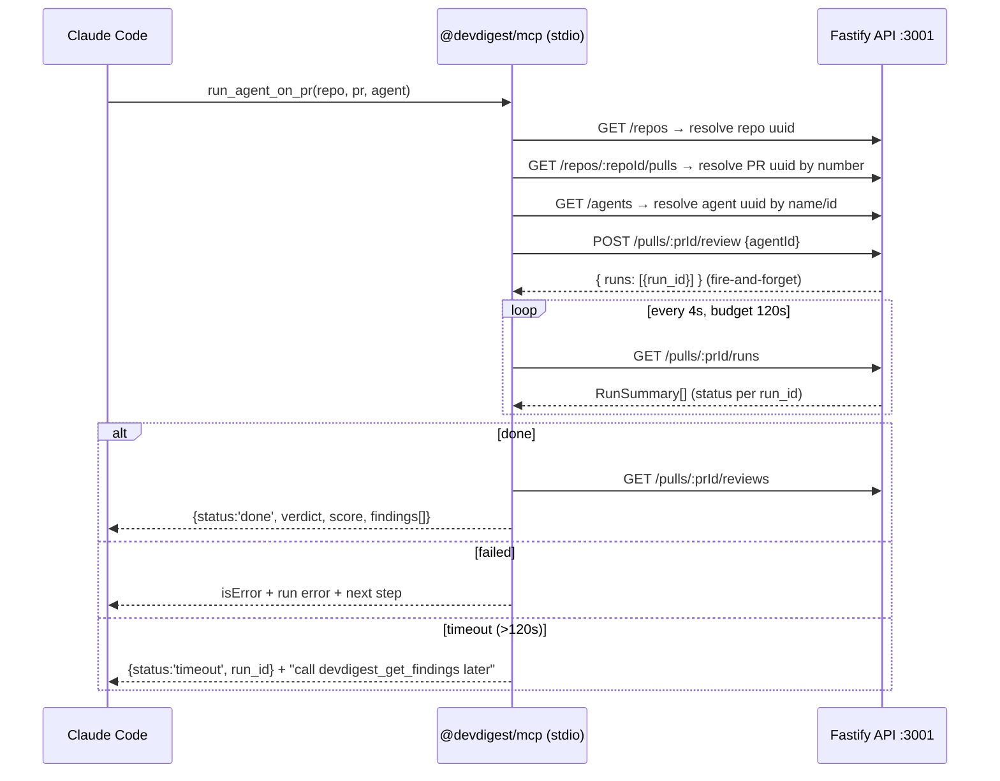

# Development Plan: L04 — Local MCP server for Claude Code (`@devdigest/mcp`)

> Status: **approved** · Scope: local stdio server only · Branch: `feat/L04-mcp`

## Agreed decisions

| Decision | Choice |
|---|---|
| Transport | **stdio** — Claude Code spawns the server locally via project-scoped `.mcp.json` (committed) |
| SDK | **`@modelcontextprotocol/sdk` v1.x** (~1.30), `McpServer` + `registerTool()` (not deprecated `.tool()`), Zod ≥3.25 |
| Architecture | **Thin HTTP proxy**: new standalone package `mcp/` (`@devdigest/mcp`) calling the existing Fastify API at `http://localhost:3001` via fetch. No DB access, no DI duplication |
| Tool names | Prefixed: `devdigest_list_agents`, `devdigest_run_agent_on_pr`, `devdigest_get_findings`, `devdigest_get_conventions`, `devdigest_get_blast_radius` |
| `run_agent_on_pr` | **Synchronous** ("result, not operation"): create run → poll internally → return findings; timeout fallback (**120 s**) returns `run_id` + "call devdigest_get_findings later" |
| `get_blast_radius` | **Honest stub**: registered now, description states "Not yet implemented", returns non-error `{ status: 'not_implemented', message }` |
| `get_conventions` default `status` | `'all'` (per-item status in the response) |

## Course design principles (every tool)

1. **Result, not operation** — tools do the complete job in one call.
2. **Flat arguments** — `repo`, `pr`, `agent` as primitives, never nested objects; human-friendly values (repo full name, PR **number**, agent name) resolved to row **uuids** internally.
3. **Concise structured response** — `{verdict, findings[]}` with only needed fields (Claude Code caps MCP output at 25k tokens, warns at 10k); `response_format: concise|detailed` where useful.
4. **Errors lead forward** — every error is `isError: true` with actionable next-step text, via one shared mapper (never thrown exceptions / raw 404s). `ECONNREFUSED` → "DevDigest API is not running — start it with ./scripts/dev.sh".

Token-efficiency practices baked in: minimal server `instructions` (1–2 sentences — loaded into every Claude Code session), lean "Call this when…" descriptions (deferred by Claude Code's ToolSearch), `readOnlyHint: true` + `openWorldHint: false` annotations on read tools, pagination/`has_more`/`truncated` on lists.

## Context (investigated ground truth)

- **Identifier chain**: client routes key by PR **number**, all APIs by row **uuid** (`client/CLAUDE.md`). Resolution endpoints: `GET /repos` → `Repo{id, full_name, owner, name}` (`server/src/vendor/shared/contracts/platform.ts:140`); `GET /repos/:repoId/pulls` → `PrMeta[]{id?, number, title, status, score…}` (`server/src/modules/pulls/routes.ts:26`); `GET /agents` → `AgentListItem[]` (`server/src/modules/agents/helpers.ts:37`).
- **Review run is fire-and-forget**: `POST /pulls/:id/review {agentId}|{all:true}` returns `{pr_id, runs:[{run_id, agent_id, agent_name}], reviews: []}` immediately (`server/src/modules/reviews/service.ts:118-153`, `ReviewRunResponse` in `contracts/review-api.ts:52`). Rate limit: 10/min (`reviews/routes.ts:29`).
- **Status polling**: web client polls `GET /pulls/:id/runs` → `RunSummary[]` (`status: running|done|failed|cancelled`, plus `error`, `score`, `blockers`, `findings_count` — `contracts/trace.ts:97-118`) every 4 s while anything is `running` (`client/src/lib/hooks/reviews.ts:40-48`). The MCP run tool does the same loop.
- **Findings**: `GET /pulls/:id/reviews` → `ReviewRecord[]` with `findings: FindingRecord[]` incl. `run_id`, `verdict`, `score`, `agent_name` (`contracts/review-api.ts:23-38`).
- **Conventions**: `GET /repos/:id/conventions` → `ConventionListResponse{conventions[], stats?}` (`contracts/conventions.ts:53`).
- **Auth**: none needed locally — `getContext` resolves via `LocalNoAuthProvider` to the default workspace (`server/src/modules/_shared/context.ts`).
- **Package template**: `e2e/` — own `package.json` + lockfile, `tsx` runner, strict `noEmit` tsconfig. Path-alias pattern for consuming server's vendored contracts: `reviewer-core/tsconfig.json:21-25` (`@devdigest/shared` → `../server/src/vendor/shared/index.ts`).
- **Shared contracts decision**: tsconfig path alias to server's vendored copy for **type-only imports** (`import type { ReviewRecord, RunSummary, Repo, PrMeta, AgentListItem, Convention }`). Type-only imports are erased at runtime, so the dual-zod-instance hazard (root `INSIGHTS.md`, ZodError-by-shape gotcha) never materializes; the MCP package's own zod defines all tool input/output schemas as new shapes. No vendored copy created, no existing contract touched.
- No root `.mcp.json` exists yet. `specs/README.md` reserves specs for cross-package work; this lesson adds one package + a config file, so no `specs/06-*.md` is planned (see Follow-ups).

### `devdigest_run_agent_on_pr` flow



## Canonical tool descriptions (use VERBATIM during implementation)

The implementer copies these texts word-for-word into `registerTool()` calls. Do not paraphrase, extend, or add examples/protocols to them.

### Server `instructions` (loaded into every Claude Code session — keep minimal)

```
DevDigest is a local AI pull-request review studio. Use its tools to list
review agents, run a review on a PR, and read findings and repo conventions.
```

### `devdigest_list_agents`

```
title: List review agents
description:
  List the review agents configured in DevDigest, with their ids, names,
  models and enabled state. Call this when you need a valid agent id or
  name — e.g. before devdigest_run_agent_on_pr — or when the user asks
  which reviewers are available.
args: —
annotations: { readOnlyHint: true, openWorldHint: false }
```

### `devdigest_run_agent_on_pr`

```
title: Run a review agent on a pull request
description:
  Run one DevDigest review agent on a pull request and wait for the result
  (up to ~2 minutes). Call this when asked to review a PR. Returns the
  verdict, score, summary and top findings. If the review is still running
  after the wait budget, returns status "timeout" with a run id — fetch the
  results later with devdigest_get_findings.
args:
  repo:  Repository full name, e.g. "acme/payments-api" (uuid also accepted).
  pr:    Pull request number as shown on GitHub, e.g. 482 — not an internal uuid.
  agent: Agent name (case-insensitive) or uuid; valid values come from
         devdigest_list_agents.
annotations: { readOnlyHint: false, destructiveHint: false,
               idempotentHint: false, openWorldHint: false }
```

### `devdigest_get_findings`

```
title: Get review findings for a pull request
description:
  Get the verdict, score and findings from already-completed review runs on
  a pull request. Call this when the user asks what reviewers found, or to
  fetch results after devdigest_run_agent_on_pr returned "timeout". Does not
  start a review — use devdigest_run_agent_on_pr for that.
args:
  repo:             Repository full name, e.g. "acme/payments-api".
  pr:               Pull request number, e.g. 482.
  agent?:           Filter to one agent's reviews (name or uuid).
  severity?:        CRITICAL | WARNING | SUGGESTION.
  response_format?: "concise" (default: severity, title, file, line per
                    finding) or "detailed" (adds rationale, suggestion,
                    confidence).
  limit?:           Max findings to return (default 20).
annotations: { readOnlyHint: true, openWorldHint: false }
```

### `devdigest_get_conventions`

```
title: Get repository coding conventions
description:
  Get the coding conventions DevDigest extracted for a repository (category,
  rule, status, confidence). Call this when you need the repo's conventions —
  e.g. to check code against them or summarize them for the user.
args:
  repo:    Repository full name, e.g. "acme/payments-api".
  status?: pending | accepted | rejected | all (default "all").
  limit?:  Max conventions to return (default 50).
annotations: { readOnlyHint: true, openWorldHint: false }
```

### `devdigest_get_blast_radius` (stub)

```
title: Get blast radius of a pull request (not implemented yet)
description:
  Not yet implemented; returns a stub response. Will map which files and
  symbols a PR's changes impact. For per-file review findings today, use
  devdigest_get_findings.
args:
  repo: Repository full name.
  pr:   Pull request number.
annotations: { readOnlyHint: true, openWorldHint: false }
```

## Scope

- **New**: `mcp/` package at repo root — `mcp/package.json`, `mcp/tsconfig.json`, `mcp/vitest.config.ts`, `mcp/README.md`, `mcp/src/{index.ts,config.ts,api.ts,errors.ts,resolve.ts,mappers.ts,poll.ts}`, `mcp/src/tools/{list-agents.ts,run-agent-on-pr.ts,get-findings.ts,get-conventions.ts,get-blast-radius.ts}`, `mcp/test/*.test.ts`.
- **New**: `.mcp.json` at repo root (project-scoped, committed).
- **Modified**: root `CLAUDE.md` — one additive line each in Stack / Where-things-are.
- **Untouched**: `server/`, `client/`, `reviewer-core/`, `e2e/` source; all shared contracts; migrations.

## Constraints

- `@devdigest/shared` contracts: consumed via **type-only** path alias to `server/src/vendor/shared`; never edited, no runtime import of vendored files.
- reviewer-core purity, grounding gate, applied migrations, `server/clones/` — not touched.
- Fire-and-forget review semantics stay server-side as-is; the MCP tool adds waiting on top — never a server change.
- **stdio framing**: no `console.log`/stdout writes anywhere in `mcp/src`; diagnostics go to `console.error` (stderr) only.
- Onion mapping inside `mcp/`: `tools/*` = presentation, `api.ts` = infrastructure (only file doing `fetch`), `mappers.ts`/`resolve.ts` = pure logic, `index.ts` = composition root injecting the API client into tools (tests inject a fake).

## Tasks

### 1. Scaffold the `mcp/` package
- **Files**: `mcp/package.json`, `mcp/tsconfig.json`, `mcp/vitest.config.ts`, `mcp/README.md`, `mcp/.gitignore`.
- Mirror `e2e/package.json` (private, `"type": "module"`; scripts: `dev` = `tsx src/index.ts`, `typecheck` = `tsc --noEmit -p tsconfig.json`, `test` = `vitest run`). Deps: `@modelcontextprotocol/sdk@^1.30`, `zod@^3.25`; devDeps: `tsx`, `typescript@^5.7`, `@types/node@^22`, `vitest`. tsconfig mirrors `e2e/tsconfig.json` (ES2022, Bundler resolution, strict, noEmit) plus `"paths": { "@devdigest/shared": ["../server/src/vendor/shared/index.ts"], "@devdigest/shared/*": ["../server/src/vendor/shared/*"] }` and `"verbatimModuleSyntax": true` to mechanically force `import type` for contracts. README: 1-page package map. Install with global pnpm (the pnpm-v11 store issue in root `INSIGHTS.md:13` applies only to `server/`).
- **Skills**: typescript-expert, onion-architecture.
- **Verify**: `cd mcp && pnpm typecheck` on placeholder `src/index.ts`.

### 2. Config + HTTP client + shared error mapper (infrastructure)
- **Files**: `mcp/src/config.ts`, `mcp/src/api.ts`, `mcp/src/errors.ts`, `mcp/test/errors.test.ts`.
- `config.ts`: `API_BASE = process.env.DEVDIGEST_API_BASE ?? 'http://localhost:3001'`; `POLL_INTERVAL_MS = 4000` (matches `client/src/lib/hooks/reviews.ts:46`), `RUN_TIMEOUT_MS = 120_000`, `FETCH_TIMEOUT_MS = 15_000`.
- `api.ts`: typed `apiFetch<T>(path, init?)` modeled on `client/src/lib/api.ts` — JSON headers only when a body is sent, normalize failures into a local `ApiError { status, code, message }` (parse Fastify `{error:{code,message}}`; `status: 0` for network errors), `AbortSignal.timeout(FETCH_TIMEOUT_MS)`. Export a `DevDigestApi` object (`get`/`post`) so tools receive it via injection.
- `errors.ts`: `toToolError(err, ctx): CallToolResult` — the single mapper producing `isError: true` + actionable text: `ECONNREFUSED`/`status 0` → "DevDigest API is not running — start it with ./scripts/dev.sh"; 404 → context-specific next step supplied by caller; 400 → echo API message + valid-input hint; timeout → retry hint; 429 → "wait a minute and retry" (review route is rate-limited 10/min). Plus `notFoundHint()` helpers for resolvers.
- **Skills**: security (encode all URL params), typescript-expert.
- **Verify**: hermetic vitest for `errors.ts` — each status/errno maps to exact forward-leading text; never throws.

### 3. Identifier resolvers (repo / PR / agent → uuid)
- **Files**: `mcp/src/resolve.ts`, `mcp/test/resolve.test.ts`.
- Pure functions taking the injected `DevDigestApi`:
  - `resolveRepo(api, repo)`: `GET /repos`; match uuid exact → `full_name` case-insensitive → unique `name` suffix. Ambiguous/missing → error listing known `full_name`s.
  - `resolvePull(api, repoId, pr)`: `GET /repos/:repoId/pulls`, match `number`; missing → "PR #N not found in <repo> — open PRs: #a, #b …".
  - `resolveAgent(api, agent)`: `GET /agents`; uuid exact → name case-insensitive; missing → list valid agent names + "call devdigest_list_agents".
- **Skills**: typescript-expert; onion-architecture (resolvers depend on the api interface, not fetch).
- **Verify**: hermetic tests with fake `DevDigestApi` + fixtures; assert match rules and exact not-found guidance.

### 4. Concise response mappers + output schemas (pure domain)
- **Files**: `mcp/src/mappers.ts`, `mcp/test/mappers.test.ts`.
- Own-zod output schemas + pure mapping functions (contract types arrive as `import type` only):
  - `AgentsOutput`: `{ agents: [{ id, name, description, provider, model, enabled, skill_count }], total }`.
  - `FindingsOutput`: `{ repo, pr_number, running_runs, reviews: [{ review_id, agent_name, verdict, score, findings_count, created_at }], findings: FindingOut[], total_findings, has_more }`; concise `FindingOut = { severity, category, title, file, start_line, agent_name }`, detailed adds `{ end_line, rationale, suggestion, confidence, accepted, dismissed, review_id }`. `mapFindings(reviews, runs, { agentName?, severity?, format, limit })` — sorts CRITICAL→WARNING→SUGGESTION, slices to `limit` (default 20), sets `has_more`.
  - `RunOutput` (discriminated on `status`): `'done'` → `{ status, run_id, agent_name, verdict, score, summary, blockers, findings_count, findings: FindingOut[] (concise, ≤20), truncated }`; `'timeout'` → `{ status, run_id, repo, pr_number, agent_name, message }`.
  - `ConventionsOutput`: `{ repo, conventions: [{ id, category, rule, status, confidence, evidence_path }], total, has_more, stats: { sampled_file_count, dropped_count, last_scan_at } | null }`; `status` filter default **`'all'`** + `limit` (default 50).
  - `BlastRadiusOutput`: `{ status: z.literal('not_implemented'), message }`.
- **Skills**: zod, typescript-expert (discriminated unions).
- **Verify**: hermetic tests with fixture `ReviewRecord[]`/`RunSummary[]`/`ConventionListResponse`; assert filtering, ordering, `limit`/`has_more`/`truncated`, concise-vs-detailed field sets.

### 5. Server entry: `McpServer`, stdio transport, blast-radius stub
- **Files**: `mcp/src/index.ts`, `mcp/src/tools/get-blast-radius.ts`.
- `index.ts` = composition root: `new McpServer({ name: 'devdigest', version: '0.1.0' }, { instructions })` with the `instructions` text **verbatim from "Canonical tool descriptions" above**; construct real `DevDigestApi`; call each tool module's `register(server, api)`; connect `StdioServerTransport`; `console.error` on startup/fatal only. Every tool module: `server.registerTool(name, { title, description, inputSchema, outputSchema, annotations }, handler)` returning `{ structuredContent, content: [{ type: 'text', text: JSON.stringify(structuredContent) }] }`.
- `get-blast-radius.ts`: inputs `{ repo: z.string(), pr: z.number().int() }`; title/description/annotations **verbatim from "Canonical tool descriptions" below**; handler returns non-error `structuredContent: { status: 'not_implemented', message: 'Blast radius analysis is not implemented yet. Use devdigest_get_findings for per-file review findings.' }` (non-error so Claude doesn't treat it as retryable failure).
- **Skills**: onion-architecture (composition root), zod, security (inputSchema = trust boundary).
- **Verify**: `pnpm typecheck`; manual smoke: `cd mcp && pnpm dev` → starts, banner on stderr, stdout clean.

### 6. Read tools: `list_agents`, `get_conventions`, `get_findings`
- **Files**: `mcp/src/tools/list-agents.ts`, `mcp/src/tools/get-conventions.ts`, `mcp/src/tools/get-findings.ts`.
- All: annotations `{ readOnlyHint: true, openWorldHint: false }`, titles/descriptions/param descriptions **verbatim from "Canonical tool descriptions" below**, failures via `toToolError`:
  - `devdigest_list_agents` — no args. `GET /agents` → `mapAgents`.
  - `devdigest_get_conventions` — flat args `{ repo, status? ('pending'|'accepted'|'rejected'|'all', default 'all'), limit? }`. `resolveRepo` → `GET /repos/:id/conventions` → `mapConventions`. Empty + `stats == null` → non-error result: "No conventions extracted yet for <repo> — extract them in the DevDigest UI at /conventions."
  - `devdigest_get_findings` — flat args `{ repo, pr, agent?, severity? ('CRITICAL'|'WARNING'|'SUGGESTION'), response_format? ('concise'|'detailed'), limit? }`. Chain: `resolveRepo` → `resolvePull` → parallel `GET /pulls/:prId/reviews` + `GET /pulls/:prId/runs` → `mapFindings` (`running_runs` tells the model a review is still in flight). No reviews → non-error empty result: "no reviews yet — call devdigest_run_agent_on_pr to run one".
- **Skills**: zod (flat primitives, enums, defaults), security (encode path params).
- **Verify**: covered by Task 8 integration test; mapper/resolver logic unit-tested in Tasks 3–4.

### 7. Write tool: `devdigest_run_agent_on_pr` (synchronous, poll-until-done)
- **Files**: `mcp/src/tools/run-agent-on-pr.ts`, `mcp/src/poll.ts`, `mcp/test/poll.test.ts`.
- `poll.ts`: `waitForRun(api, prId, runId, { intervalMs, timeoutMs, now?, sleep? })` — injectable clock/sleep for hermetic tests; polls `GET /pulls/:prId/runs`, returns matching `RunSummary` once `status !== 'running'`, or `{ timedOut: true }` after the 120 s budget.
- Tool: flat args `{ repo, pr, agent }`. Chain: resolve repo → PR → agent; `POST /pulls/:prId/review { agentId }`; `waitForRun`; then:
  - `done` → `GET /pulls/:prId/reviews`, pick `ReviewRecord` by `run_id`, return `RunOutput{status:'done', …}` — verdict/score/summary + concise findings.
  - `failed`/`cancelled` → `isError: true`: "Run <id> failed: <RunSummary.error>. Fix the cause (e.g. missing OPENROUTER key in Settings) and retry, or run a different agent (devdigest_list_agents)."
  - timeout → non-error `RunOutput{status:'timeout', run_id, repo, pr_number, message: "The review is still running after 2 minutes. Call devdigest_get_findings with repo '<repo>' and pr <n> later to fetch the results."}` (the 120 s budget matches Claude Code's 2-min auto-background threshold, so the call typically completes in the foreground).
- Description and annotations: **verbatim from "Canonical tool descriptions" below.**
- **Skills**: zod, typescript-expert, security (single write path builds bodies only from resolved uuids), onion-architecture (injected deps — no real timers in tests).
- **Verify**: hermetic `poll.test.ts` with fake api + fake sleep: done-on-Nth-poll, failed, timeout paths.

### 8. Testing: in-memory MCP integration test
- **Files**: `mcp/test/server.test.ts` (+ extract `mcp/src/server.ts` so `index.ts` stays a 5-line stdio bootstrap and `buildServer(api: DevDigestApi)` is importable).
- Use SDK's `InMemoryTransport.createLinkedPair()` + `Client` against `buildServer(fakeApi)`; assert: all 5 tools listed with prefixed names + annotations; `devdigest_list_agents` returns conforming `structuredContent` **and** mirrored JSON text block; `devdigest_get_findings` with unknown repo → `isError: true` with forward-leading message; `devdigest_get_blast_radius` → `status: 'not_implemented'`; API-down fake (`ECONNREFUSED`) → "start it with ./scripts/dev.sh" text. Hermetic per `server/CLAUDE.md` naming convention (plain `*.test.ts`).
- **Skills**: onion-architecture §10 (tests mirror the rings), typescript-expert.
- **Verify**: `cd mcp && pnpm test` — errors, resolve, mappers, poll, server suites green.

### 9. Register with Claude Code: `.mcp.json` + project map
- **Files**: `.mcp.json` (new, repo root), root `CLAUDE.md` (two additive lines), `mcp/README.md` (finish).
- `.mcp.json` (project scope, committed):
  ```json
  {
    "mcpServers": {
      "devdigest": {
        "command": "mcp/node_modules/.bin/tsx",
        "args": ["mcp/src/index.ts"],
        "env": { "DEVDIGEST_API_BASE": "http://localhost:3001" }
      }
    }
  }
  ```
  (tsx is the repo-standard runner; requires one-time `pnpm install` in `mcp/`, documented in README.)
- Root `CLAUDE.md`: add `- mcp \`@devdigest/mcp\` — local stdio MCP server for Claude Code (5 tools, thin HTTP proxy to :3001)` to Stack, and Where-things-are pointer `MCP tools → mcp/src/tools/`. Insert-only.
- **Verify**: `node -e "JSON.parse(require('fs').readFileSync('.mcp.json'))"`; `claude mcp list` from repo root shows `devdigest`.

### 10. Final manual verification from Claude Code
- `./scripts/dev.sh` (seed provides repo `acme/payments-api`, PR #482 per `e2e/CLAUDE.md`); launch Claude Code in the repo, approve project `.mcp.json`; exercise each tool:
  - `devdigest_list_agents` → agents from seed;
  - `devdigest_get_conventions` repo `acme/payments-api` → extracted set or empty-forward message;
  - `devdigest_get_findings` repo + pr `482` → seeded review (score 61 per `server/INSIGHTS.md:16`);
  - `devdigest_run_agent_on_pr` with a seeded agent name (needs configured LLM key — otherwise verify the `failed` path returns the actionable key message);
  - `devdigest_get_blast_radius` → `not_implemented`.
  - API-down check: stop the API, call any tool, expect the `./scripts/dev.sh` guidance.
  - Confirm no stdout pollution (tools keep responding — framing intact).

## Verification (execution order)

1. `cd mcp && pnpm install` (Task 1)
2. `cd mcp && pnpm typecheck` (after Tasks 1–2, again after 5/7)
3. `cd mcp && pnpm test` (Tasks 3, 4, 7, 8)
4. `./scripts/dev.sh`
5. `node -e "JSON.parse(require('fs').readFileSync('.mcp.json'))" && claude mcp list` (Task 9)
6. Manual tool walk-through per Task 10 (incl. API-down path)
7. Regression safety: `cd server && pnpm typecheck && pnpm test` — untouched-green (no server file modified)

## Skills applied (for the implementer)

- **onion-architecture** — Tasks 1, 2, 3, 5, 7, 8: mcp mirrors the rings in miniature; contracts only through the `@devdigest/shared` seam, type-only; hermetic tests via injected fakes.
- **zod** — Tasks 4, 5, 6, 7: schemas as trust boundary for tool args, enums + defaults for flat params, own zod instance (avoids vendored dual-zod gotcha, root `INSIGHTS.md`).
- **fastify-best-practices** — Tasks 6, 7 as reference map of the consumed API only; no server edits.
- **typescript-expert** — Tasks 1, 3, 4, 7: path aliases + `verbatimModuleSyntax`, discriminated unions.
- **security** — Tasks 2, 5, 6, 7: tool args are untrusted; encode path params; write path builds bodies only from resolved uuids.

## Out-of-scope / Follow-ups

- **Out of scope**: HTTP/SSE MCP transport, auth, remote deployment, implementing blast radius, any server module changes, dependency-cruiser coverage of `mcp/`.
- **Risk — run without LLM key**: fresh local setup fails fast; failed-path message points at Settings. Confirm exact error string during manual verification.
- **Risk — `.mcp.json` before `pnpm install` in `mcp/`**: tsx binary missing → Claude Code spawn failure. Mitigated by README one-liner; `npx -y tsx` alternative rejected (non-deterministic).
- **Follow-up**: `specs/06-mcp-server.md` if a later lesson builds on this surface; an e2e-style scripted `claude mcp` smoke once L06 automation lands.
- **Follow-up**: when blast radius lands server-side, only `get-blast-radius.ts` (description, outputSchema, handler) changes — the stub's flat args (`repo`, `pr`) stay stable.
