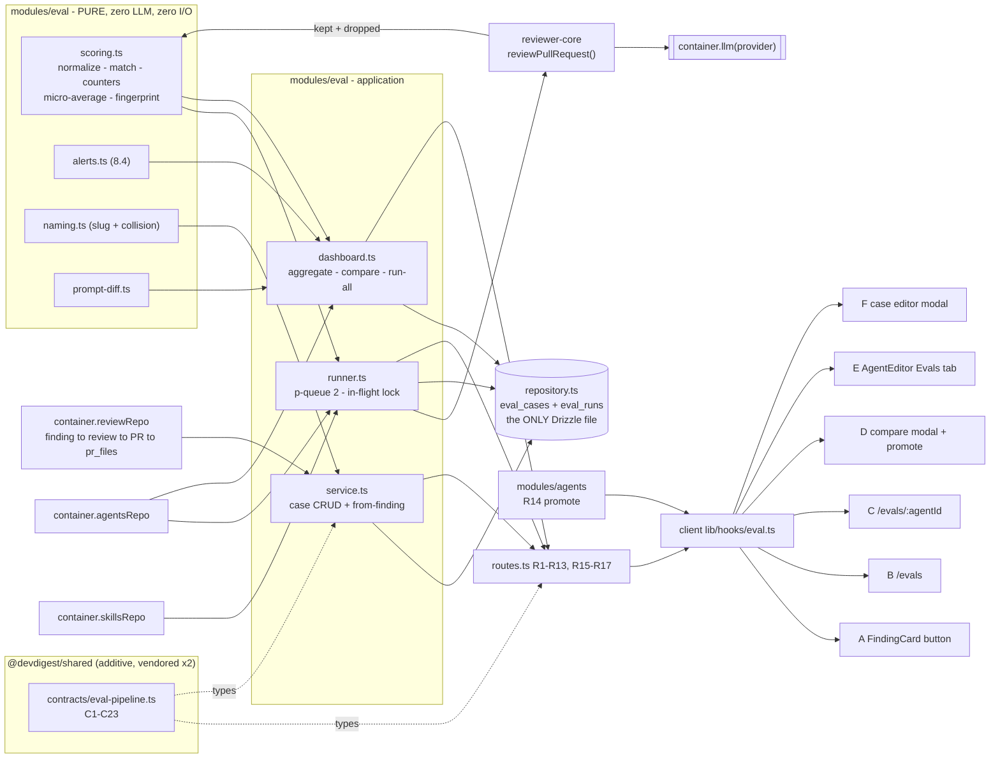
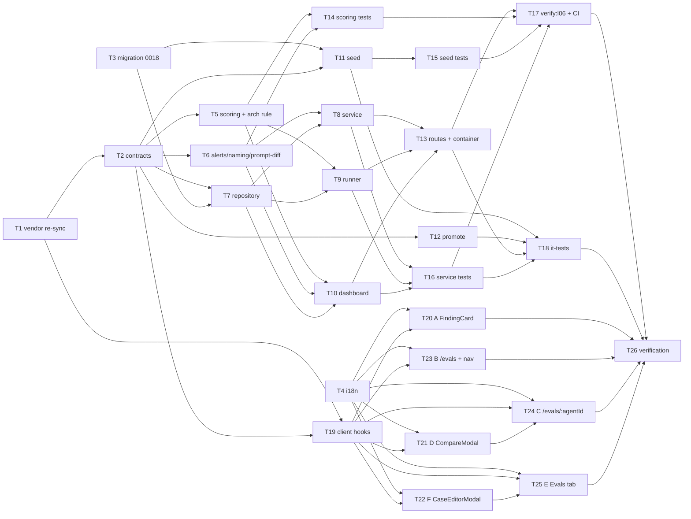

# Implementation Plan: L06 — Eval Pipeline (regression harness for reviewer agents)

> Source spec: `specs/06-eval-pipeline.md` (Spec ID `SPEC-2026-09-02-eval-pipeline`, Status **draft**,
> 50 EARS criteria AC-1…AC-50, decisions **D1–D4 locked by the requester**).
> This plan does not restate, extend or amend the spec — it maps its criteria onto files, phases and
> owned paths. Where the spec is ambiguous or collides with the codebase, the issue is raised in
> **§Concerns** with a stated assumption; nothing is silently redefined.
> Branch context at planning time: `feat/L06-evals`.

## Overview

An **in-app regression harness for reviewer agents**. A real accept/dismiss decision on a finding
becomes an eval case (`must_find` / `must_not_flag`); a batch run replays every case of an agent
through the **same** `reviewPullRequest` engine (real LLM, real grounding gate); scoring is **pure
code with zero model calls** and yields recall / precision / citation accuracy. Two batches of the
same agent are comparable, their system-prompt difference is shown as a diff, and a past version can
be promoted. New server slice `modules/eval/`, one additive migration, one new contract file, six
client surfaces (A–F), a seeded set of ≥8 cases, and a hermetic `pnpm verify:l06` gate.

## Execution mode

**multi-agent (parallel)** — *assumed default; the launching request asked for non-overlapping owned
paths and a parallelism DAG, which is the multi-agent shape.* The work is large (26 tasks, two
packages, a contract, a migration, five pure modules, six UI screens) and splits into a
contract/storage foundation, a pure-domain lane, a server-application lane, a server-test lane and a
client lane. **Owned paths below are strictly non-overlapping for any pair of tasks that can run
concurrently.**

*If the user prefers **single-agent**:* keep the task bodies and run them strictly in id order
T1 → T26. Owned-path non-overlap then stops being a correctness constraint, and T14/T15 may be
folded into T5/T11, and T21/T22 into T24/T25.

## Requirements (verified)

Restated from `specs/06-eval-pipeline.md`. The spec's own **AC-N ids are normative**; the R-ids below
group them for traceability. Full AC → task matrix at the end of this plan.

- **R1 — One-click case creation from a judged finding.** Accepted → `must_find` with
  file/lines/title/severity/category; dismissed → `must_not_flag` with file/lines only; `input_diff`
  is the whole stored `pr_files.patch` of that one file, rebuilt with intact `@@` headers; owner is
  the review's `agent_id`; unjudged → 409 + disabled button; re-click is idempotent (unique index).
  _(AC-1 – AC-10, §7)_ → T3, T6, T8, T19, T20
- **R2 — Case CRUD, workspace-scoped, 404 never 403.** Guarded delete: 409 `case_has_runs` with the
  affected run count unless `?force=true`. _(AC-11, AC-12, §6 R3–R7)_ → T7, T8, T13, T18
- **R3 — Case editor validation.** Warn on every `must_find` expectation whose range misses every
  hunk of its own diff; invalid `EvalExpectedOutput` JSON → badge + Save disabled.
  _(AC-13, AC-14, §10 F)_ → T22
- **R4 — Batch execution.** 202 + `batch_id` + snapshotted `agent_version` + `cases_total`, with
  `cases_total` pending rows inserted **before** the response; fire-and-forget on a `p-queue` at
  concurrency 2; cap 50 cases; one in-flight batch per agent (409); polled progress.
  _(AC-15, AC-18, AC-19, AC-20, §5.3)_ → T9, T13, T16
- **R5 — Runner fidelity contract.** Exactly one engine invocation per case with the agent's **live**
  `system_prompt` / `model` / `strategy` and the case's **pinned** diff and meta; **never** repo-intel,
  project-context specs, or **`intent`**; untrusted text travels as `diff`/`prDescription`, never
  concatenated into `systemPrompt`. _(AC-16, AC-17, §4.5, §5.1, §5.2, §16)_ → T9, T16
- **R6 — Pure scoring, zero LLM.** Path normalization (case-sensitive), closed inclusive line
  intervals, match = file + range intersection only, per-case pass per kind, six counters,
  micro-average with `null` on a zero denominator, never `NaN`, `O(F × E)`.
  _(AC-21, AC-36, AC-41, §4)_ → T5, T14
- **R7 — Grounding is never bypassed.** `citation_accuracy = grounding_kept / (kept + dropped)` taken
  from the engine's own partition; `reviewPullRequest` is the runner's only engine entry point.
  _(AC-41, AC-42, §4.5)_ → T5, T9, T16
- **R8 — Dashboards.** Batch aggregation on read; per-agent card metrics from the **latest complete
  batch only** + a 10-batch recall sparkline; running batch shows progress instead of numbers; the
  date window filters cards, delta, trend and table together, with an explicit empty state.
  _(AC-22, AC-23, AC-24, AC-28, §8.1–8.3)_ → T10, T13, T21, T24
- **R9 — Deterministic alert rules.** ≥2 complete batches in the window, `ALERT_THRESHOLD_PTS = 2`,
  primary = largest absolute mover, ties **precision > recall > citation_accuracy**, tone from
  direction, `new_false_positive` when precision fell **and** noise rose; otherwise no banner.
  _(AC-25, AC-26, AC-27, §8.4)_ → T6, T14, T24
- **R10 — Compare.** Two batches of the same agent → per-metric deltas + a line-level system-prompt
  diff; 422 on `same_batch` / `cross_agent_compare`; `comparable: false` + `changed_case_ids` when the
  case-set fingerprints differ. _(AC-29, AC-30, AC-33, §9.1, §4.7)_ → T5, T6, T10, T13, T21, T24
- **R11 — Promote.** Lives in `modules/agents/`, reusing `update` → `isConfigChange` →
  `snapshotVersion`; promoting v7 at v9 creates v10 and says so; identical config → `changed: false`,
  no new version; promoting never re-runs evals. _(AC-31, AC-32, §9.2)_ → T12, T21
- **R12 — Run all agents.** One batch per **enabled** agent with ≥1 case; skipped agents returned with
  `no_cases` / `already_running` / `disabled`. _(AC-34, §6 R17)_ → T10, T16, T21
- **R13 — Additive persistence.** ONE migration (`0018`) adding `eval_runs.{batch_id, agent_version,
  owner_id}` + `eval_cases.source_finding_id`, two indexes and one unique index; every column
  nullable; pre-0018 rows still read. **`owner_id` is never a tenancy filter**; no FK on
  `source_finding_id`; no batch header table. _(AC-35, §3)_ → T3, T7, T18
- **R14 — Seed.** ≥8 cases (spec target: 10) on the seeded `Security Reviewer`, both kinds present,
  exported as a plain array so `verify:l06` can assert without a database; every case's diff parses to
  ≥1 file and every `must_find` range intersects a hunk of its own diff. _(AC-37, AC-40, §11)_ → T11, T15
- **R15 — The gate.** `pnpm verify:l06` from `server/`, three hermetic files, exits zero with **no
  network, no API key, no Postgres**; a prompt-sensitive stub `LLMProvider` proves that changing the
  system prompt moves recall and precision. _(AC-38, AC-39, §17)_ → T16, T17
- **R16 — Contracts.** No field added to any existing shared contract file; all new shapes (C1–C23) in
  **one** new file vendored byte-identically into both copies; the client's `eval-ci.ts` and
  `knowledge.ts` re-vendored before any eval UI ships. _(AC-43, AC-46, §2)_ → T1, T2, T26
- **R17 — Accessibility.** Every metric change carries a glyph **and** text, not colour alone; the
  compare modal traps focus and closes on Escape without closing an underlying dialog; the prompt diff
  is escaped plain text in a monospace block with leading `+`/`−`. _(AC-44, AC-45, §14)_ → T21, T24
- **R18 — Error paths and money.** Zero-file diff → errored `empty_diff` **before** any model call and
  zero cost; one provider failure does not fail the batch (`pass = null`, never a fail); no usage →
  case cost `null` → batch cost `null`; pending rows older than 20 min report as errored and the batch
  leaves `running`. _(AC-47 – AC-50, §5.3, §13)_ → T9, T10, T16, T18
- **R19 — Non-goals hold.** No reviewer-core change, no skill-owned case execution, no CI/conformance/
  compose work, no new SSE surface, no scheduling, no import/export, no e2e flow, no non-English
  locale, no `Files` tab. _(§20)_ → enforced by T2/T5's file boundaries, the depcruise rule in T5, and
  the Red-flags check

## Concerns — spec defects and codebase collisions found while planning

Each carries a **stated assumption** so the implementer is never blocked. None of these re-opens a
locked decision (D1–D4).

- **C1 — Migration `0018` is correct. Verified.** The highest applied migration is
  `0017_zippy_mephisto.sql` (`server/src/db/migrations/meta/_journal.json`, idx 17). No correction to
  the spec is needed. Generate with `pnpm db:generate`; do not hand-write the file name.
- **C2 — `MockLLMProvider.id` cannot be `'openrouter'`.** `server/src/adapters/mocks.ts:59` types it
  `'openai' | 'anthropic'`, but every seeded agent is `provider: 'openrouter'`
  (`server/src/db/seed.ts:18`) and `ContainerOverrides.llm` already keys `'openrouter'`
  (`container.ts:57`). AC-39 forbids an API key. → **Assumption:** widen `MockLLMProvider`'s `id` to
  the port's full union (a one-line change to a test double, no production behaviour) as part of T16,
  so T18's it-tests can mock the seeded openrouter agents. The `verify:l06` service test uses a
  **bespoke inline stub** anyway (it needs prompt-sensitive output and a `costUsd: null` variant that
  `MockLLMProvider` cannot express).
- **C3 — `EvalDashboard.delta.*` has no null path.** The frozen contract types the three deltas as
  non-nullable `z.number()` (`contracts/eval-ci.ts:79-83`), but §4.6 makes every metric nullable. The
  spec spells out the vacuous-perfect coercion for `current` (`?? 1`) and is silent on `delta`.
  → **Assumption:** `delta[m] = (head[m] ?? 1) − (base[m] ?? 1)`, and `0` when the window holds fewer
  than two complete batches. The honest, nullable deltas live on `EvalCompare.deltas` (C19) and
  `EvalAlertDetail` (C16), which is what the UI reads — the coerced numbers on the frozen
  `EvalDashboard` are never rendered as a score (AC-21).
- **C4 — `EvalTrendPoint` metrics are non-nullable too** (`eval-ci.ts:58-60`). §4.6 says null metrics
  are skipped in the sparkline. → **Assumption:** a trend point is **omitted entirely** when any of its
  three metrics is null, rather than coerced; `pass_rate = cases_passed / cases_total` (0 when
  `cases_total` is 0). The batch table (`EvalBatchRecord[]`, C10) still lists that batch with honest
  nulls, so nothing disappears from the UI.
- **C5 — `EvalCaseInput.owner_id` is `z.string()` and `expected_output` is `z.unknown()`**
  (`eval-ci.ts:20-29`). The frozen schema is not a sufficient trust boundary. → **Assumption:** routes
  R4/R6 parse the body with `EvalCaseInput` **and then** re-parse `owner_id` with `z.string().uuid()`
  and `expected_output` with `EvalExpectedOutput` (C3), returning 422 on failure. `input_diff` also
  gets an explicit non-empty check at write time so an empty case cannot be created.
- **C6 — `EvalCase.input_diff` is non-nullable but `eval_cases.input_diff` is nullable**
  (`db/schema/eval.ts:16`). → **Assumption:** the repository maps `null → ''` at the boundary; the
  runner then reports `empty_diff` (AC-47) rather than crashing.
- **C7 — `EvalRunResult.result` is a full `EvalRun`**, which demands `per_trace: EvalPerTrace[]` and a
  non-nullable integer `duration_ms` (`knowledge.ts:58-67`). A single-case run (R8) has one trace.
  → **Assumption:** R8 fills `per_trace` with exactly one entry (`{name: case.name, pass, expected:
  expected_output, actual: findings}`), `traces_total = 1`, and coerces null metrics to `1` under the
  §4.6 vacuous-perfect convention.
- **C8 — Route-collision check on `POST /findings/:id/eval-case` (R1).** `modules/reviews/routes.ts:151`
  registers `/findings/:id/${action}` in a **loop over literal actions**, i.e. static third segments —
  not a parametric `:action`. There is therefore **no collision**, but the plan requires an explicit
  regression test (T17) so a future refactor to `:action` is caught.
- **C9 — `AgentsService` still takes a `Container`** (`agents/service.ts:52-57`), which
  `no-container-inward` flags as a warn. T12 adds the promote method to that existing service and
  **must not** refactor its DI — that refactor is a separate backlog item (`onion-architecture` §13) and
  would collide with every other agents-module change. The **new** `modules/eval/` slice takes explicit
  deps objects (the `modules/blast/` pattern) and must add **zero** new warnings.
- **C10 — CI workflow comments claim `server/package.json` is skip-worktree.** It is not
  (`git ls-files -v server/package.json` → `H`), so adding `verify:l06` to it is safe. But the existing
  jobs deliberately inline `pnpm exec vitest run …` rather than relying on the script. → **Assumption:**
  T17 adds the script **and** wires the CI job with the inlined file list, matching the precedent.
- **C11 — precision can only move through `must_not_flag` noise.** `findings_total` (the precision
  denominator) sums across **all** cases, including `must_find` ones, so a rich `must_find` case
  dilutes precision toward 1.0. This is a direct consequence of §4.6's locked reading, not a defect —
  but it constrains the AC-38 crux test: the **weak-prompt fixture must emit a noise finding on a
  `must_not_flag` case** and the strong-prompt fixture must not. Carried into T16 as a hard test-design
  requirement.
- **C12 — `Sidebar.tsx:57,62` renders `NAV` labels raw (untranslated)** while the command palette uses
  `t(\`nav.${key}\`)` from `shell.json` (which already has `nav.eval`). → **Assumption:** the new nav
  entry carries the English label inline in `nav.ts`, matching every existing entry; no i18n change is
  needed there.
- **C13 — `client/src/app/agents/[id]/page.tsx:15` hard-codes `VALID_TABS`.** Without adding `"evals"`
  the `?tab=evals` deep link silently falls back to `config`. Carried into T25's owned paths.
- **C14 — `eval_runs` has no `workspace_id`.** Tenancy is only reachable by joining
  `eval_cases.workspace_id`, while the new `eval_runs_owner_ran_idx` makes an `owner_id`-only filter
  fast and tempting. The spec already forbids it (§3); this plan repeats it as a `Known gotchas` entry
  on T7 and requires a cross-workspace it-test (T18).

## Open questions & recommendations

The spec's six `[NEEDS CLARIFICATION]` items (§22), each with a recommendation so implementation is not
blocked. Plus one planning recommendation.

- **Q1 — `EVAL_CONCURRENCY = 2`, `MAX_CASES_PER_BATCH = 50`.** → **Recommend: ship as specified**, but
  put both in `modules/eval/constants.ts` with a doc comment naming them as unmeasured proposals, so
  re-tuning is a one-line change and never a code change. Confirm after the first real batch.
- **Q2 — `ALERT_THRESHOLD_PTS = 2`.** → **Recommend: ship 2** (it reproduces the design's own banner)
  and keep it in the same constants file. On a ~10-case set, run-to-run noise plausibly exceeds 2 pts;
  if the banner turns out to fire on noise, raise to 3–5. No code shape depends on the value.
- **Q3 — `run-all`: sequential or parallel agents?** → **Recommend: start all eligible agents in
  parallel** (as specified), because `run-all` already skips agents with a batch in flight and each
  agent is internally capped at 2. Mitigation for a low provider tier: `EVAL_CONCURRENCY` is per-batch,
  so an operator can drop it to 1 and get N concurrent calls instead of 2N without touching `run-all`.
  Revisit only if a rate-limit error is actually observed.
- **Q4 — Re-sync all five drifted vendored files, or only the two AC-46 requires?**
  → **Recommend: re-sync all five** (T1). I diffed them: **every difference is additive on the server
  side** (`adapters.ts` gains `sessionId`, the `'openrouter'` provider id, `commitFiles`/`findOpenPr`,
  `resync`; `knowledge.ts` gains `AgentVersion`/`AgentVersionConfig` + comments; `eval-ci.ts` gains
  `AgentManifest` and widens `ConformanceInput.provider`; `productionize.ts` widens `PluginAgent.provider`;
  `trace.ts` is comment-only). `grep` shows the client references **none** of `LLMProvider`,
  `PluginAgent` or `AgentManifest`, so a byte-copy is zero-risk, and it buys a permanently clean
  `diff -rq` baseline that AC-43's and AC-46's verification depend on. Doing only two would leave the
  `diff -rq` acceptance permanently noisy.
- **Q5 — Orphaned cases when an agent is deleted.** → **Recommend: keep v1 as specified** (rows survive,
  hidden from the UI). Cascading a delete would destroy the user's hand-curated regression set as a
  side effect of tidying an agent — the exact data the feature exists to protect. Add nothing; the
  case editor's "source finding no longer exists" state already models the same idea.
- **Q6 — "Run on save" persistence.** → **Recommend: per-modal-session default `off`**, as assumed.
  Persisting it needs a settings key and a contract, which D1's one-migration budget does not cover,
  and the toggle is two clicks from the Run button.
- **Rec-1 — Split the eval slice into five files, not one service.** `modules/eval/` gets
  `scoring.ts` / `alerts.ts` / `naming.ts` / `prompt-diff.ts` (pure), `repository.ts` (the only Drizzle
  file), and three application files `service.ts` / `runner.ts` / `dashboard.ts` behind **one** container
  getter `evalService`. This is what makes Phase 4 parallelizable at all, and it keeps the pure modules
  importable by `verify:l06` with no I/O in their graph (AC-36).

## Affected modules & contracts

- **`server` — new slice `src/modules/eval/`**: `constants.ts`, `scoring.ts`, `alerts.ts`, `naming.ts`,
  `prompt-diff.ts`, `types.ts`, `repository.ts`, `service.ts`, `runner.ts`, `dashboard.ts`, `routes.ts`.
  Registered statically in `modules/index.ts` (the registry comment at :28 already reserves `eval`),
  wired by **one** lazy getter in `platform/container.ts`. Agent rows, versions and skills come from
  `container.agentsRepo` / `container.skillsRepo`; finding → review → PR → `pr_files` comes from
  `container.reviewRepo`. **No sibling-module folder import.**
- **`server` — `modules/agents/`**: gains `POST /agents/:id/versions/:version/promote` (R14) reusing the
  existing `update` → `isConfigChange` → `snapshotVersion` path. No DI refactor (C9).
- **`server` — DB**: additive migration `0018_*`, `db/schema/eval.ts` extended with the four columns and
  three indexes + the §3 explanatory comments, `db/rows.ts` gains `EvalCaseRow` / `EvalRunRow` (its own
  doc comment names `eval` as an intended consumer).
- **`server` — seed**: new `src/db/seed-evals.ts` exporting `SEED_EVAL_CASES`; consumed by `seed.ts`
  beside `seed-skills.ts`, insert-only with a `(workspaceId, ownerId, name)` select-guard (there is no
  unique constraint to `onConflictDoNothing` against).
- **`server` — architecture gate**: one new `error`-severity `dependency-cruiser` rule keeping `db/`,
  `adapters/`, `fastify` and `platform/container.ts` out of the pure scoring modules (AC-36).
- **`reviewer-core` — untouched.** Consumed only as `reviewPullRequest`. `groundFindings`, the
  deterministic re-score and the kept/dropped partition are neither bypassed nor modified (R19, AC-42).
- **`client`** — new `lib/hooks/eval.ts` + barrel line; new routes `app/evals/` and `app/evals/[agentId]/`;
  new `CompareModal` and `EvalCaseEditorModal`; a new `Evals` tab in `AgentEditor`; a new action button
  in `FindingCard`; a nav entry + `g e` shortcut; additive keys in three message files. First real
  product consumer of the `@devdigest/ui` chart kit.
- **`mcp`, `e2e` — untouched** (R19; every eval run is a model call, which `e2e/CLAUDE.md` forbids).
- **Contracts:** re-vendor five drifted files (T1), then **one new additive file**
  `contracts/eval-pipeline.ts` holding C1–C23, mirrored byte-identically into both copies with one
  `export *` line added to each barrel. **No existing contract file body is edited.**

## Architecture changes

| Change | File | Ring / boundary |
|---|---|---|
| Re-vendor 5 drifted contract files (byte-copy server → client) | `client/src/vendor/shared/{adapters.ts, contracts/{eval-ci,knowledge,productionize,trace}.ts}` | core (contracts) |
| New wire contract, additive | `server/src/vendor/shared/contracts/eval-pipeline.ts` + client mirror | core (contracts) |
| Barrel line, both copies | `*/src/vendor/shared/index.ts` | core |
| Additive columns + indexes on the existing eval tables | `server/src/db/schema/eval.ts`, `migrations/0018_*.sql` | infrastructure |
| Row types for cross-cutting consumers | `server/src/db/rows.ts` | infrastructure |
| Scoring, metrics, fingerprint (pure, no I/O, plain data in) | `server/src/modules/eval/scoring.ts` | domain-ish pure module in the slice |
| Alert rules, case naming, prompt diff (pure) | `server/src/modules/eval/{alerts,naming,prompt-diff}.ts` | domain-ish pure modules |
| Queries — the only Drizzle file in the slice | `server/src/modules/eval/repository.ts` | infrastructure |
| Case CRUD + create-from-finding orchestration | `server/src/modules/eval/service.ts` | application — **explicit deps object, never `Container`** |
| Batch execution (p-queue, in-flight lock, ReviewInput assembly) | `server/src/modules/eval/runner.ts` | application |
| Aggregation, compare, run-all | `server/src/modules/eval/dashboard.ts` | application |
| HTTP translation | `server/src/modules/eval/routes.ts` | presentation |
| Promote (reuses the agents update path) | `server/src/modules/agents/{routes,service}.ts` | presentation + application |
| Lazy getter + `ContainerOverrides.evalService` | `server/src/platform/container.ts` | composition root |
| Static registration | `server/src/modules/index.ts` | presentation |
| Purity gate for the scoring modules | `server/.dependency-cruiser.cjs` | enforcement |
| Data hooks (only `lib/api.ts` fetches) | `client/src/lib/hooks/eval.ts` | client data layer |
| Screens A–F | `client/src/app/evals/**`, `.../FindingCard/`, `.../AgentEditor/` | client — `"use client"` leaves, inline `styles.ts` + CSS tokens |

---

## Phased tasks

### Phase 0 — Unblock the client (must land first) · size XS · ~0.5 h

- **T1 — Re-vendor the five drifted `@devdigest/shared` files (server → client, byte-copy)**
  - **Action:** copy, byte-for-byte, `server/src/vendor/shared/adapters.ts` and
    `server/src/vendor/shared/contracts/{eval-ci,knowledge,productionize,trace}.ts` over their client
    counterparts. **Server is canonical** — every difference is additive on the server side (see Q4);
    do not merge by hand and do not "improve" anything while copying. Scope decision, stated
    explicitly: **all five files are in scope**, not just the two AC-46 names, because a clean
    `diff -rq` is the acceptance mechanism for AC-43 and AC-46 and a partial sync leaves it noisy
    forever. Do not touch either `index.ts` barrel in this task (they are already byte-identical).
  - **Module:** shared (client vendored copy) · **Type:** core
  - **Skills to use:** `zod` (read-only: understand what the widened enums and new schemas imply),
    `typescript-expert` (confirm no client type narrows on the widened unions)
  - **Owned paths:** `client/src/vendor/shared/adapters.ts`,
    `client/src/vendor/shared/contracts/eval-ci.ts`, `client/src/vendor/shared/contracts/knowledge.ts`,
    `client/src/vendor/shared/contracts/productionize.ts`,
    `client/src/vendor/shared/contracts/trace.ts`
  - **Depends-on:** none
  - **Risk:** low (verified additive; `grep` shows zero client references to `LLMProvider`,
    `PluginAgent`, `AgentManifest`)
  - **Known gotchas:** root `INSIGHTS.md` — contracts are vendored **twice with no sync script**; this
    task exists precisely because that drifted. `client/vitest.config.ts` aliases only `@`,
    `@devdigest/shared`, `@devdigest/ui` — the `/*` subpath aliases are **not** registered for vitest,
    so a deep import like `@devdigest/shared/contracts/...` resolves under `tsc`/Next but not under
    vitest; import from the barrel.
  - **Acceptance:** `diff -rq server/src/vendor/shared client/src/vendor/shared` prints nothing and
    exits 0; `cd client && pnpm typecheck` passes; `cd client && pnpm test` passes unchanged.
  - **Commit:** `chore(shared): re-vendor drifted contract copies into the client (AC-46)`

### Phase 1 — Foundation *(T2 ∥ T3 ∥ T4)* · size M–L · ~6 h

- **T2 — New additive contract `contracts/eval-pipeline.ts`, both vendored copies in lockstep**
  - **Action:** create the new file defining C1–C23 exactly as tabulated in spec §2.2, importing and
    **reusing** `EvalCase`, `EvalRunRecord`, `EvalOwnerKind`, `Agent`, `Provider` from `./knowledge.js`,
    `EvalDashboard` from `./eval-ci.js`, and `Severity` / `FindingCategory` / `Finding` from
    `./findings.js` — **reuse, never redefine**. Build C6 and C8 with `.extend()` on the frozen
    schemas (the `04-intent-layer.md` precedent) so the frozen files stay untouched. **Every optional
    field uses `.nullish()`, never `.nullable()`** (root `INSIGHTS.md`: `.nullable()` is
    required-but-null and breaks every fixture that builds the object). Add exactly one
    `export * from './contracts/eval-pipeline.js';` line to **each** barrel. Copy the file
    byte-identically into `client/src/vendor/shared/contracts/`. Include a header doc block stating
    the vacuous-perfect convention (§4.6) and the C3/C4 assumptions from §Concerns, so the coercions
    are discoverable from the contract itself.
  - **Module:** shared (both copies) · **Type:** core
  - **Skills to use:** `zod` (`.extend()` on a frozen schema from a new file; schema + inferred type
    exported together; enums for fixed sets; `.nullish()` vs `.nullable()`), `typescript-expert`
    (literal-union narrowing on `EvalBatchStatus` / `EvalExpectationKind`), `onion-architecture`
    (§2 core contracts, §6 the three distinct Zod jobs)
  - **Owned paths:** `server/src/vendor/shared/contracts/eval-pipeline.ts`,
    `server/src/vendor/shared/index.ts`, `client/src/vendor/shared/contracts/eval-pipeline.ts`,
    `client/src/vendor/shared/index.ts`
  - **Depends-on:** T1
  - **Risk:** medium (vendored-lockstep footgun; 23 schemas)
  - **Known gotchas:** the barrel uses `.js` specifiers (NodeNext) resolved by the bundler on the
    client — match the existing lines exactly. `ZodError` is matched **by shape, not `instanceof`**
    (zod is instantiated twice) — do not write `instanceof ZodError` anywhere.
  - **Acceptance:** `diff server/src/vendor/shared/contracts/eval-pipeline.ts client/src/vendor/shared/contracts/eval-pipeline.ts`
    exits 0; `diff server/src/vendor/shared/index.ts client/src/vendor/shared/index.ts` exits 0;
    `cd server && pnpm typecheck` and `cd client && pnpm typecheck` both pass;
    `git diff --name-only` shows **no** modification to `contracts/eval-ci.ts`, `knowledge.ts`,
    `findings.ts` or any other pre-existing contract body (AC-43).
  - **Commit:** `feat(shared): add contracts/eval-pipeline.ts (C1-C23), vendored x2 (AC-43)`

- **T3 — Migration `0018`: additive columns + indexes on `eval_cases` / `eval_runs`**
  - **Action:** in `db/schema/eval.ts` add `evalRuns.batchId` (uuid, nullable),
    `evalRuns.agentVersion` (integer, nullable), `evalRuns.ownerId` (uuid, nullable) and
    `evalCases.sourceFindingId` (uuid, nullable, **no FK**), plus the three indexes of spec §3
    (`eval_runs_batch_idx`, `eval_runs_owner_ran_idx` on `(owner_id, ran_at desc)`,
    `eval_cases_source_finding_uq` unique on `(source_finding_id)`). Carry spec §3's three notes into
    the file as comments **verbatim in spirit**: `owner_id` is a denormalized *agent* id and **never a
    tenancy filter**; there is deliberately **no FK** on `source_finding_id` because `findings` rows are
    deleted with run history; there is deliberately **no batch header table**. Follow the
    `0014/0016/0017` precedent (all columns nullable-or-defaulted so rows written by the applied `0000`
    schema survive). Generate the SQL with `pnpm db:generate` — **do not hand-write it**, do not edit
    any existing migration or `meta/` snapshot. Add `EvalCaseRow` / `EvalRunRow` to `db/rows.ts`
    (its doc comment already names `eval` as an intended consumer).
  - **Module:** server · **Type:** backend
  - **Skills to use:** `drizzle-orm-patterns` (schema definition, index declaration, generate-then-migrate),
    `postgresql-table-design` (`uuid` vs `bigint identity`, unique-with-NULLs semantics — multiple NULL
    `source_finding_id` values must remain legal, which plain `UNIQUE` gives; **do not** add
    `NULLS NOT DISTINCT`, which would allow only one seeded case), `onion-architecture` (§5 schemas
    model the physical DB and encode no business rules)
  - **Owned paths:** `server/src/db/schema/eval.ts`, `server/src/db/rows.ts`,
    `server/src/db/migrations/0018_*.sql`, `server/src/db/migrations/meta/*`
  - **Depends-on:** none
  - **Risk:** medium (migrations are do-not-touch once applied)
  - **Known gotchas:** `server/CLAUDE.md` — never edit applied SQL; migrations are **not** auto-run on
    boot (`cd server && pnpm db:migrate` before any it-test or manual run), and `relation ... does not
    exist` means exactly that. The unique index must tolerate many NULLs (seeded cases have
    `source_finding_id = null`) — verify in the it-test, not by inspection.
  - **Acceptance:** `cd server && pnpm db:generate` produces exactly one new file `0018_*.sql` whose
    body contains four `ADD COLUMN` and three `CREATE INDEX` statements and nothing else;
    `git diff --stat src/db/migrations/` shows no change to any file numbered ≤ 0017;
    `cd server && pnpm typecheck` passes.
  - **Commit:** `feat(db): migration 0018 — eval batch/version/owner + source finding (AC-35)`

- **T4 — i18n: all additive message keys, in one pass**
  - **Action:** add every key spec §10.1 enumerates. In `client/messages/en/eval.json`: the new
    `dashboard.*` keys (`subtitle`, `runAllAgents`, `agentsHeading`, `recentAllAgents`, `lastRun`,
    `noCases`, `noRunsInWindow`, `windowLabel`, `window.{7,30,90,all}`, `allAgentsBack`, `version`),
    the whole `dashboard.alert.*` block, a new `compare` block, the new `caseEditor.*` keys, the new
    `evalsTab.*` keys, and a new `errors` block. In `client/messages/en/prReview.json` add the five
    `finding.*` keys. In `client/messages/en/agents.json` add `editor.tabs.evals` (the AgentEditor tab
    label resolves under the `agents` namespace, not `eval`). **Reuse the existing keys as-is** — do
    not restate `dashboard.casesSummary` (already an ICU plural), do not add a `caseEditor.tabs.files`
    key (§19.1: there is no Files tab). Landing this early makes every screen task read-only against
    the message files, which is what keeps Phase 7 parallel.
  - **Module:** client · **Type:** ui
  - **Skills to use:** `frontend-ui-architecture` (message-namespace ownership), `next-best-practices`
    (next-intl namespaces; `messages/en/*.json` is filesystem-scanned by `src/i18n/request.ts`, so no
    registry edit is needed)
  - **Owned paths:** `client/messages/en/eval.json`, `client/messages/en/prReview.json`,
    `client/messages/en/agents.json`
  - **Depends-on:** none
  - **Risk:** low
  - **Known gotchas:** `client/src/i18n/request.ts` `readdirSync`-merges the folder — adding a
    namespace needs no shared-file edit, but a malformed JSON file breaks **every** namespace at
    runtime. The alert block must be authored as ICU messages the client can compose (`others`
    up/down/mixed), not as pre-built sentences.
  - **Acceptance:** `node -e "for (const f of ['eval','prReview','agents']) require('./client/messages/en/'+f+'.json')"`
    exits 0; every key named in spec §10.1 is present (`jq` spot-check);
    `cd client && pnpm test` passes unchanged (no existing key was renamed or removed).
  - **Commit:** `feat(i18n): eval pipeline message keys (dashboard, compare, case editor, finding)`

### Phase 2 — Pure domain *(T5 ∥ T6)* · size L · ~6.5 h

- **T5 — `scoring.ts`: the whole of spec §4, pure, plus the purity gate**
  - **Action:** implement, as exported pure functions with **plain data in and counters out**:
    `normalizePath(p)` (the exact six-step §4.1 pipeline, **case-sensitive**), `intervalsIntersect`
    (closed inclusive, `lo/hi` normalized per §4.2), `matches(finding, expectation)` (file +
    range only — `title`/`severity`/`category` are advisory display metadata and **must not**
    participate, §4.3), `scoreCase(expected: EvalExpectedOutput, outcome)` returning the six §4.5
    counters plus `pass` (`true` / `false` / `null` for errored), `aggregateBatch(rows)` returning the
    three §4.6 micro-averages with an **explicit zero-denominator branch returning `null`** on each
    (never `NaN`), the §4.6.1 batch counts, and `caseFingerprint(inputDiff, inputMeta, expectedOutput)`
    = first 16 hex of `sha256` over `diff + '\0' + canonicalJson(meta) + '\0' + canonicalJson(expected)`
    with key-sorted `canonicalJson`. Also create `constants.ts` with `EVAL_CONCURRENCY = 2`,
    `MAX_CASES_PER_BATCH = 50`, `EVAL_CASE_TIMEOUT_MS = 120_000`, `BATCH_WALL_CLOCK_MS = 15 * 60_000`,
    `BATCH_STALE_MINUTES = 20`, `ALERT_THRESHOLD_PTS = 2`, `SPARKLINE_BATCHES = 10`,
    `RECENT_BATCH_LIMIT = 20`, `DEFAULT_WINDOW_DAYS = 30`, each with the Q1/Q2 doc comment marking it
    as a proposed, unmeasured bound. Finally add **one new `error`-severity rule** to
    `.dependency-cruiser.cjs` named `eval-scoring-purity`, `from: '^src/modules/eval/(scoring|alerts|naming|prompt-diff|constants)\\.ts$'`,
    forbidding `drizzle-orm`/`postgres`, `fastify*`, `^src/adapters/`, `^src/db/`,
    `^src/platform/container\\.ts$` and the Node I/O builtins — copy the shape and the explanatory
    `comment` field from the existing `core-no-io-builtins` rule. `node:crypto` is the one permitted
    builtin (sha256) and must be listed as an explicit exception with a comment saying why.
  - **Module:** server · **Type:** core
  - **Skills to use:** `typescript-expert` (discriminated union on `EvalExpectationKind`, exhaustive
    `never` switch), `zod` (parse the `expected_output` blob at the module edge, not inside the loop),
    `onion-architecture` (§2 "pure functions are not infrastructure"; §11 escape hatches must be
    explicit and commented)
  - **Owned paths:** `server/src/modules/eval/scoring.ts`, `server/src/modules/eval/constants.ts`,
    `server/.dependency-cruiser.cjs`
  - **Depends-on:** T2
  - **Risk:** medium (this module *is* the product claim; a wrong denominator invalidates every number)
  - **Known gotchas:** `parseUnifiedDiff` already strips `b/` and `groundFindings` compares exact
    strings — normalization is a defensive layer on the **expectation** side only (§4.1), do not
    normalize the engine side. A finding matching two `must_not_flag` expectations counts as **one**
    noise finding (§4.5). `grounding_total = kept + dropped` is only the true pre-gate count while the
    runner never passes `intent`; put that sentence in the module's doc comment so the invariant
    travels with the code.
  - **Acceptance:** `cd server && pnpm typecheck` passes; `cd server && pnpm arch` reports **0 errors**
    and no new warnings versus the baseline captured before the change (record the baseline count in
    the commit body); `node -e "require('fs')"`-style grep confirms the module imports nothing from
    `db/`, `adapters/`, `fastify` or `platform/container.ts`. Behavioural proof lands in T14.
  - **Commit:** `feat(eval): pure scoring module + constants + arch purity rule (AC-21, AC-36, AC-41)`

- **T6 — `alerts.ts`, `naming.ts`, `prompt-diff.ts`: the remaining pure rules**
  - **Action:** `alerts.ts` — implement spec §8.4's eight rules as one pure
    `buildAlert(head, base): EvalAlertDetail | null`: fewer than two complete batches → `null`; skip a
    metric when either side is `null`; `delta_pts = round((head − base) × 100)` **half away from zero**
    (`Math.sign(x) * Math.round(Math.abs(x))`, because JS `Math.round` is half-up and would misreport a
    negative `.5`); significant iff `|delta_pts| ≥ ALERT_THRESHOLD_PTS`; primary = largest absolute
    mover with ties broken **precision > recall > citation_accuracy**; `tone` from direction; `others`
    in the same priority order; `new_false_positive` iff primary is a precision decrease **and**
    `head.noise_findings > base.noise_findings`. Also export `alertFallbackSentence(detail)` producing
    the plain-English string the frozen `EvalDashboard.alert` must carry (§8.4 last paragraph) — the
    client ignores it and renders C16 through next-intl.
    `naming.ts` — `slugifyCaseName(title)` (lowercase → non-`[a-z0-9]` runs to `-` → trim `-` → cap 48;
    empty → `"case"`) and `nextFreeName(slug, taken: string[])` appending the first free `-2`, `-3`, …
    `prompt-diff.ts` — a deterministic line-level LCS diff of two strings emitting
    `EvalPromptDiffLine[]` (`context` / `added` / `removed`), with a hard cap on emitted lines so a
    3000-line prompt cannot blow the payload.
  - **Module:** server · **Type:** core
  - **Skills to use:** `typescript-expert` (exhaustive metric union, stable sort comparator),
    `onion-architecture` (§2 decision rules belong inward), `zod` (the C16/C18 shapes are the contract —
    build to them, do not invent parallel types)
  - **Owned paths:** `server/src/modules/eval/alerts.ts`, `server/src/modules/eval/naming.ts`,
    `server/src/modules/eval/prompt-diff.ts`
  - **Depends-on:** T2
  - **Risk:** low
  - **Known gotchas:** the rounding rule is a real trap — `Math.round(-2.5)` is `-2` in JS, which would
    turn a −2.5 pt precision drop into a non-significant −2 on one side of zero and a significant +3 on
    the other. Tie-breaking must be **stable and explicit**, not `Array.sort` default behaviour.
    `alerts.ts` must import `ALERT_THRESHOLD_PTS` from `constants.ts` (owned by T5) — that is a read-only
    import, not a shared write.
  - **Acceptance:** `cd server && pnpm typecheck` passes; `pnpm arch` still 0 errors (the new files are
    inside the `eval-scoring-purity` rule's `from` pattern). Behavioural proof lands in T14.
  - **Commit:** `feat(eval): pure alert rules, case naming and prompt diff (AC-8, AC-25-27, AC-29)`

### Phase 3 — Infrastructure · size L · ~4 h

- **T7 — `repository.ts` + `types.ts`: the only Drizzle file in the slice**
  - **Action:** `types.ts` declares the slice's **domain shapes** (`EvalCaseDomain`, `EvalRunDomain`,
    `EvalBatchRow`, the structural projections the three application files consume) so **no
    `$inferSelect` row type ever crosses a service signature** (§14, `onion-architecture` §5).
    `repository.ts` (`constructor(private db: Db) {}`, `import * as t from '../../db/schema.js'`,
    the `modules/blast/repository.ts` shape) implements methods **named for the operation, not the SQL**:
    `listCasesForOwner(workspaceId, ownerId)`, `getCase(workspaceId, caseId)`, `insertCase(...)`,
    `updateCase(...)`, `deleteCase(workspaceId, caseId, { force })`, `countRunsForCase(caseId)`,
    `findCaseBySourceFinding(workspaceId, findingId)`, `takenNamesForOwner(workspaceId, ownerId)`,
    `caseLinksForPull(workspaceId, prId)` (join `eval_cases.source_finding_id` → `findings` →
    `reviews` → `pull_requests`), `insertPendingRuns(batchId, agentVersion, ownerId, caseIds)`,
    `completeRun(runId, values)`, `runsForBatch(workspaceId, batchId)`,
    `listBatchRowsForAgent(workspaceId, agentId, { days, limit })`, `listRecentBatchRows(workspaceId, limit)`,
    `listRunsForAgent(workspaceId, agentId, { batchId, limit })`. **Tenancy is resolved by joining
    `eval_cases.workspace_id` on every read and write** — `eval_runs` has no `workspace_id`.
    Map `input_diff: null → ''` (C6) and rows → domain types at this boundary. Translate a
    unique-constraint violation on `eval_cases_source_finding_uq` into a domain signal the service can
    read (not a leaked `postgres` error). Every method takes an optional `tx` so a service can span
    several calls in one `db.transaction`.
  - **Module:** server · **Type:** backend
  - **Skills to use:** `drizzle-orm-patterns` (query builder, joins, `inArray`, `desc`, `onConflict`,
    transactions), `postgresql-table-design` (index-aware predicates; the new
    `eval_runs_owner_ran_idx` is `(owner_id, ran_at desc)` so a leftmost-prefix filter is required for
    it to be used), `onion-architecture` (§5 repository is the only query layer; domain-named methods;
    map row → domain at the boundary; translate DB errors), `typescript-expert`
  - **Owned paths:** `server/src/modules/eval/repository.ts`, `server/src/modules/eval/types.ts`
  - **Depends-on:** T2, T3
  - **Risk:** high (tenancy correctness lives here, and `eval_runs` has no tenant column)
  - **Known gotchas:** **`eval_runs.owner_id` is NOT a tenancy column** (§3, C14) — a method that
    filters by `owner_id` alone is a cross-workspace leak, even though the index makes it fast. A batch
    is **derived** by grouping on `batch_id`; there is no header table, so `cases_total` comes from the
    pending rows inserted up front. `pass = null` means *errored **or** not yet finished* — the two are
    distinguished by `actual_output IS NULL` (pending) versus non-null with an `error` field.
  - **Acceptance:** `cd server && pnpm typecheck` passes; `pnpm arch` reports 0 errors and **no new**
    `no-db-outside-repo` / `no-db-schema-outside-repo` warnings (this file is the only Drizzle importer
    in the slice); `grep -r '\$inferSelect' server/src/modules/eval/` matches nothing outside
    `types.ts`. Behavioural proof lands in T18.
  - **Commit:** `feat(eval): repository + domain types, workspace-scoped via eval_cases (AC-11, AC-35)`

### Phase 4 — Application *(T8 ∥ T9 ∥ T10 ∥ T11 ∥ T12)* · size XL · ~16.5 h

- **T8 — `service.ts`: case CRUD and one-click creation from a finding**
  - **Action:** `EvalService` with an **explicit deps object** (`{ evalRepo, reviewRepo, agentsRepo,
    runner, dashboard }`) — never a `Container` (C9). Implement case CRUD (R2) and `createFromFinding`
    (R1, spec §7): resolve `container.reviewRepo.findingContext(findingId)` → `{finding, review, pull}`,
    **assert `pull.workspaceId === workspaceId` and 404 otherwise** (`findingContext` is not
    workspace-scoped); 409 `finding_not_judged` when both `acceptedAt` and `dismissedAt` are null;
    409 `finding_has_no_agent` when `review.agentId` is null; read `reviewRepo.getPrFiles(pull.id)`,
    find the row whose `path === finding.file`, 409 `no_patch_for_file` when it is missing or its
    `patch` is null; rebuild the single-file diff **exactly as `diffFromPrFiles` does**
    (`diff --git a/p b/p` / `--- a/p` / `+++ b/p` / the stored patch, joined with `\n`) — the whole
    file patch, never the finding's hunk (§7). Build `expected_output` per kind (accepted → `must_find`
    with `title`/`severity`/`category`, each `safeParse`d against its enum and **omitted** on failure;
    dismissed → `must_not_flag` with file and lines only). Name via `naming.ts` against
    `takenNamesForOwner`. Idempotency: check `findCaseBySourceFinding` first and **return 200 with the
    existing case**; also catch the unique-violation signal from T7 as the race-safe second guard.
    Delete guard: 409 `case_has_runs` with the run count unless `force`. Every not-found is 404, never
    403.
  - **Module:** server · **Type:** backend
  - **Skills to use:** `onion-architecture` (§7 explicit deps object; §9 cross-module data via the
    container, never a sibling folder import), `zod` (`safeParse` the advisory enum fields; C5's second
    parse gate), `typescript-expert`, `security` (A01 — the workspace assertion on `findingContext` is
    the access-control barrier; A08 — never spread a request body into a write)
  - **Owned paths:** `server/src/modules/eval/service.ts`
  - **Depends-on:** T2, T6, T7
  - **Risk:** medium
  - **Known gotchas:** `reviews.agent_id` is **nullable with no FK** (`db/schema/reviews.ts:29`) — the
    409 path is real, not theoretical, and seeded reviews may hit it. Seeded `pr_files` rows carry **no
    `patch`** (`seed.ts:183-188`), so `no_patch_for_file` is the default outcome against seed data;
    tests must supply their own patch. `findings.severity` / `.category` are plain `text` columns, so
    they can hold values outside the enum.
  - **Acceptance:** `cd server && pnpm typecheck` passes; `pnpm arch` reports **no**
    `no-container-inward` and **no** `no-cross-module` warning for this file. Behavioural proof lands
    in T16 and T18.
  - **Commit:** `feat(eval): case CRUD + one-click creation from a judged finding (AC-1-AC-12)`

- **T9 — `runner.ts`: batch execution, the engine call, and every error path**
  - **Action:** `EvalRunner` with an explicit deps object (`{ evalRepo, agentsRepo, skillsRepo,
    llm: (id) => Promise<LLMProvider>, logger }`). `startBatch(workspaceId, agentId, caseIds?)`:
    reject with 409 `batch_already_running` if the agent is in the in-memory `Set<agentId>`; 422
    `no_cases` when the selection is empty and 422 `too_many_cases` above `MAX_CASES_PER_BATCH`; mint a
    `batch_id`, snapshot `agent.version`, **insert one pending `eval_runs` row per case up front**
    (`actual_output = NULL`, `owner_id = agentId`), return `EvalBatchStarted` immediately, then
    `void this.execute(...).catch(...)` — the exact `reviews/service.ts:143-148` fire-and-forget shape,
    never an unhandled rejection. Execution: a `p-queue` at `EVAL_CONCURRENCY`, a per-case
    `EVAL_CASE_TIMEOUT_MS` and a batch `BATCH_WALL_CLOCK_MS` after which remaining pending rows are
    marked errored. Per case: `parseUnifiedDiff(case.input_diff)`; **if `files.length === 0`, record
    `error: 'empty_diff'`, `pass = null`, `cost = 0` and return before any model call** (AC-47); else
    build the `ReviewInput` per §5.1 using the **conditional-spread** idiom of
    `run-executor.ts:262-302` so an absent key leaves the prompt byte-identical:
    `systemPrompt` / `model` / `strategy` from the **live agent row**, `diff` from the parsed case,
    `llm: await deps.llm(agent.provider)`, `skills` from
    `skillsRepo.resolveAgentSkills(agent.id)` + `splitEnabledSkills`, `prDescription` from
    `input_meta.body`, a synthetic `task` line from `input_meta.title` + the case name,
    `sessionId: \`eval:${batchId}:${caseId}\``, `onEvent` to a per-case log sink.
    **HARD RULE, carried from §4.5/§5.1 and enforced by a test:** the runner passes **no `intent`**,
    **no `callers`**, **no `repoMap`**, **no `specs`** — `intent` in particular would make the scope
    filter run after grounding and destroy the kept/dropped partition that `citation_accuracy` depends
    on. Score with `scoring.ts` (zero model calls), write the row via `completeRun`, release the lock in
    a `finally`. A provider throw for one case marks that case errored with `pass = null` and lets the
    batch continue (AC-48); a null `costUsd` is recorded as null (AC-49). `runSingleCase` (R8) reuses
    the same path with a one-case batch and shapes the `EvalRunResult` per C7.
  - **Module:** server · **Type:** backend
  - **Skills to use:** `onion-architecture` (§7 the executor orchestrates, the decisions live in the
    pure modules; §8 the engine's grounding gate is domain policy and is not bypassed),
    `typescript-expert` (`Promise.allSettled` / timeout races without leaking timers), `zod`,
    `security` (A05/ASI01 — `input_diff` and `input_meta.body` are untrusted author text and must reach
    the model **only** as `diff` / `prDescription`, where reviewer-core's existing `wrapUntrusted` +
    `INJECTION_GUARD` cover them; never concatenated into `systemPrompt`. A09 — the per-case log sink
    records counts and case names only, **never diff bodies**, because seeded cases deliberately
    contain secret-looking strings)
  - **Owned paths:** `server/src/modules/eval/runner.ts`
  - **Depends-on:** T2, T5, T7
  - **Risk:** high (money, concurrency, and the single most load-bearing invariant in the spec)
  - **Known gotchas:** `parseUnifiedDiff` **never throws** — bad input silently yields `files: []`
    (`adapters/git/diff-parser.ts:76`), which is exactly why the empty-diff branch must be an explicit
    check and not a `try/catch`. Importing `parseUnifiedDiff` from `adapters/` trips
    `no-concrete-adapter-outside-root` (warn); `diff-loader.ts` is the documented precedent — add the
    same narrowly-scoped, commented exception rather than widening the rule. The in-flight `Set` relies
    on the single-instance assumption already recorded in `server/CLAUDE.md`.
  - **Acceptance:** `cd server && pnpm typecheck` passes; `pnpm arch` 0 errors and no new warnings
    beyond the one commented adapter exception; `grep -n "intent" server/src/modules/eval/runner.ts`
    shows only the comment explaining why it is never passed. Behavioural proof lands in T16.
  - **Commit:** `feat(eval): batch runner over reviewPullRequest, no intent, zero-LLM scoring (AC-15-19, AC-42, AC-47-49)`

- **T10 — `dashboard.ts`: aggregation, compare, run-all**
  - **Action:** `EvalDashboardService` with an explicit deps object (`{ evalRepo, agentsRepo }`).
    `batchRecord(workspaceId, batchId)` → C10, with the derived §5.3 status (`running` while ≥1 row has
    `actual_output IS NULL` **and** `ran_at` is inside `BATCH_STALE_MINUTES`; pending rows older than
    that report as errored and the batch leaves `running`, AC-50; `failed` when finished and every row
    errored; else `complete`) and metrics from `scoring.aggregateBatch` over **finished rows only**.
    `overview()` → C14: one `EvalAgentSummary` per agent with cases, the **latest complete batch only**
    (§8.2) and a `SPARKLINE_BATCHES`-long recall sparkline, plus `RECENT_BATCH_LIMIT` recent batches
    across all agents. `agentDashboard(workspaceId, agentId, days)` → C17: the window filters batches,
    trend, `current` and `delta` **together** (§8.3), with an empty state when the window holds no
    complete batch (AC-23); fill the frozen `EvalDashboard` under the C3/C4 conventions and attach the
    structured `EvalAlertDetail` from `alerts.buildAlert` plus the English fallback string.
    `compare(workspaceId, base, head)` → C19: 422 `same_batch` / `cross_agent_compare`; per-metric
    deltas (`null` when either side is null, cost card omitted when either side is null);
    `comparable` = the two batches' multisets of `(case_id, case_fingerprint)` are equal, with
    `changed_case_ids` naming the differences (fingerprints read out of the `actual_output` blob, §4.7);
    `prompt_diff` from `agentsRepo.getVersion(agentId, v).configJson` on both sides, `safeParse`d with
    `AgentVersionConfig` and fed to `prompt-diff.ts`, with `prompt_diff_available: false` when either
    `agent_version` is null (a pre-0018 row) or a snapshot is missing.
    `runAll(workspaceId)` → C23: start one batch per **enabled** agent with ≥1 case; return skipped
    agents with `no_cases` / `already_running` / `disabled` (AC-34).
  - **Module:** server · **Type:** backend
  - **Skills to use:** `onion-architecture` (§7 orchestration only — every rule lives in `scoring.ts` /
    `alerts.ts` / `prompt-diff.ts`; §9 agent versions come from `container.agentsRepo`, never a sibling
    import), `zod` (`AgentVersionConfig.safeParse` over untyped `jsonb`), `typescript-expert`
  - **Owned paths:** `server/src/modules/eval/dashboard.ts`
  - **Depends-on:** T5, T6, T7
  - **Risk:** medium
  - **Known gotchas:** `agent_versions.config_json` is untyped `jsonb` — never cast it, always
    `safeParse` (the newly re-vendored `AgentVersionConfig` from T1 is the schema). A `running` batch
    must report **partial counts**, not partial metrics — the UI shows a spinner in their place
    (AC-22). Do not recompute the design's `17/20` from the live case count; it is that batch's own
    `cases_passed / cases_total` (§19.3).
  - **Acceptance:** `cd server && pnpm typecheck` passes; `pnpm arch` 0 errors, no new warnings.
    Behavioural proof lands in T16 (run-all, aggregation) and T18 (compare, comparability).
  - **Commit:** `feat(eval): batch aggregation, windowed dashboard, compare and run-all (AC-22-24, AC-29-30, AC-33-34, AC-50)`

- **T11 — Seed: `seed-evals.ts` with 10 cases and the seed wiring**
  - **Action:** new `server/src/db/seed-evals.ts` exporting an `interface SeedEvalCase`
    (`{ name, ownerAgentName, notes, inputDiff, inputMeta, expectedOutput }`) and a plain, importable
    **`SEED_EVAL_CASES` array** — deliberately data-only, no DB writes, so `verify:l06` can assert over
    it with no database (AC-37). Ten cases owned by the seeded **Security Reviewer**, including the
    design's five names (`stripe-key-leak`, `ssrf-webhook`, `missing-retry-after`,
    `clean-refactor-no-flags`, `service-role-in-client`) plus five more. Composition per §11:
    **6 × `must_find`** (a real defect on a real **added** line) and **4 × `must_not_flag`**, one of
    which (`clean-refactor-no-flags`) is a genuinely clean diff. Both kinds are mandatory: with only
    `must_find` cases, precision is pinned at 1.0 and cannot move (§4.6, C11). Each `input_diff` is a
    hand-written, self-contained unified diff with correct `@@ -a,b +c,d @@` headers. Wire into
    `seed.ts` beside `seed-skills.ts`, after the `agentBy` name → id map is built, using the
    **select-guard** idiom (`eval_cases` has no unique constraint on `(workspace_id, owner_id, name)`,
    so `onConflictDoNothing` will not work): select by `(workspaceId, ownerId, name)` and insert only
    when absent. `source_finding_id` stays `null` for every seeded case.
  - **Module:** server · **Type:** backend
  - **Skills to use:** `drizzle-orm-patterns` (insert-only, existence-guarded seeding),
    `postgresql-table-design` (jsonb payload shape), `zod` (author each `expectedOutput` so it parses as
    `EvalExpectedOutput`), `security` (the seeded diffs deliberately contain secret-looking strings —
    they are synthetic fixtures; do not use a real key format that a secret scanner will flag in CI)
  - **Owned paths:** `server/src/db/seed-evals.ts`, `server/src/db/seed.ts`
  - **Depends-on:** T2, T3
  - **Risk:** medium (the §11 invariants are easy to violate by hand and silently produce a
    permanently-failing case)
  - **Known gotchas:** every `must_find` expectation's `[start_line, end_line]` must intersect a hunk of
    **its own** diff, or the grounding gate drops the correct answer and that case's recall is pinned at
    0 forever (AC-40). `seed()` is called **twice** by the it-tests to assert idempotency
    (`skills.it.test.ts:32-33`) — the guard must survive that. `pnpm db:seed` runs `tsx src/db/seed.ts`,
    which loads reviewer-core, so `npm ci` in `reviewer-core/` must have run first (root `INSIGHTS.md`).
  - **Acceptance:** `cd server && pnpm typecheck` passes; `cd server && pnpm db:seed && pnpm db:seed`
    (against a local Postgres) leaves exactly 10 `eval_cases` rows. Mechanical invariant proof lands in
    T15.
  - **Commit:** `feat(seed): 10 eval cases for the Security Reviewer, both kinds (AC-37, AC-40)`

- **T12 — Promote: `POST /agents/:id/versions/:version/promote` in `modules/agents/`**
  - **Action:** add `promoteVersion(workspaceId, agentId, version)` to the **existing** `AgentsService`
    and a route using the **existing** `VersionParams` schema (`agents/routes.ts:15-18`). The method
    reads `agentsRepo.getVersion(agentId, version)`, `safeParse`s its `configJson` with
    `AgentVersionConfig`, and applies it through `agentsRepo.update(...)` — **the same path as
    `PUT /agents/:id`**, so `isConfigChange` → `snapshotVersion` runs unchanged. Returns C20
    `EvalPromoteResult` (`{ agent, promoted_from_version, new_version, changed }`); when the config is
    byte-identical to the live one, `isConfigChange` returns false, no version is created and
    `changed: false` comes back. 404 for a missing agent or version (never 403). **Do not refactor
    `AgentsService`'s `Container` constructor** (C9) and **do not** duplicate the version-bump semantics
    in the eval module (§9.2 — that is how the two drift).
  - **Module:** server · **Type:** backend
  - **Skills to use:** `fastify-best-practices` (routes translate, they do not decide; params schema as
    the trust boundary; `reply.status`), `onion-architecture` (§4 route thinning; reuse the existing
    update path rather than a parallel one), `zod`
  - **Owned paths:** `server/src/modules/agents/routes.ts`, `server/src/modules/agents/service.ts`
  - **Depends-on:** T2
  - **Risk:** low
  - **Known gotchas:** `isConfigChange` deliberately treats any `outputSchema !== undefined` as a change
    (`agents/helpers.ts:103`), so a naive spread of the whole snapshot will always bump the version and
    break AC-32. Pass `outputSchema` **only when it actually differs**. `attachedDocPaths` is
    deliberately excluded from `isConfigChange` and from the snapshot — do not add it.
  - **Acceptance:** `cd server && pnpm typecheck` passes; `pnpm arch` reports no **new** warnings for
    the agents module (the pre-existing `no-container-inward` warning is unchanged, not increased).
    Behavioural proof lands in T18.
  - **Commit:** `feat(agents): promote a stored version through the existing update path (AC-31, AC-32)`

### Phase 5 — Presentation (server) · size M · ~3 h

- **T13 — `routes.ts` + container getter + static registration**
  - **Action:** `modules/eval/routes.ts` implementing R1–R13 and R15–R17 exactly as spec §6 tabulates,
    following the `modules/blast/routes.ts` template: `const service = container.evalService` (resolved
    from the container, **never** `new`), `getContext(container, req)` on **every** route, `IdParams`
    for uuid params (non-uuid → 422 before tenancy resolves), a cross-workspace row is **404, never
    403**. R9 and R17 `reply.status(202)`; R4 `reply.status(201)`; R1 returns 201 on create and **200**
    on the idempotent re-click. Apply C5's second parse gate on R4/R6 bodies. Add a lazy
    `get evalService()` to `platform/container.ts` that builds `new EvalRepository(this.db)` once and
    composes `EvalRunner`, `EvalDashboardService` and `EvalService` into a single seam, plus
    `evalService?: EvalService` on `ContainerOverrides` (the `blastService` / `briefService` shape at
    `container.ts:174-213`). Add `eval` to the `modules` registry in `modules/index.ts` (the comment at
    :28 already reserves the name).
  - **Module:** server · **Type:** backend
  - **Skills to use:** `fastify-best-practices` (routes/schemas/error-handling: one service call per
    handler, no business branching, `fastify-type-provider-zod` params/body/response),
    `onion-architecture` (§4 Fastify is presentation-only; §2 the container is the only place naming a
    concrete class), `zod`, `security` (A01 — `getContext` is the barrier and must be on every route,
    including the two that address `/findings` and `/pulls`)
  - **Owned paths:** `server/src/modules/eval/routes.ts`, `server/src/platform/container.ts`,
    `server/src/modules/index.ts`
  - **Depends-on:** T8, T9, T10
  - **Risk:** medium
  - **Known gotchas:** `POST /findings/:id/eval-case` sits next to `modules/reviews/routes.ts:151`'s
    `/findings/:id/${action}` loop — those are **static** third segments, so there is no collision
    today (C8), but the regression test in T17 must lock that in. Modules are registered **statically**
    (no filesystem autoload) — one import plus one entry, nothing else. `ZodError` is matched by shape,
    not `instanceof`.
  - **Acceptance:** `cd server && pnpm typecheck` passes; `cd server && pnpm exec vitest run test/routes-smoke.test.ts`
    passes; the API boots (`pnpm dev` reaches `listening`); `pnpm arch` 0 errors and **no new** warnings.
  - **Commit:** `feat(eval): routes, container wiring and static module registration`

### Phase 6 — Server tests and the gate *(T14 ∥ T15 ∥ T16, then T17, T18)* · size XL · ~14.5 h

- **T14 — `test/eval-scoring.test.ts` — the pure matrix (hermetic)**
  - **Action:** one hermetic file covering the whole of §4 and §8.4: the `normalizePath` matrix
    (backslashes, whitespace, `a/`/`b/` prefixes only when the remainder is non-empty, repeated `./`,
    collapsed `//`, leading `/`, and an explicit **case-sensitivity** assertion that `SRC/Config.ts`
    does **not** match `src/config.ts`); interval intersection including reversed `start > end` and a
    missing `end_line`; the match rule **ignoring** `title`/`severity`/`category`; per-case `pass` for
    both kinds and `null` for errored; all six counters, including the "a finding matching two
    `must_not_flag` expectations counts once" case; micro-aggregation against a hand-computed fixture;
    **every zero-denominator branch returning `null`** and an assertion that no metric is ever `NaN`;
    the AC-41 fixture where the gate drops 1 of 4 → `citation_accuracy === 0.75`; fingerprint
    determinism (same inputs → same hash; key-reordered `input_meta` → **same** hash; changed
    expectation → different hash); the §8.4 alert-rule delta matrix (below threshold → null, tie
    breaking, `new_false_positive` with and without a noise increase, `null`-metric skipping,
    half-away-from-zero rounding at exactly ±2.5); `slugifyCaseName` + collision table; the prompt
    diff's line kinds. Add an upper-bound timing assertion (§14: ≤ 20 ms for a 50-case batch), asserted
    as a bound, not a benchmark.
  - **Module:** server · **Type:** backend (test)
  - **Skills to use:** `typescript-expert`, `zod` (build fixtures through the contract schemas so a
    contract drift breaks the test)
  - **Owned paths:** `server/test/eval-scoring.test.ts`
  - **Depends-on:** T5, T6
  - **Risk:** low
  - **Known gotchas:** the file must import **only** the pure modules — no provider, no container, no
    `db` may appear anywhere in its import graph (AC-36's observable). Do not import
    `modules/eval/service.ts` for a convenience type.
  - **Acceptance:** `cd server && pnpm exec vitest run test/eval-scoring.test.ts` passes with no
    Postgres, no network and no API key; the file name has no `.it.` segment.
  - **Commit:** `test(eval): pure scoring, metric and alert-rule matrix (AC-21, AC-25-27, AC-36, AC-41)`

- **T15 — `test/eval-seed.test.ts` — the seed invariants without a database (hermetic)**
  - **Action:** import `SEED_EVAL_CASES` directly and assert §11's four invariants plus AC-37:
    `length >= 8`; at least one `must_find` and at least one `must_not_flag`; every `expected_output`
    parses as `EvalExpectedOutput`; `parseUnifiedDiff(c.input_diff).files.length >= 1` for every case;
    every `must_find` expectation's `[start_line, end_line]` intersects a hunk of **its own** case's
    diff (reuse `scoring.intervalsIntersect` against the parsed hunks' new-side ranges); names unique
    within the owner. No database, no container.
  - **Module:** server · **Type:** backend (test)
  - **Skills to use:** `zod`, `typescript-expert`
  - **Owned paths:** `server/test/eval-seed.test.ts`
  - **Depends-on:** T11
  - **Risk:** low
  - **Known gotchas:** `parseUnifiedDiff` never throws, so a malformed seed diff shows up as
    `files: []` rather than an error — the assertion must be on `files.length`, not on a `try/catch`.
  - **Acceptance:** `cd server && pnpm exec vitest run test/eval-seed.test.ts` passes with no Postgres.
  - **Commit:** `test(eval): seed-set invariants asserted without a database (AC-37, AC-40)`

- **T16 — `test/eval-service.test.ts` — the batch runner under a stub provider (hermetic, the crux)**
  - **Action:** the file `verify:l06` exists for. Harness: the `test/blast.test.ts` `makeDeps()` shape —
    in-memory fake repository objects of `vi.fn()`s plus a **bespoke inline `LLMProvider` stub**
    (not `MockLLMProvider`, which cannot express `costUsd: null` or prompt-sensitive output). Cover:
    - **AC-38, the crux.** A prompt-sensitive stub whose `completeStructured` inspects the **system
      message**: when it contains the marker phrase it returns the fixture that finds the planted
      defect **and omits** the finding on the dismissed location; otherwise it returns the weaker
      fixture that misses the defect **and emits a noise finding on a `must_not_flag` case** (C11 — the
      noise is what lets precision move at all). Batch 1 with the weak prompt, mutate the fake agent's
      `system_prompt`, batch 2 over the same cases; assert `recall₂ > recall₁` **and**
      `precision₂ !== precision₁`.
    - **AC-16 / §16.** Inspect the captured request: the **system message contains only the agent's
      prompt**; the diff and PR body appear in the user content; no repo-map, no callers, no specs and
      **no intent scope block** is present.
    - **AC-17.** `completeStructured` call count equals the case count — one per case, zero for scoring.
    - **AC-18.** A concurrency probe in the stub (increment/decrement an in-flight counter, record the
      max) asserts the peak is ≤ 2; a separate assertion covers 422 `too_many_cases` above 50.
    - **AC-19.** Two consecutive `startBatch` calls → the second is 409, and only one batch id exists.
    - **AC-34.** `runAll` over a mixed agent set returns the right `started` / `skipped` reasons.
    - **AC-47.** A case whose diff parses to zero files: the stub records **zero** calls for it, the row
      is errored with `empty_diff`, cost 0.
    - **AC-48.** A stub that throws on the second case: the other rows persist, the failed row is
      `pass = null`, batch metrics come from the succeeded cases only.
    - **AC-49.** A stub returning `costUsd: null` → case cost null → batch cost null.
    - **AC-1 – AC-9 (service side).** Accepted-finding and dismissed-finding fixtures through
      `createFromFinding`: assert the persisted `expected_output` per kind, the rebuilt single-file diff
      (`parseUnifiedDiff` yields exactly one file whose hunks cover the finding's lines), the generated
      name, and that a second invocation returns the same case id and creates no second row.
    - **AC-42.** An import-surface assertion that the runner's only reviewer-core entry point is
      `reviewPullRequest`.
    Also widen `MockLLMProvider`'s `id` to the port's full union (C2) in the same commit so T18 can mock
    the seeded openrouter agents.
  - **Module:** server · **Type:** backend (test)
  - **Skills to use:** `react-testing-library` **not applicable here**; use `typescript-expert`
    (typed fakes via `satisfies`), `zod` (fixtures built through the contracts), `security` (assert the
    untrusted text never reaches the system message)
  - **Owned paths:** `server/test/eval-service.test.ts`, `server/src/adapters/mocks.ts`
  - **Depends-on:** T8, T9, T10
  - **Risk:** high (this file is the product claim's only mechanical proof)
  - **Known gotchas:** the fire-and-forget batch means the test must **await completion**, not the 202 —
    poll the fake repository until every row is finished (the `test/helpers/runs.ts` polling idiom),
    with a bounded timeout, never a fixed `setTimeout`. `MockLLMProvider` returns a fixed
    `costUsd: 0.001` and cannot be made prompt-sensitive — that is why the stub is bespoke.
  - **Acceptance:** `cd server && pnpm exec vitest run test/eval-service.test.ts` passes with **no
    Postgres, no network and no `*_API_KEY` in the environment** (verify by running it with
    `env -u OPENAI_API_KEY -u ANTHROPIC_API_KEY -u OPENROUTER_API_KEY`).
  - **Commit:** `test(eval): batch runner under a prompt-sensitive stub provider (AC-16-19, AC-34, AC-38, AC-42, AC-47-49)`

- **T17 — `verify:l06`, CI wiring, route smoke and contract fixtures**
  - **Action:** add to `server/package.json`, beside `verify:l03`:
    `"verify:l06": "vitest run test/eval-scoring.test.ts test/eval-seed.test.ts test/eval-service.test.ts"`.
    Add a third job to `.github/workflows/server-unit.yml` that installs reviewer-core's deps
    (`npm ci` in `reviewer-core/` — root `INSIGHTS.md`, or the run crashes with `ERR_MODULE_NOT_FOUND`)
    and runs the **inlined** file list (matching the existing jobs' deliberate avoidance of the
    package.json scripts, C10), with **no** provider secret in `env` and no database service. Extend
    `test/routes-smoke.test.ts` with a non-uuid → 422 case for each new uuid-addressed route **and** the
    C8 regression: `POST /findings/<uuid>/eval-case` must not be routed to the accept/dismiss handler.
    Extend `test/contracts.test.ts` with a `parse` fixture for every new schema C1–C23.
  - **Module:** server · **Type:** backend (test/infra)
  - **Skills to use:** `fastify-best-practices` (testing with `inject()`), `zod`
  - **Owned paths:** `server/package.json`, `.github/workflows/server-unit.yml`,
    `server/test/routes-smoke.test.ts`, `server/test/contracts.test.ts`
  - **Depends-on:** T13, T14, T15, T16
  - **Risk:** low
  - **Known gotchas:** `routes-smoke.test.ts` works without Postgres only because the zod params schema
    short-circuits **before** `getContext` resolves tenancy (the comment at :77-78 explains it) — a new
    route that reads the body before validating params would break that property.
  - **Acceptance:** `cd server && env -u OPENAI_API_KEY -u ANTHROPIC_API_KEY -u OPENROUTER_API_KEY pnpm verify:l06`
    exits 0 with Docker stopped; `cd server && pnpm exec vitest run test/routes-smoke.test.ts test/contracts.test.ts`
    passes; the new CI job is green on the PR.
  - **Commit:** `chore(eval): verify:l06 hermetic gate + CI job + route/contract fixtures (AC-39)`

- **T18 — `test/eval.it.test.ts` — Postgres round-trip (testcontainers)**
  - **Action:** the DB-backed cases the gate deliberately excludes: migration `0018` round-trip (the
    four columns readable, the unique index tolerating many NULL `source_finding_id` values, the
    partial index used); batch grouping over real rows; **tenancy — a case and a batch from another
    workspace return 404, never 403** (AC-11, C14); guarded delete 409 `case_has_runs` with the row
    count unchanged, then `?force=true` cascading (AC-12); a pre-0018-shaped row (`batch_id` null)
    still readable and excluded from batch grouping (AC-35); a back-dated pending `ran_at` reporting as
    errored with the batch leaving `running` (AC-50); the R1 idempotency path end-to-end with real
    `pr_files.patch` data (AC-9); compare with a case edited between two batches →
    `comparable: false` + `changed_case_ids` (AC-33); promote v1 while at v3 → v4 whose `config_json`
    equals v1's and `new_version: 4` (AC-31), then promote again → `changed: false` (AC-32).
    Use the standard harness (`dockerAvailable()` guard, `startPg()`, `seed()` **twice**, `buildApp`
    with mocked git/github/llm).
  - **Module:** server · **Type:** backend (test)
  - **Skills to use:** `drizzle-orm-patterns`, `postgresql-table-design` (verify the index is actually
    used, not just present), `fastify-best-practices` (`inject()`)
  - **Owned paths:** `server/test/eval.it.test.ts`
  - **Depends-on:** T11, T12, T13, T16
  - **Risk:** medium
  - **Known gotchas:** `server/INSIGHTS.md` — use a **unique repo `fullName`** per it-test; `seed()`
    already creates `acme/payments-api`. Seeded agents are `provider: 'openrouter'`, so the LLM
    override must be keyed `openrouter` and `MockLLMProvider`'s id must have been widened (T16, C2).
    Migrations are not auto-run: the fixture's `startPg()` calls `runMigrations` for you, but a local
    manual run needs `pnpm db:migrate`.
  - **Acceptance:** `cd server && pnpm exec vitest run test/eval.it.test.ts` passes with Docker
    available and self-skips cleanly without it.
  - **Commit:** `test(eval): Postgres round-trip — tenancy, cascade, pre-0018 rows, compare, promote`

### Phase 7 — Client *(T19, then T20 ∥ T21 ∥ T22, then T23 ∥ T24 ∥ T25)* · size XL · ~25 h

- **T19 — `lib/hooks/eval.ts`: the whole data layer for screens A–F**
  - **Action:** one `"use client"` domain hook file following `lib/hooks/reviews.ts`: `usePrEvalCases(prId)`
    (`["pr-eval-cases", prId]`, R2), `useCreateEvalCaseFromFinding()` (R1),
    `useEvalDashboard()` (`["eval-dashboard"]`, R15), `useAgentEvalDashboard(agentId, days)`
    (`["eval-agent-dashboard", agentId, days]`, R13), `useAgentEvalCases(agentId)` (R3),
    `useEvalCase(id)` / `useCreateEvalCase()` / `useUpdateEvalCase()` / `useDeleteEvalCase()` (R4–R7),
    `useRunEvalCase()` (R8), `useStartEvalBatch()` (R9), `useEvalBatch(batchId)` (R10) with
    `refetchInterval: (q) => q.state.data?.status === 'running' ? 2000 : false`,
    `useAgentEvalBatches(agentId, days)` (R11), `useEvalCompare(base, head)` (R16, `enabled` only when
    both are set and differ), `usePromoteAgentVersion()` (R14), `useRunAllEvals()` (R17). Types come
    from `@devdigest/shared`; **all fetching goes through `lib/api.ts`** (the only place with `fetch`).
    Invalidate the right keys on each mutation. Append one `export * from "./eval";` line to
    `lib/hooks/index.ts`.
  - **Module:** client · **Type:** ui
  - **Skills to use:** `react-best-practices` (all data fetching in custom hooks; no fetch in component
    bodies), `next-best-practices` (`"use client"` only where needed; App Router data patterns),
    `frontend-ui-architecture` (the api.ts → hooks → component layering)
  - **Owned paths:** `client/src/lib/hooks/eval.ts`, `client/src/lib/hooks/index.ts`
  - **Depends-on:** T1, T2 *(runtime verification also needs T13)*
  - **Risk:** low
  - **Known gotchas:** `client/CLAUDE.md` — global query errors toast only on network/5xx; **4xx stays
    silent** and the component renders an inline empty state, so do not add per-hook error toasts for
    409/422. Routes are keyed by PR **number** but every API is keyed by row **uuid** — these hooks take
    uuids only. Query keys are inline arrays; there is no key factory to extend.
  - **Acceptance:** `cd client && pnpm typecheck` passes; `cd client && pnpm test` passes;
    every route in spec §6 has exactly one corresponding hook.
  - **Commit:** `feat(client): eval data hooks for screens A-F`

- **T20 — Screen A: `🧪 Turn into eval case` on the finding card**
  - **Action:** add the button to `FindingCard`'s action row in the **designed position** (between
    `Learn` and `Reply to author`, i.e. after `Dismiss` in what actually renders today) — do **not**
    revive the dead `Learn` / `Reply` buttons (§19.6, out of scope). Disabled with an accessible
    description ("Accept or dismiss this finding first") when the finding is neither accepted nor
    dismissed (AC-7). When the finding id appears in the `usePrEvalCases(prId)` payload, render the
    "Eval case ✓" state linking to the case editor (AC-10) — the join happens **client-side from the
    already-loaded payload**, never by adding a field to the frozen `ReviewRecord.findings` contract.
    `FindingCard` stays **presentational**: it gains props (`evalCaseLink`, `onTurnIntoEvalCase`,
    `evalPending`) and `FindingsPanel` owns the mutation, mirroring how `useFindingAction` is wired
    today. Colocated `FindingCard.test.tsx` additions: the disabled+described state, the created state
    from a seeded `EvalCaseLink[]`, and the enabled click path.
  - **Module:** client · **Type:** ui
  - **Skills to use:** `react-best-practices` (presentational vs container split; ≤5–7 props; no
    derived state in `useState`), `next-best-practices`, `frontend-ui-architecture` (folder-per-component,
    inline `styles.ts` + `var(--…)` tokens, **no Tailwind classes**), `react-testing-library`
  - **Owned paths:** `client/src/app/repos/[repoId]/pulls/[number]/_components/FindingCard/**`,
    `client/src/app/repos/[repoId]/pulls/[number]/_components/FindingsPanel/**`
  - **Depends-on:** T4, T19
  - **Risk:** low
  - **Known gotchas:** `aria-label` alone is not enough for a disabled button — the reason must be
    reachable via `aria-describedby` (the RTL assertion in AC-7 is on the accessible **description**).
    `FindingCard.test.tsx` renders in both themes via a `data-theme` loop; keep that shape.
  - **Acceptance:** `cd client && pnpm exec vitest run src/app/repos/**/FindingCard src/app/repos/**/FindingsPanel`
    passes; `cd client && pnpm typecheck` passes; no Tailwind utility class appears in the diff.
  - **Commit:** `feat(client): turn a judged finding into an eval case from the finding card (AC-7, AC-10)`

- **T21 — Screen D: the compare modal (standalone) + promote**
  - **Action:** `client/src/app/evals/_components/CompareModal/` built on the shared `<Modal>` from
    `@devdigest/ui` (which already wires `useDialogBehavior`'s focus trap and dialog stack — do **not**
    call the hook directly; the app-level precedent is `CreateSkillModal`). Renders: four delta cards
    (`RECALL 78% → 82% ▲4pt`), each carrying **a glyph and the "pt" text, never colour alone** (AC-44),
    with `—` when a delta is `null` and the **COST card omitted entirely** when either side is null;
    a `SYSTEM PROMPT DIFF` monospace block rendering `EvalPromptDiffLine[]` as **escaped plain text**
    with a leading `+`/`−` character (never `dangerouslySetInnerHTML`, never markdown-with-HTML — §16)
    plus a red/green legend; the `prompt_diff_available: false` explanatory empty state; the
    `comparable: false` warning strip naming the changed cases, placed **above** the delta cards; and
    `Close` + `⑃ Promote v7` with the §9.2 confirmation copy, success toast, and the "already the
    active configuration" branch for `changed: false`. Colocated `CompareModal.test.tsx` covers the
    glyph+text assertion (AC-44), the focus trap and Escape-without-closing-the-underlying-dialog
    (AC-45, following `Modal.test.tsx`), and the not-comparable strip (AC-33).
  - **Module:** client · **Type:** ui
  - **Skills to use:** `react-best-practices` (composition; no render factories; conditional rendering
    without the `{count && …}` trap), `frontend-ui-architecture`, `next-best-practices`,
    `react-testing-library`, `security` (A05 — the prompt diff is user-authored text rendered as escaped
    plain text only)
  - **Owned paths:** `client/src/app/evals/_components/CompareModal/**`
  - **Depends-on:** T4, T19
  - **Risk:** medium (a11y assertions are precise)
  - **Known gotchas:** `client/vitest.config.ts` does not register the `@devdigest/ui/*` subpath alias —
    import `Modal` from the `@devdigest/ui` barrel or the test will fail to resolve. The client test
    harness has **no MSW and no QueryClientProvider**: `vi.mock("@/lib/hooks/eval", …)` with a mutable
    module-scope state object is the established pattern.
  - **Acceptance:** `cd client && pnpm exec vitest run src/app/evals/_components/CompareModal` passes;
    `cd client && pnpm typecheck` passes.
  - **Commit:** `feat(client): eval compare modal with prompt diff and promote (AC-29, AC-33, AC-44, AC-45)`

- **T22 — Screen F: the eval case editor modal (standalone)**
  - **Action:** `client/src/app/evals/_components/EvalCaseEditorModal/` on the shared `<Modal>`:
    `Name *`; an `Input` segmented control with **exactly two tabs, `Diff` and `PR meta`** (§19.1 —
    there is **no Files tab**, and the existing i18n already agrees); an `Expected output` JSON editor
    with a validity badge driven by `EvalExpectedOutput.safeParse` and **Save disabled while invalid**
    (AC-14); a `+ Finding skeleton` button inserting a valid one-expectation template; a
    `must_find`-expectation warning for every range that does not intersect a hunk of the case's own
    diff (AC-13) — computed by a **pure helper in the folder's `helpers.ts`** with its own
    `helpers.test.ts`; a last-run result strip; a `Run on save` toggle defaulting to **off per modal
    session** (Q6); the `source_finding_id` link to `?tab=findings&finding=<id>` on the PR, degrading to
    "source finding no longer exists"; `Cancel` / `▷ Run case` / `✓ Save`; and the delete confirmation
    that states the run-count consequence when the server answers 409 `case_has_runs`.
  - **Module:** client · **Type:** ui
  - **Skills to use:** `react-best-practices` (derive, don't store — the JSON validity and the warnings
    are computed during render, never mirrored into `useState`+`useEffect`; business logic in helpers,
    not the component body), `frontend-ui-architecture`, `next-best-practices`, `zod`
    (`safeParse` at the editor boundary), `react-testing-library`, `security` (A05 — the JSON is parsed,
    never `eval`'d, and never interpolated into a prompt)
  - **Owned paths:** `client/src/app/evals/_components/EvalCaseEditorModal/**`
  - **Depends-on:** T4, T19
  - **Risk:** medium
  - **Known gotchas:** parsing a diff client-side to compute the AC-13 warning duplicates a server
    concern — keep the helper to a **minimal `@@` header scan** (new-side start + count), not a full
    parser, and unit-test it directly. Routes are keyed by PR number while the finding deep link is by
    uuid — build the link from the case's stored `input_meta.number`, not from a uuid.
  - **Acceptance:** `cd client && pnpm exec vitest run src/app/evals/_components/EvalCaseEditorModal`
    passes, including a malformed-JSON test asserting the badge **and** the disabled Save; `pnpm typecheck`
    passes.
  - **Commit:** `feat(client): eval case editor modal with JSON validity and hunk warnings (AC-13, AC-14)`

- **T23 — Screen B: `/evals` overview + navigation**
  - **Action:** `client/src/app/evals/page.tsx` (thin RSC re-export, the `conventions/` precedent) plus
    `client/src/app/evals/_components/EvalDashboard/**` (`"use client"` leaf). Renders the `AGENTS`
    row-cards (icon, name, model badge, sub-line `Last run v7 · <ran_at> · 17/20 pass`, `Sparkline`,
    RECALL / PREC / CITE stat columns, chevron to `/evals/[agentId]`), the
    `RECENT EVAL RUNS · ALL AGENTS` table, and `▷ Run all agents` with per-agent skip reasons. Empty
    states for "no agents with cases" and "agent with 0 cases" (AC-20). Add the nav entry to `NAV`'s
    `SKILLS LAB` section after Conventions — `{ key: "eval", label: "Eval Dashboard", icon: "Gauge",
    href: "/evals", gKey: "e" }` — plus the matching `SHORTCUTS` row `{ keys: "g e", label: "Go to Eval
    Dashboard", group: "Navigation" }`. `activeKeyFor` already returns `"eval"` for `/eval*`
    (`app-shell/helpers.ts:35`) — **no change there**. Breadcrumbs `Skills Lab › Eval Dashboard` from
    the existing `eval.page.crumb*` keys. Colocated RTL test: populated, empty, and a `running` batch
    showing a progress indicator instead of metric values (AC-22).
  - **Module:** client · **Type:** ui
  - **Skills to use:** `next-best-practices` (App Router, RSC by default, `"use client"` on the leaf),
    `react-best-practices`, `frontend-ui-architecture` (inline `styles.ts` + tokens; reuse the
    `@devdigest/ui` chart kit rather than building primitives), `react-testing-library`
  - **Owned paths:** `client/src/app/evals/page.tsx`,
    `client/src/app/evals/_components/EvalDashboard/**`, `client/src/vendor/ui/nav.ts`
  - **Depends-on:** T4, T19
  - **Risk:** low
  - **Known gotchas:** `Sidebar.tsx` renders `NAV` labels **raw** (untranslated) while the command
    palette translates via `shell.json`'s `nav.eval`, which already exists — put the English label
    inline in `nav.ts` like every other entry (C12). `Sparkline` is plain inline SVG (safe in jsdom);
    `LineChart` uses recharts `ResponsiveContainer`, which measures 0×0 in jsdom — assert on the
    surrounding chrome, never on chart internals.
  - **Acceptance:** `cd client && pnpm exec vitest run src/app/evals/_components/EvalDashboard` passes;
    `pnpm typecheck` passes; `g e` reaches `/evals` and the sidebar item highlights.
  - **Commit:** `feat(client): /evals overview, agent row-cards, run-all and nav entry (AC-20, AC-22, AC-24)`

- **T24 — Screen C: `/evals/[agentId]` drill-down**
  - **Action:** `client/src/app/evals/[agentId]/page.tsx` + `_components/AgentEvalDashboard/**`.
    Renders: agent switcher, the date-range control (`7 / 30 / 90 / All time`, default 30, **mirrored
    into the URL** via `useQueryParam` and passed as `?days=` — URL-dependent state lives in the URL),
    `▷ Run eval` with live progress in the label ("Running… 7/20") sourced from the polled
    `EvalBatchRecord`, the alert banner rendered from the structured `EvalAlertDetail` **through
    next-intl** (never the server's English `alert` string), three `MetricCard`s with sparklines, the
    `METRIC TREND` `LineChart` (y 0.6→1.0, legend Recall/Precision/Citation), and the `RECENT RUNS`
    table with compare checkboxes capped at **two** selections (ticking a third clears the oldest;
    Compare disabled below two and for a cross-agent or same-batch selection). Opens `CompareModal`
    from T21. Empty states: no batches, no batches in the window (AC-23), a one-point trend rendered as
    a **visible marker** and a zero-point trend rendered as an empty state instead of an axis (AC-28).
    Every delta carries a glyph and text (AC-44). Colocated RTL tests for: the empty window, the
    one-point and zero-point trend, the absent banner when no metric moved (AC-26), the selection cap,
    and the running-batch progress indicator (AC-22).
  - **Module:** client · **Type:** ui
  - **Skills to use:** `next-best-practices` (async `params` in Next 15; `useSearchParams` needs a
    Suspense boundary), `react-best-practices` (URL state in the URL, not `useState`; push state down;
    no `{count && …}` with a possible 0), `frontend-ui-architecture`, `react-testing-library`
  - **Owned paths:** `client/src/app/evals/[agentId]/**`
  - **Depends-on:** T4, T19, T21
  - **Risk:** medium
  - **Known gotchas:** in Next 15 `params` is a **Promise** in server components — keep the page a thin
    client leaf using `useParams()` (the `agents/[id]/page.tsx` precedent) or `await params` properly.
    A client page reading `useSearchParams` bails out to CSR without a `<Suspense>` boundary. The
    server route already filters everything by the window — do **not** re-filter client-side, or the
    cards and the table will disagree (§8.3, §19.2).
  - **Acceptance:** `cd client && pnpm exec vitest run src/app/evals/\\[agentId\\]` passes;
    `pnpm typecheck` passes; changing the range control updates the URL and refetches.
  - **Commit:** `feat(client): /evals/:agentId drill-down, alert banner, trend and compare selection (AC-22-28, AC-30, AC-44)`

- **T25 — Screen E: the `Evals` tab in `AgentEditor`**
  - **Action:** append `{ key: "evals", labelKey: "editor.tabs.evals", icon: "FlaskConical" }` to
    `AgentEditor/constants.ts`'s `TABS` (4th, between Context and the future Stats), add the branch in
    `AgentEditor.tsx`, and **add `"evals"` to `VALID_TABS` in `client/src/app/agents/[id]/page.tsx:15`**
    or the `?tab=evals` deep link silently falls back to `config` (C13). New
    `AgentEditor/_components/EvalsTab/**`: `⌾ EVAL METRICS` with `View full dashboard →` linking to
    `/evals/[agentId]`, four metric cards, an `Eval cases` heading with an `N / M passing` pill,
    `▷ Run all evals`, `+ New eval case`, and one row per case (status icon, mono name, sub-line, kind
    badge, run/edit/delete icons) with rows flipping to their result as each case finishes during a
    batch. Opens `EvalCaseEditorModal` from T22. Colocated `EvalsTab.test.tsx`: the empty-cases state
    with a disabled Run control (AC-20), and the per-case result flip.
  - **Module:** client · **Type:** ui
  - **Skills to use:** `react-best-practices`, `next-best-practices`, `frontend-ui-architecture`
    (folder-per-component, `_components/` nesting, inline styles), `react-testing-library`
  - **Owned paths:** `client/src/app/agents/[id]/_components/AgentEditor/constants.ts`,
    `client/src/app/agents/[id]/_components/AgentEditor/AgentEditor.tsx`,
    `client/src/app/agents/[id]/_components/AgentEditor/_components/EvalsTab/**`,
    `client/src/app/agents/[id]/page.tsx`
  - **Depends-on:** T4, T19, T22
  - **Risk:** low
  - **Known gotchas:** the tab label resolves under the **`agents`** namespace (`labelKey:
    "editor.tabs.evals"`), not `eval` — that key is added by T4 in `agents.json`. `AgentEditor.tsx`
    currently switches tabs with a nested ternary; a fourth branch is the point to convert it to a
    lookup, but keep it a component map (`<Tab />`), never a `renderTab()` factory.
  - **Acceptance:** `cd client && pnpm exec vitest run src/app/agents` passes (including the existing
    `AgentEditor.test.tsx`); `pnpm typecheck` passes; `/agents/<id>?tab=evals` deep-links to the tab.
  - **Commit:** `feat(client): AgentEditor Evals tab with case list and metrics (AC-20)`

### Phase 8 — Verification · size S · ~2 h

- **T26 — Full-stack verification sweep and traceability check**
  - **Action:** run every gate in one pass and record the results in the PR body:
    `diff -rq server/src/vendor/shared client/src/vendor/shared` (must print nothing — AC-43, AC-46);
    `git diff --name-only` review confirming no existing contract body, no applied migration and no
    `reviewer-core/` file was modified (R19); `cd server && pnpm typecheck && pnpm test && pnpm arch`
    (**0 errors, no new warnings vs the baseline recorded in T5**); `cd client && pnpm typecheck && pnpm test`;
    `cd server && env -u OPENAI_API_KEY -u ANTHROPIC_API_KEY -u OPENROUTER_API_KEY pnpm verify:l06` with
    Docker stopped; `cd server && pnpm db:migrate && pnpm db:seed` against a fresh database; a manual
    smoke of the five headline criteria against `./scripts/dev.sh`. Finally walk the AC → task matrix
    below and confirm each of the 50 criteria has a passing observable.
  - **Module:** all · **Type:** backend + ui
  - **Skills to use:** `onion-architecture` (§11 read the `pnpm arch` rule comments, never silence a
    warning), `engineering-insights` (capture anything substantial into the right `INSIGHTS.md` at the
    end — insert-only, ≤5 entries)
  - **Owned paths:** none (verification only; the only permitted write is an append to an `INSIGHTS.md`)
  - **Depends-on:** T17, T18, T20, T23, T24, T25
  - **Risk:** low
  - **Known gotchas:** `pnpm arch` refuses odd-numbered Node releases — use Node `^20.12 || ^22 || >=24`
    (`server/INSIGHTS.md`). Any step that loads reviewer-core needs `npm ci` in `reviewer-core/` first
    (reviewer-core uses **npm**, not pnpm) or it dies with `ERR_MODULE_NOT_FOUND: openai`.
  - **Acceptance:** every command above exits 0; the AC matrix has no unmapped or unproved row.
  - **Commit:** `chore(eval): L06 verification sweep` *(or no commit if nothing changed)*

---

## Dependency DAG

**What runs concurrently**

| Wave | Tasks | Note |
|---|---|---|
| 0 | T1 · T3 · T4 | T3 and T4 have no dependency at all and can start with T1 |
| 1 | T2 | the gate for every typed task |
| 2 | T5 · T6 · T7 · T12 · T19 | T7 also needs T3; T12 and T19 need only T2 |
| 3 | T8 · T9 · T10 · T11 · T14 · T20 · T21 · T22 | the widest wave — 8 concurrent implementers |
| 4 | T13 · T15 · T16 · T23 · T24 · T25 | T24 needs T21, T25 needs T22 |
| 5 | T17 · T18 | |
| 6 | T26 | |

**Critical path (7 hops, ~24 h of serialized work):**
`T1 → T2 → T7 → T9 → T16 → T17 → T26`.
The client lane (`T1 → T19 → T21 → T24 → T26`, 5 hops) and the seed lane
(`T3 → T11 → T15 → T17 → T26`, 5 hops) are both shorter and never block it. **T2 is the single
highest-leverage unblock** — five tasks wait on it directly and eleven transitively; land it first
after T1.

**Owned-path non-overlap:** no file appears in two tasks' `Owned paths`. The two shared-file hotspots
are handled by sequencing, not by sharing: all message keys land once in T4 before any screen task
reads them, and all three server-wiring files (`container.ts`, `modules/index.ts`,
`modules/eval/routes.ts`) belong to T13 alone.

---

## Testing strategy

The repo splits server tests **by filename**: `*.it.test.ts` runs Postgres via testcontainers,
everything else is hermetic. `pnpm verify:l06` is **hermetic-only** by construction.

| Level | Files | Command |
|---|---|---|
| Pure (hermetic) | `server/test/eval-scoring.test.ts` | `cd server && pnpm exec vitest run test/eval-scoring.test.ts` |
| Seed data (hermetic, no DB) | `server/test/eval-seed.test.ts` | `cd server && pnpm exec vitest run test/eval-seed.test.ts` |
| Service/runner (hermetic, stub provider) | `server/test/eval-service.test.ts` | `cd server && pnpm exec vitest run test/eval-service.test.ts` |
| **The gate** | the three above | `cd server && pnpm verify:l06` |
| Route smoke + contracts (hermetic) | `server/test/routes-smoke.test.ts`, `server/test/contracts.test.ts` | `cd server && pnpm exec vitest run test/routes-smoke.test.ts test/contracts.test.ts` |
| Integration (Postgres) | `server/test/eval.it.test.ts` | `cd server && pnpm exec vitest run test/eval.it.test.ts` |
| Architecture | `.dependency-cruiser.cjs` incl. the new `eval-scoring-purity` rule | `cd server && pnpm arch` (Node ^20.12 \|\| ^22 \|\| >=24) |
| Client unit + RTL | see below | `cd client && pnpm test` |
| Types | both packages | `pnpm typecheck` in `server/` and `client/` |
| e2e | **none** (R19 — every eval run is a model call, which `e2e/CLAUDE.md` forbids) | — |

**Colocated client RTL tests** (harness: Vitest + RTL + `NextIntlClientProvider` with the real
`messages/en/*.json`, `vi.mock` of `@/lib/hooks/eval`, `@/components/app-shell`, `@/lib/toast`; **no MSW,
no QueryClientProvider**):

| Component | Covers |
|---|---|
| `FindingCard.test.tsx` (extended) | AC-7 disabled + accessible description · AC-10 created state |
| `FindingsPanel.test.tsx` (extended) | the mutation wiring for the new action |
| `CompareModal.test.tsx` | AC-33 not-comparable strip · AC-44 glyph + "pt" text · AC-45 focus trap + Escape over a nested dialog |
| `EvalCaseEditorModal.test.tsx` + `helpers.test.ts` | AC-13 hunk-mismatch warning (pure helper) · AC-14 invalid JSON badge + disabled Save |
| `EvalDashboard.test.tsx` | AC-20 empty state + disabled Run · AC-22 running batch shows progress not numbers · AC-24 latest-batch card metrics |
| `AgentEvalDashboard.test.tsx` | AC-23 empty window · AC-26 no banner · AC-28 one-point marker and zero-point empty state · AC-30 compare disabled · AC-44 |
| `EvalsTab.test.tsx` | AC-20 empty cases · per-case result flip during a batch |

**How `verify:l06` mechanically verifies the five headline criteria**

| Criterion | Mechanism |
|---|---|
| The set has ≥ 8 cases | `eval-seed.test.ts`: `SEED_EVAL_CASES.length >= 8`, both kinds present, plus the AC-40 diff/hunk invariants — asserted over the imported array with **no database** |
| One-click creation, both expectation types | `eval-service.test.ts`: accepted- and dismissed-finding fixtures through `createFromFinding`; asserts kind, expectation fields, the rebuilt single-file diff, the generated name, and idempotent re-invocation |
| **Changing the system prompt visibly moves recall/precision** | `eval-service.test.ts`, the crux: a stub `LLMProvider` whose `completeStructured` **inspects the system message** — with the marker phrase it returns the fixture that finds the planted defect and emits **no** noise finding; without it, the weak fixture that misses the defect **and** emits a noise finding on a `must_not_flag` case. Batch 1 weak → mutate `system_prompt` → batch 2 over the same cases → assert `recall₂ > recall₁` **and** `precision₂ !== precision₁`. (The noise finding is mandatory: precision moves only through `must_not_flag` matches — C11.) |
| Scoring makes zero LLM calls | Two independent proofs: `eval-scoring.test.ts` imports **only** the pure modules (no provider exists in its graph, and the `eval-scoring-purity` depcruise rule keeps it that way at `error` severity); `eval-service.test.ts` asserts the stub's `completeStructured` count **equals the case count** — one per case, none for scoring |
| `pnpm verify:l06` is green | the script itself, wired into `server-unit.yml` with the file list inlined, **no `*_API_KEY` in `env`** and no database service |

---

## Risks & mitigations

| Risk | Mitigation |
|---|---|
| **The vendored copies drift again** during a 26-task feature. | T1 establishes a clean `diff -rq` baseline; T2's and T26's acceptance both re-run it. Only T1 and T2 own vendored paths. |
| **A wrong denominator silently invalidates every number.** | Every metric formula lives in one pure module (T5) with an exhaustive zero-denominator matrix (T14) and an explicit "never `NaN`" assertion. |
| **`intent` gets passed to the engine "for fidelity"** and quietly breaks `citation_accuracy`. | The prohibition is a doc comment in `runner.ts`, an assertion in T16 that no scope block reaches the prompt, and a line in the module header explaining *why*. |
| **A cross-workspace leak via `eval_runs.owner_id`**, whose new index makes the wrong query fast. | The rule is a comment in `schema/eval.ts` (T3), a `Known gotchas` entry on T7, and a two-workspace it-test (T18). |
| **Unbounded spend** during development or a runaway batch. | `MAX_CASES_PER_BATCH = 50`, one in-flight batch per agent, `run-all` skips running agents, a per-case timeout and a batch wall-clock cap — all in one constants file. R8/R9/R17 are the only endpoints that spend. |
| **Fire-and-forget batches leak unhandled rejections** or leave rows pending after a restart. | The exact `void … .catch(…)` shape from `reviews/service.ts:143-148`; the derived `stale` status makes a restart self-healing with no reaper job (AC-50, T10, T18). |
| **A seeded case is authored so the grounding gate drops the correct answer**, pinning its recall at 0 forever. | The AC-40 invariant is asserted mechanically in `verify:l06` (T15), not by review. |
| **`pnpm arch` regresses** while adding a 11-file slice. | The new slice uses explicit deps objects and a single Drizzle file from the start; T5 records the pre-change warning baseline in its commit body and T26 compares against it. The one adapter import (`parseUnifiedDiff`) gets a narrowly-scoped commented exception, following `diff-loader.ts`. |
| **The AC-38 crux test passes vacuously** because precision cannot move on a `must_find`-only fixture. | Stated as C11 and pinned as a hard test-design requirement on T16: the weak fixture must emit a noise finding on a `must_not_flag` case. |
| **Six client screens diverge on copy** or contend on `eval.json`. | T4 lands **all** message keys before any screen starts; no screen task owns a message file. |
| **The alert fires on run-to-run noise** at `ALERT_THRESHOLD_PTS = 2` on a ~10-case set. | Flagged as Q2; the value is a single constant with a doc comment marking it unmeasured. Recalibrate after the first real batches — no code change needed. |
| **The harness's prompt is a strict subset of a real review prompt** (no repo-intel, no specs, no intent), so some regressions are invisible. | Accepted and documented by the spec (§5.1); recorded as a follow-up (§23). Not a defect to fix here — but the plan does not let the UI claim otherwise. |

## Effort estimate

| Phase | Tasks | Size | Serialized effort | With max parallelism |
|---|---|---|---|---|
| 0 — Unblock | T1 | XS | ~0.5 h | 0.5 h |
| 1 — Foundation | T2, T3, T4 | M–L | ~6 h | ~3 h |
| 2 — Pure domain | T5, T6 | L | ~6.5 h | ~4 h |
| 3 — Infrastructure | T7 | L | ~4 h | 4 h |
| 4 — Application | T8, T9, T10, T11, T12 | XL | ~16.5 h | ~5 h |
| 5 — Server presentation | T13 | M | ~3 h | 3 h |
| 6 — Server tests + gate | T14–T18 | XL | ~14.5 h | ~9 h |
| 7 — Client | T19–T25 | XL | ~25 h | ~11 h |
| 8 — Verification | T26 | S | ~2 h | 2 h |
| **Total** | **26** | | **~78 h** (≈ 2 dev-weeks single-agent) | **≈ 4–5 wall-clock days** with 3–4 concurrent implementers |

One commit per task, messages as given in each task body.

---

## Traceability — AC → task

| AC | Tasks | AC | Tasks |
|---|---|---|---|
| AC-1 | T8, T16 | AC-26 | T6, T14, T24 |
| AC-2 | T8, T16 | AC-27 | T6, T14 |
| AC-3 | T8, T16 | AC-28 | T24 |
| AC-4 | T8, T16 | AC-29 | T6, T10, T18 |
| AC-5 | T8, T16 | AC-30 | T13, T24 |
| AC-6 | T8, T16 | AC-31 | T12, T18 |
| AC-7 | T8, T13, T20 | AC-32 | T12, T18 |
| AC-8 | T6, T8, T14 | AC-33 | T5, T10, T18, T21 |
| AC-9 | T3, T8, T18 | AC-34 | T10, T16 |
| AC-10 | T19, T20 | AC-35 | T3, T7, T18 |
| AC-11 | T7, T8, T13, T18 | AC-36 | T5, T14 |
| AC-12 | T7, T8, T13, T18 | AC-37 | T11, T15 |
| AC-13 | T22 | AC-38 | T16 |
| AC-14 | T22 | AC-39 | T17 |
| AC-15 | T9, T13, T18 | AC-40 | T11, T15 |
| AC-16 | T9, T16 | AC-41 | T5, T14 |
| AC-17 | T9, T16 | AC-42 | T5, T9, T16 |
| AC-18 | T9, T13, T16 | AC-43 | T2, T26 |
| AC-19 | T9, T16 | AC-44 | T21, T24 |
| AC-20 | T13, T23, T25 | AC-45 | T21 |
| AC-21 | T5, T14 | AC-46 | T1, T26 |
| AC-22 | T10, T23, T24 | AC-47 | T9, T16 |
| AC-23 | T10, T13, T24 | AC-48 | T9, T16 |
| AC-24 | T10, T23 | AC-49 | T9, T16 |
| AC-25 | T6, T14 | AC-50 | T9, T10, T18 |

All 50 criteria are mapped; every task carries at least one criterion or is an explicit
enablement/verification step (T1, T4, T7, T19, T26).

---

## Red-flags check

- [x] Every requirement maps to a task — all 50 ACs in the matrix above; R1–R19 in §Requirements
- [x] No specification was authored or edited — `specs/06-eval-pipeline.md` is an input; defects are
      raised in §Concerns with stated assumptions, never patched into the spec
- [x] Execution mode is recorded (multi-agent, with a single-agent ordering fallback) and the plan is
      shaped for it
- [x] Dependencies form a DAG — verified acyclic; every `Depends-on` points to a lower task id
- [x] (multi-agent) Concurrent tasks have non-overlapping `Owned paths` — no file appears twice; the
      two shared-file hotspots (message files, server wiring) are each owned by exactly one task
- [x] Every Acceptance is measurable — each is a command exit code, a `diff` result, a named test file,
      or a `git diff --name-only` assertion
- [x] No edits to existing shared contracts without an explicit callout — T1 is a deliberate,
      user-recommended re-vendor of five drifted files (Q4); T2 adds one new file and one barrel line
      per copy and edits **no** existing contract body (AC-43)
- [x] Migration number verified against the journal (0018 is free; latest applied is 0017) — C1
- [x] `reviewer-core` untouched; the grounding gate is never bypassed (R7, AC-42), enforced by the new
      `eval-scoring-purity` depcruise rule and a T16 import-surface assertion
