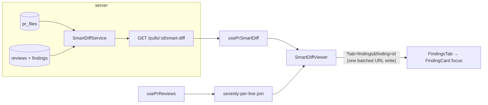

# 05 — Smart Diff (L0x): risk-ordered PR files, deterministic, zero LLM

Status: **planned** (2026-08-21). Cross-package (server + client). Sorts a PR's changed
files by review-risk so the reviewer sees business logic first: a deterministic
path/pattern classifier groups files into **core / wiring / boilerplate**, joins the
latest review's findings onto exact diff lines, and renders a "Smart order" view in the
Files changed tab. **No LLM call, no tokens** — it recombines already-persisted PR files
and findings.

**Locked by requirements** (2026-08-21):
- Classifier is **path + pattern only** (thresholds/patterns in a constants file).
  `RepoIntel.getFileRank` is deliberately NOT used in v1.
- Boilerplate group is ALWAYS collapsed by default; findings render inline ONLY in
  Smart order; clicking a finding navigates via `?tab=` to the exact FindingCard in
  "Agent runs" — never GitHub, never file-top, no popups.

## 1. Pre-existing scaffolding (reused, not rebuilt)

| Piece | Where |
|---|---|
| Frozen `SmartDiff` contract (`SmartDiffRole`, `SmartDiffFile{path, pseudocode_summary nullish, additions, deletions, finding_lines[]}`, `SmartDiffGroup`, `ProposedSplit`, `split_suggestion`) | `*/vendor/shared/contracts/brief.ts:80-113` — untouched |
| `SmartDiffResponse = SmartDiff` alias | `contracts/review-api.ts:63-65` — untouched |
| PR files persisted (`path, additions, deletions, patch`) | `server/src/db/schema/pulls.ts:36-45`; repo read `ReviewRepository.getPrFiles` (`repository.ts:45-47`) |
| Findings (`file, startLine, endLine, severity, dismissedAt`) per review | `server/src/db/schema/reviews.ts:55-84`; `ReviewRepository.reviewsForPull` (`repository.ts:70-72`) |
| "Latest review" rule (per `(prId, agentId)`, `kind='review'`, newest-first first-seen) | `server/src/modules/pulls/routes.ts:145-163`; rationale in `server/INSIGHTS.md` (aggregate across agents, never "the latest review") |
| Module template: thin routes + `IdParams` + `getContext`; explicit-deps service; container lazy getter | `modules/intent/routes.ts`, `platform/container.ts:140-149`; registration comment already reserves smart-diff (`modules/index.ts:24`) |
| Constants-file style + pure classifier style | `modules/conventions/constants.ts`, `modules/reviews/status.ts` |
| Diff rendering: `DiffTab` → `DiffViewer` → `FileCard` → `CodeLine`; `parsePatch` yields `Line{kind, oldNo, newNo}` | `client/src/components/diff-viewer/*`; `helpers.ts:12-38`; `AUTO_EXPAND_MAX_LINES` in `constants.ts:4` |
| Findings UI: `FindingsTab` target state (`runId`+nonce, `FindingsTab.tsx:55-58`) → `ReviewRunAccordion` open+scroll effect (`:47-52`) → `FindingsPanel` (`focusIdx`) → `FindingCard` (`data-finding-id`, `focused` style) | `client/src/app/repos/[repoId]/pulls/[number]/_components/*` |
| Severity tokens `--crit/--warn/--sugg` (+ `-bg` variants); `SEV_COLOR` map; `SeverityBadge` primitive | `FindingCard/constants.ts`; `client/src/vendor/ui/styles.css:25-31,64-70` |
| i18n `prReview.smartDiff` block (coreLabel/wiringLabel/boilerplateLabel/largeTitle/largeBody/filesCount/findingLines/groupedByRole) | `client/messages/en/prReview.json:60-68` |
| Hook pattern + URL-param hook (with the documented same-tick multi-key limitation) | `client/src/lib/hooks/intent.ts`, `hooks/core.ts`, `hooks/use-query-param.ts:24-45` |

## 2. Contracts — **NO changes**

`SmartDiff`/`SmartDiffResponse` already exist and are frozen. Nothing is added to
`@devdigest/shared` (server copy or client copy). `pseudocode_summary` stays `null` in
v1 (no LLM). The only contract-adjacent work is a parse fixture in tests (§9) — the
fixture at `server/test/contracts.test.ts:109-120` already parses `SmartDiff`; extend
only if it lacks a findings-bearing case.

## 3. DB delta — **NONE**

No new table, no migration. SmartDiff is **computed on read** per GET:
- inputs (`pr_files`, latest findings) are already persisted and change independently
  (new review runs, PR sync) — a persisted SmartDiff would need invalidation logic for
  zero gain;
- computation is pure JS over ≤ a few hundred rows — cheap;
- "always fresh vs the latest review" falls out for free.
(Alternative — a `pr_smart_diff` jsonb table like `pr_brief`, `schema/reviews.ts:108-113` —
is recorded in Decisions and stays cheap to add later.)

## 4. Classifier rules (deterministic, `modules/smart-diff/constants.ts`)

Precedence: **boilerplate → wiring → core (default)**. Matching is on the repo-relative
path, case-sensitive basename/segment checks — no regex engine beyond a few anchored
patterns, no I/O.

**Boilerplate** (generated / mechanical — skim):
- exact basenames: `pnpm-lock.yaml`, `package-lock.json`, `yarn.lock`, `bun.lockb`,
  `Cargo.lock`, `poetry.lock`, `Pipfile.lock`, `composer.lock`, `Gemfile.lock`, `go.sum`
- any path **segment** in: `dist`, `build`, `out`, `coverage`, `node_modules`,
  `__snapshots__`, `__generated__`, `.next`, `vendor`
- suffixes: `.snap`, `.min.js`, `.min.css`, `.map`, plus binary assets
  (`.png .jpg .jpeg .gif .ico .svg .woff .woff2`)
- basename contains `.generated.`; path contains segment pair `migrations/meta`
  (drizzle snapshots)

**Wiring** (hooks the core into the app):
- basename starts with `.` (dotfiles: `.env*`, `.eslintrc*`, `.prettierrc`, `.gitignore`,
  `.npmrc`, `.editorconfig`, …)
- `tsconfig(\..+)?\.json`; basename ends `.config.js|.config.ts|.config.cjs|.config.mjs`
- exact basenames: `package.json`, `pnpm-workspace.yaml`, `Dockerfile`, `Makefile`
- path starts `.github/` or ends `.yml`/`.yaml` (CI, compose)
- barrel files: basename `index.ts` / `index.js` (NOT `.tsx`/`.jsx` — may be components;
  open question §14)
- `.sql` under a `migrations` segment (reviewable, but mechanical)

**Core** = everything else (including tests — reviewable business logic).

**Thresholds** (same file):
- `TOO_BIG_TOTAL_LINES = 1000` — `split_suggestion.too_big` when
  Σ(additions+deletions) across all files exceeds it (`total_lines` = that sum)
- `FINDING_LINE_SPAN_CAP = 10` — max lines expanded per finding into `finding_lines`
- `MIN_PROPOSED_SPLITS = 2`

**`proposed_splits` (deterministic):** when `too_big`, one `ProposedSplit` per non-empty
role in fixed order (`name` = role, `files` = group paths). If fewer than
`MIN_PROPOSED_SPLITS` non-empty roles, fall back to grouping all files by first path
segment (one split per segment). Still < 2 → `proposed_splits: []` (hint renders with
no list). Simple, explainable, no heuristics to tune.

**`finding_lines` mapping:** take the **latest review per `(prId, agentId)`**
(`kind='review'`, newest-first first-seen — exactly the `pulls/routes.ts:145-163` rule,
per the INSIGHTS decision that "latest review" alone picks an arbitrary agent), union
their **non-dismissed** findings, and for each finding whose `file` matches the path emit
new-file line numbers `startLine .. min(endLine ?? startLine, startLine +
FINDING_LINE_SPAN_CAP − 1)`; dedupe + sort ascending. Findings without a `startLine` are
skipped (nothing to anchor).

**Severity per line (client-side join):** the contract's `finding_lines` has no severity
— by design the client joins severity from the **already-loaded** `usePrReviews` payload
(client/INSIGHTS precedent: `findingsByRun` join in FindingsTab, "don't add server
fields"). A pure client helper replicates the same latest-per-agent + non-dismissed rule
and builds `Map<path, Map<newLineNo, { severity, findingId }>>`, keeping the **worst**
severity per line (CRITICAL > WARNING > SUGGESTION) and that finding's id for click
navigation. Server `finding_lines` then serves only the "N findings" badge / auto-expand
fallback; both sides derive from the same documented rule (risk noted §11).

## 5. Server module `modules/smart-diff/`

`constants.ts` · `helpers.ts` · `service.ts` · `routes.ts`; registered in
`modules/index.ts` (the comment already reserves it). Modeled on `modules/intent/`.

- `helpers.ts` (pure, no imports from db/fastify — `reviews/status.ts` style):
  `classifyPath(path): SmartDiffRole`; `buildSmartDiff(files, findings): SmartDiff`
  taking **plain shapes** (`{path, additions, deletions}`,
  `{file, startLine, endLine, severity, dismissedAt}`) so no `$inferSelect` row type
  crosses into signatures. Groups always emitted in fixed order core→wiring→boilerplate
  (possibly empty `files: []`); files within a group sorted by findings-count desc,
  changed-lines desc, path asc (stable, deterministic).
- `service.ts`: `SmartDiffService` with an **explicit deps object** built in the
  container (`{ repo: ReviewRepository }` — the intentService precedent,
  `container.ts:140-149`; no `constructor(container)`, no new `pnpm arch` warnings).
  One method `get(workspaceId, prId): Promise<SmartDiff>`:
  `repo.getPull` (tenancy; undefined → `NotFoundError`), `repo.getPrFiles`,
  `repo.reviewsForPull` → map rows to plain shapes at this boundary → apply
  latest-per-agent filter → `buildSmartDiff`. Before the first review the findings
  input is simply `[]` — grouping works, `finding_lines` are empty (requirement:
  sorting works before any review).
- `routes.ts` (thin, `ZodTypeProvider`): `GET /pulls/:id/smart-diff` —
  `schema: { params: IdParams }`, `getContext(container, req)`, return
  `service.get(...)`; PR not found → 404 (client 4xx-silent convention). No rate limit
  (pure read, no LLM).
- `platform/container.ts`: lazy getter `smartDiffService` (`??=` cache) directly under
  `intentService`. No new port/adapter, no `ContainerOverrides` slot needed (tests
  construct the service with an in-memory fake deps object).

## 6. Client — hook + SmartDiffViewer + DiffTab toggle

- **Hook** `lib/hooks/smart-diff.ts` (+ `hooks/index.ts` barrel export):
  `usePrSmartDiff(prId, enabled)` — key `["pr-smart-diff", prId]`,
  `api.get<SmartDiffResponse>(`/pulls/${prId}/smart-diff`)`, `enabled: !!prId && enabled`
  (fetched only when Smart order is active). In `page.tsx` `onRunDone` add
  `qc.invalidateQueries({ queryKey: ["pr-smart-diff", prId] })` next to the existing
  invalidations so finding overlays refresh after a run settles.
- **Shared diff-viewer extension** (optional props, zero behavior change for existing
  callers):
  - `FileCard`: new optional `open`/`defaultOpen` override, optional `lineFindings?:
    Map<number, { severity; findingId }>` (keyed by NEW line number), optional
    `headerBadge?: ReactNode` (the "N findings" red-dot badge), optional
    `onFindingClick?: (findingId: string) => void`, optional `highlightLarge?: boolean`
    (header tint when changed lines > threshold).
  - `CodeLine`: when its `ln.newNo` is in `lineFindings` — severity-colored left border
    + `--{sev}-bg` tinted background + right-aligned `SeverityBadge` (existing
    `@devdigest/ui` primitive, no popups) that is a button calling `onFindingClick`.
    New style fns beside `lineRowFor/lineSignFor` in `diff-viewer/styles.ts`, colors
    strictly `var(--crit|--warn|--sugg)` (+`-bg`).
- **`SmartDiffViewer`** — colocated route-local component
  `_components/DiffTab/_components/SmartDiffViewer/{SmartDiffViewer.tsx, index.ts,
  constants.ts, helpers.ts, styles.ts, SmartDiffViewer.test.tsx}` (folder-per-component
  convention; single consumer → colocate, don't promote). Renders:
  - header row: files-affected summary ("9 files +247 −38") computed from the payload;
  - split hint when `split_suggestion.too_big` (existing `largeTitle`/`largeBody` keys
    + proposed-split list);
  - three group sections (colored square + label + subtitle + "N files"); Core+Wiring
    sections expanded, Boilerplate ALWAYS collapsed by default (local `useState` per
    section); inside, `FileCard`s: files with findings forced open + badge, all others
    collapsed;
  - `helpers.ts` (pure): `latestReviewsPerAgent(reviews)`,
    `buildLineFindings(reviews): Map<path, Map<line, {...}>>`, `sumStats(smartDiff)`;
  - `constants.ts`: `LARGE_FILE_LINES = 600` (large-file highlight — client-visual
    threshold, contract has no flag, so it lives client-side), group order, subtitle
    key map.
- **`DiffTab`**: local `useState` toggle Smart/Original (segmented control, ghost
  Buttons). Original = today's `DiffViewer` untouched (commenting kept, **no** finding
  overlays). Smart = `SmartDiffViewer` fed by `usePrSmartDiff` + `usePrReviews` data
  passed down from `page.tsx` (already loaded there — no second fetch), commenting
  omitted in smart mode (Decisions §13). Loading/error/empty states in DiffTab.
- **i18n** — extend `client/messages/en/prReview.json` `smartDiff` block (client JSON is
  not a frozen contract): `orderSmart`, `orderOriginal`, `coreSub` ("The substance of
  the change — review closely"), `wiringSub` ("Hooks the core into the app"),
  `boilerplateSub` ("Generated / mechanical — skim"), `fileFindings` ("{count}
  finding(s)"), `largeFileHint`, `statLine` ("{count} files +{additions} −{deletions}").
  Existing keys (`coreLabel`…, `largeTitle`, `largeBody`, `filesCount`) reused as-is.

## 7. Finding-click navigation (CRITICAL requirement, precise mechanism)

Standard routing, URL-driven (repo convention: URL-dependent state in the URL, parallel
to `useQueryParam("trace")`):

1. **Batch URL setter** — `use-query-param.ts` documents that two different-key setters
   in one tick lose the first write (`:31-34`) and prescribes batching. Add
   `useSetQueryParams(): (updates: Record<string, string | null>) => void` in the same
   file: one `URLSearchParams` built from the live URL, one `router.replace(...,
   { scroll: false })`.
2. **`page.tsx`** — `const [findingTarget, setFindingTarget] = useQueryParam("finding")`;
   `const setParams = useSetQueryParams()`; handler
   `goToFinding = (id) => setParams({ tab: "findings", finding: id })` passed to
   `DiffTab` → `SmartDiffViewer` → `FileCard.onFindingClick`. Pass
   `targetFindingId={findingTarget}` + `onFindingTargetConsumed={() =>
   setFindingTarget(null)}` into `FindingsTab`. Consume-then-clear makes a repeat click
   on the same finding re-navigate (no nonce arithmetic needed) and prevents re-scroll
   on later tab toggles.
3. **`FindingsTab`** — on `targetFindingId`, locate the containing review
   (`runs.find(r => r.findings.some(f => f.id === target))`) and extend the existing
   target state (`:55-58`) to `{ reviewId, findingId, n }`; after dispatch call
   `onFindingTargetConsumed`.
4. **`ReviewRunAccordion`** — accept optional `targetFindingId`; extend the existing
   open+scroll effect (`:47-52`): when its `review.findings` contain the id → `setOpen(true)`
   (match by `review.id`, not `run_id` — `run_id` can be null).
5. **`FindingsPanel`** — accept `targetFindingId` + nonce; effect sets `focusIdx` to the
   finding's index in `shown` (also flips `hideLow` off if the target is filtered out)
   and scrolls `[data-finding-id="…"]` into view (`scrollIntoView` + `scrollMarginTop`,
   ReviewRunAccordion precedent).
6. **`FindingCard`** — no change needed: `data-finding-id` and the `focused` visual
   state already exist; `focused={i === focusIdx}` lights the target.

No GitHub links, no scroll-to-file-top, no popups (also avoids the clipped-popover trap
in client/INSIGHTS).

## 8. Tasks (dependency-ordered; ∥ = parallelizable)

1. **Server classifier core** *(no deps)*
   - Files: `server/src/modules/smart-diff/constants.ts`, `smart-diff/helpers.ts`
   - Changes: pattern lists + thresholds exactly as §4; pure `classifyPath` +
     `buildSmartDiff` over plain input shapes (`reviews/status.ts` +
     `conventions/constants.ts` patterns).
   - Skills to apply: onion-architecture (pure functions are not infrastructure; no row
     types in signatures), typescript-expert (narrow literal types for roles).
   - Tests: new hermetic `server/test/smart-diff-helpers.test.ts` (`pulls-status.test.ts`
     template): every pattern class, precedence, group ordering, `finding_lines` span
     cap, latest-per-agent + dismissed exclusion, `too_big` + `proposed_splits`
     fallbacks, empty-findings path.
2. **Server service + route + wiring** *(after 1)*
   - Files: `server/src/modules/smart-diff/service.ts`, `smart-diff/routes.ts`,
     `server/src/modules/index.ts` (+1 import, +1 entry),
     `server/src/platform/container.ts` (lazy `smartDiffService` getter).
   - Changes: §5 verbatim; explicit deps `{ repo: ReviewRepository }`; thin GET route
     with `IdParams` + `getContext` + `NotFoundError` (intent routes template).
   - Skills to apply: fastify-best-practices (route = translator, schema at the edge),
     onion-architecture (explicit deps, container-only construction, no sibling-module
     imports — cross-cutting data via `container.reviewRepo`), zod (route trust
     boundary; contract untouched), security (read-only endpoint, tenancy via
     `getContext`).
   - Tests: add `/pulls/:id/smart-diff` non-uuid→422 to
     `server/test/routes-smoke.test.ts` (`:56-65` pattern); new
     `server/test/smart-diff.it.test.ts` (testcontainers,
     `pulls-comments.it.test.ts` template, **unique repo `fullName`** per
     server/INSIGHTS): seed files + two agents' reviews + a re-run → GET returns
     latest-per-agent finding lines, dismissed excluded, `SmartDiffResponse.parse`
     round-trip.
3. **∥ Client hook + invalidation** *(no deps on 1–2 for code; needs 2 to run live)*
   - Files: `client/src/lib/hooks/smart-diff.ts`, `hooks/index.ts`,
     `client/src/app/repos/[repoId]/pulls/[number]/page.tsx` (`onRunDone` invalidation).
   - Changes: §6 hook; key `["pr-smart-diff", prId]`, gated `enabled`.
   - Skills to apply: react-best-practices (data fetching in hooks only, core hook
     pattern), frontend-ui-architecture (hooks in `lib/hooks/<domain>.ts`),
     next-best-practices (client-boundary hygiene).
   - Tests: covered via component tests in task 7.
4. **∥ Shared diff-viewer extension** *(no deps)*
   - Files: `client/src/components/diff-viewer/{FileCard/FileCard.tsx,
     CodeLine/CodeLine.tsx, styles.ts, constants.ts}`.
   - Changes: optional `lineFindings`/`open`/`headerBadge`/`onFindingClick`/
     `highlightLarge` props; severity line styles from `--crit/--warn/--sugg`(+`-bg`);
     match on `ln.newNo`; `SeverityBadge` as the inline badge/button. Existing callers
     compile unchanged.
   - Skills to apply: react-best-practices (derive don't store; no render factories;
     optional-prop extension over forking), frontend-ui-architecture (shared component
     stays in `components/`, styling in colocated `styles.ts` + tokens).
   - Tests: behavior asserted through task 7's SmartDiffViewer tests (annotated line
     renders badge; click fires callback).
5. **SmartDiffViewer + DiffTab toggle + i18n** *(after 3, 4)*
   - Files: `_components/DiffTab/_components/SmartDiffViewer/{SmartDiffViewer.tsx,
     index.ts, constants.ts, helpers.ts, styles.ts}`, `_components/DiffTab/DiffTab.tsx`,
     `client/messages/en/prReview.json`, `page.tsx` (pass `reviews` into DiffTab).
   - Changes: §6 — toggle, header stat line, split hint, three sections
     (Boilerplate ALWAYS collapsed), findings-driven file expansion, large-file
     highlight, pure client join helpers, new i18n keys.
   - Skills to apply: frontend-ui-architecture (route-local colocation,
     folder-per-component, promote-on-second-use), react-best-practices (pure helpers
     outside component; no `{count && …}` zero-render traps; `useMemo` only for the
     line-findings map), next-best-practices (`"use client"` leaf, next-intl usage).
   - Tests: task 7.
6. **∥(with 5) Finding-click navigation plumbing** *(independent of 1–5 except the
   `onFindingClick` handoff; mergeable last)*
   - Files: `client/src/lib/hooks/use-query-param.ts` (add `useSetQueryParams`),
     `page.tsx`, `_components/FindingsTab/FindingsTab.tsx`,
     `_components/ReviewRunAccordion/ReviewRunAccordion.tsx`,
     `_components/FindingsPanel/FindingsPanel.tsx`.
   - Changes: §7 steps 1–6 exactly (batched single URL write; consume-then-clear;
     accordion match by `review.id`; panel focus + scroll; `hideLow` override).
   - Skills to apply: react-best-practices (URL-dependent state in URL; effects only
     for the external scroll/DOM sync; cleanup), next-best-practices
     (`useSearchParams`/`router.replace` semantics), frontend-ui-architecture.
   - Tests: task 7.
7. **Client tests** *(after 4–6)*
   - Files: `SmartDiffViewer/SmartDiffViewer.test.tsx`; extend
     `FindingsPanel/FindingsPanel.test.tsx` (or a small FindingsTab-level test).
   - Changes/coverage (flow tests, `FindingCard.test.tsx` template —
     `NextIntlClientProvider` + real messages): (a) smart payload renders 3 sections,
     boilerplate collapsed, file with findings expanded with severity-badged line, "N
     findings" badge, stat header, split hint when `too_big`; clicking the badge calls
     the navigation callback with the finding id; (b) toggle back to Original renders
     the plain DiffViewer with NO overlays; (c) findings-side: given
     `targetFindingId`, the containing accordion opens and the exact FindingCard gets
     `focused` (stub `scrollIntoView` in jsdom).
   - Skills to apply: react-testing-library (userEvent, role/text queries, fewer longer
     flow tests, no implementation-detail assertions).
   - Tests: `cd client && pnpm test`.

Parallel lanes: **{1→2} server** ∥ **{3, 4, 6} client foundations**; 5 joins 3+4; 7 last.

## 9. Tests (summary)

- Server hermetic: `smart-diff-helpers.test.ts` (classifier matrix + builder rules);
  one-shot wrapper `pnpm verify:l03` (server/package.json) runs exactly this file.
- Server smoke: `routes-smoke.test.ts` — non-uuid `:id` → 422, no DB.
- Server integration: `smart-diff.it.test.ts` — persist → GET → `SmartDiffResponse.parse`;
  latest-per-agent; dismissed excluded; unique repo fullName.
- Contracts: reuse the existing `SmartDiff` parse test (`contracts.test.ts:109-120`);
  add a findings-bearing fixture only if missing.
- Client RTL: SmartDiffViewer flows + navigation focus (task 7).

## 10. Skills applied (and INSIGHTS consulted)

- **onion-architecture** — tasks 1–2: pure helpers in the module (not adapters), explicit
  deps object, container-getter consumption, no sibling-module imports, no new
  `pnpm arch` warnings.
- **fastify-best-practices** — task 2: thin translating route, edge schema, 404 as
  domain error translation.
- **zod** — task 2/§2: frozen contract untouched (EXTEND-only rule respected by
  changing nothing); route trust boundary via `IdParams`.
- **drizzle-orm-patterns / postgresql-table-design** — consulted to conclude §3 = no
  schema work (compute-on-read; no migration task exists to mis-phrase).
- **frontend-ui-architecture / next-best-practices / react-best-practices** — tasks 3–6:
  colocation, hooks-only fetching, optional-prop extension of shared components, URL
  state, client-leaf boundaries.
- **react-testing-library** — task 7.
- **security** — task 2: tenancy-scoped read-only endpoint; no user-controlled patterns
  evaluated as regex from input.
- INSIGHTS points consulted: `server/INSIGHTS.md` — latest-review-per-(prId,agentId)
  decision (drives §4 `finding_lines`); unique `fullName` in it-tests (task 2);
  seed-has-no-agent_runs note (manual verification expectations).
  `client/INSIGHTS.md` — join findings client-side from the loaded `usePrReviews`
  payload (drives the severity join); avoid popovers in `overflow:hidden` containers
  (badges inline, no popups). Root `INSIGHTS.md` — vendored-contracts lockstep (no
  contract edits at all here); `npm ci` in `reviewer-core/` before server test steps.

## 11. Risks & mitigations

- **Server/client rule drift** (`finding_lines` vs client severity join): both derive
  from one documented rule (latest-per-agent, non-dismissed, `newNo` anchoring); tests
  on both sides encode the same fixtures. Worst case the badge count and overlay differ
  — cosmetic, not correctness.
- **Same-tick URL writes lose one param**: solved by the single batched
  `useSetQueryParams` write (the hook's own documented remedy).
- **Classifier misfiles a path** (e.g. a hand-written `index.tsx`): patterns are one
  constants file; default is core (fail-safe: misclassification errs toward "review
  closely").
- **Shared FileCard regression**: all new props optional; Original mode renders the
  untouched path; existing DiffViewer tests + task 7(b) guard it.
- **Findings anchored to lines not present in the patch** (rare post-sync drift): lines
  absent from `parsePatch` output simply render no overlay; the "N findings" badge still
  points the reviewer to the Agent runs tab.
- **Env gotchas** (INSIGHTS): `npm ci` in `reviewer-core/` before server tests;
  `pnpm arch` needs Node `^20.12||^22||>=24`.

## 12. Verification (execution order)

1. `cd reviewer-core && npm ci` (server test prerequisite — package itself untouched)
2. `cd server && pnpm verify:l03` — classifier-only quick gate (no UI clicking)
3. `cd server && pnpm typecheck && pnpm test`
4. `cd server && pnpm arch` — 0 errors, no NEW warnings vs baseline
5. `cd client && pnpm typecheck && pnpm test`
6. Manual: `./scripts/dev.sh` → a PR → Files changed → toggle Smart order: groups
   render (no findings pre-review); run a review; overlays + badges appear after
   `onRunDone`; click a finding line badge → lands on `?tab=findings&finding=…`, the
   right accordion opens and the exact FindingCard is focused; Original order shows no
   overlays; a >1000-changed-line PR shows the split hint.
   (No migrations, no seed changes, no `diff -r` on vendor/shared — nothing there moves.)

## 13. Decisions

| Decision | Choice | Alternative kept cheap |
|---|---|---|
| Persistence | compute on read per GET (fresh, cheap, zero invalidation) | `pr_smart_diff` jsonb table (prBrief precedent) |
| "Latest review" | per `(prId, agentId)`, `kind='review'`, union across agents | single newest review — rejected (INSIGHTS: arbitrary agent) |
| Dismissed findings | excluded from `finding_lines` and overlays | include with muted style |
| Severity per line | client joins from loaded `usePrReviews` (contract has no per-line severity) | new contract field — forbidden (frozen) |
| `proposed_splits` | role-based; top-level-dir fallback; else empty | dependency-aware splitting via repo-intel |
| `RepoIntel.getFileRank` | not used (task states path+patterns) | optional core-ordering signal (follow-up) |
| Inline comments in Smart mode | omitted (findings own the inline channel) | thread commenting through both modes |
| Repeat-click navigation | consume-then-clear `?finding` param | nonce state (FindingsTab runId precedent) |
| `pseudocode_summary` | stays `null` in v1 (deterministic, no LLM) | LLM summaries as a later lesson |
| Groups array | always all 3 roles in fixed order (empty allowed) | emit only non-empty |

## 14. Resolved questions (user-confirmed 2026-08-21)

1. **Default toggle position** — **Smart order** by default when the tab opens.
2. **Thresholds** — `TOO_BIG_TOTAL_LINES = 1000`, `LARGE_FILE_LINES = 600`.
3. **Original order hides finding overlays entirely** — confirmed (user requirement:
   "у звичайному режимі знахідки на рядках не видно").
4. **`index.tsx`/`index.jsx`** — classified as **core** (may be a real component);
   only `index.ts`/`index.js` count as wiring barrels.
5. **Persistence** — compute-on-read, no jsonb table.
6. **`pseudocode_summary`** — stays `null` in v1.
7. **Dismissed findings** — excluded from overlays and badges.

## 15. Out of scope / follow-ups

`RepoIntel.getFileRank` as an ordering signal; LLM `pseudocode_summary`; persisted
SmartDiff + PrBrief composition; commenting in Smart mode; per-workspace configurable
patterns/thresholds; e2e coverage; non-English i18n.
