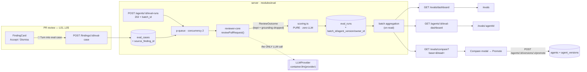
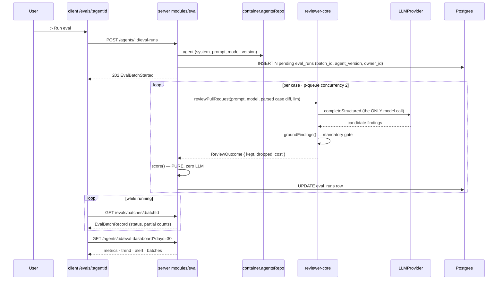

# 06 — Eval Pipeline (L06): regression harness for reviewer agents

Spec ID: `SPEC-2026-09-02-eval-pipeline` · Status: **draft** (2026-09-02) · Supersedes: none

> **File-name note.** `specs/README.md` standardises on `YYYY-MM-DD-feature.md` and says not
> to continue the `NN-` numbering. This file deliberately keeps `06-eval-pipeline.md` on the
> requester's instruction, to sit alongside `04-intent-layer.md` / `05-smart-diff.md` as the
> lesson-numbered series. The Spec ID above still follows the standard.

Cross-package (server + client + vendored contracts + reviewer-core consumption, engine
unchanged). An **in-app regression harness for reviewer agents**: change an agent's system
prompt / model / linked skills → run the eval set → see in numbers whether the agent got
better or worse. The dataset is not invented — every case is born from a **real accept /
dismiss decision** the user already made on a finding produced by L01–L05.

- An **accepted** finding becomes a `must_find` case — "on this diff you must report X at
  `file:line`".
- A **dismissed** finding becomes a `must_not_flag` case — "on this diff you must NOT
  comment on `file:lines`".

The agent runs against each case through the **same** `reviewPullRequest` engine used for
real PRs (real LLM, real grounding gate). Scoring is **pure code with zero LLM calls**.

**Locked by the requester** (do not re-open):

- **D1 — batching.** ONE additive migration extends `eval_runs` with `batch_id uuid`,
  `agent_version integer`, `owner_id uuid`. `eval_cases` gains only `source_finding_id`.
  Applied SQL is never edited; every new column is nullable-or-defaulted (0014/0016/0017
  precedent).
- **D2 — expectation encoding.** `eval_cases.expected_output` holds
  `{ kind: 'must_find' | 'must_not_flag', expectations: [...] }`. One case, one `kind`.
- **D3 — LLM.** `POST /agents/:id/eval-runs` calls the REAL provider through the DI
  container. `pnpm verify:l06` stays hermetic (pure scoring tests + a service test with a
  stub `LLMProvider` injected via `ContainerOverrides`).
- **D4 — scope.** Everything in the designs ships: compare modal with system-prompt diff,
  Promote, Run-all-agents, trend chart, alert banner.



---

## 1. Pre-existing scaffolding (reused, not rebuilt)

| Piece | Where |
|---|---|
| `eval_cases` / `eval_runs` tables (applied in migration `0000_init.sql`) | `server/src/db/schema/eval.ts:7-35`; barrel `db/schema.ts:23,37,75-76` |
| Frozen contracts `EvalCaseInput`, `EvalRunRecord`, `EvalRunResult`, `EvalTrendPoint`, `EvalDashboard` | `server/src/vendor/shared/contracts/eval-ci.ts:20-89` — untouched |
| Frozen contracts `EvalRun`, `EvalPerTrace`, `EvalCase`, `EvalOwnerKind`, `Agent`, `Provider` | `contracts/knowledge.ts:49-84,159,178-196` — untouched |
| Review engine entry (`ReviewInput` → `ReviewOutcome` with `review.findings` + `dropped[]`) | `reviewer-core/src/review/run.ts:41-119,196-247` |
| Mandatory grounding gate (`groundFindings` → `{ kept, dropped }`) | `reviewer-core/src/grounding.ts:51-80` |
| Synthetic-diff assembly precedent (`diff --git` / `---` / `+++` + patch → `parseUnifiedDiff`) | `server/src/modules/reviews/diff-loader.ts:33-44` |
| Unified-diff parser (strips `b/`; **never throws** — bad input → `files: []`) | `server/src/adapters/git/diff-parser.ts:14,37-40,76` |
| `ReviewInput` assembly reference (what a runner must supply) | `server/src/modules/reviews/run-executor.ts:229-278` |
| Agent version bump + `agent_versions` snapshot (`config_json` = provider/model/system_prompt/output_schema/strategy/ci_fail_on/repo_intel/skills) | `server/src/modules/agents/repository.ts:127-158,181-201`; `helpers.ts:60-93` (`isConfigChange`) |
| `GET /agents/:id/versions[/:version]` (read-only history; **no** promote/rollback exists) | `server/src/modules/agents/routes.ts:22-31` |
| Thin-route template: `IdParams`, `getContext`, `NotFoundError`/`ValidationError` | `modules/_shared/{schemas,context}.ts`; `platform/errors.ts:1-38` |
| Static module registry (comment already reserves `eval`) | `server/src/modules/index.ts:27-29` |
| `ContainerOverrides` (incl. `llm?: Partial<Record<provider, LLMProvider>>`) + lazy `??=` getters | `server/src/platform/container.ts:48-66,257-288` |
| `MockLLMProvider` with `structuredBySchema` + a recorded `calls[]` array | `server/src/adapters/mocks.ts:44-108` |
| `p-queue@^8.0.1` already a dependency; `JobRunner` precedent | `server/src/platform/jobs.ts:1,31,40`; `modules/repo-intel/pipeline/full.ts:25` |
| `verify:l03` one-shot gate precedent (server-local script; **no root proxy exists**) | `server/package.json:13` |
| Findings carry `file/startLine/endLine/severity/category/title/acceptedAt/dismissedAt`; `reviews.agentId` is **nullable** | `server/src/db/schema/reviews.ts:53-80,30` |
| `pr_files.patch` (nullable) — the source of a case's frozen diff | `server/src/db/schema/pulls.ts:35-45` |
| i18n namespace `eval.json` (`dashboard`, `caseEditor`, `evalsTab`, `page`) — filesystem-scanned, no registry to update | `client/messages/en/eval.json`; `client/src/i18n/request.ts` |
| `activeKeyFor("/eval") → "eval"` already scaffolded (no NAV entry, no route yet) | `client/src/components/app-shell/helpers.ts:35` |
| `NAV` / `NavItemDef` / `SHORTCUTS` shapes; `SKILLS LAB` section has 2 items today | `client/src/vendor/ui/nav.ts:30-36,52-70` |
| `AgentEditor` `TABS` constants array; `agents.json` already holds the `evals` tab label | `client/src/app/agents/[id]/_components/AgentEditor/constants.ts:1-15` |
| Chart kit `Sparkline` / `LineChart` / `MetricCard` / `BarRow` (recharts) — exists, used only in Showcase | `client/src/vendor/ui/charts/index.ts` |
| `FindingCard` action row (today: Accept, Dismiss only); `useFindingAction` mutation | `.../FindingCard/FindingCard.tsx:91-112`; `client/src/lib/hooks/reviews.ts:139-160` |
| Modal focus-trap + dialog stack (compare modal, case editor) | `client/src/vendor/ui/kit/dialog-behavior.ts` |
| Seeded agents (`General / Security / Performance / Test Quality / API Contract Reviewer`); seed is insert-only, never truncates; **nothing seeds eval today** | `server/src/db/seed.ts:80-81,242-378` |

**Contract drift found (must be fixed as part of this work).** `diff -rq server/src/vendor/shared
client/src/vendor/shared` currently reports 5 differing files: `adapters.ts`,
`contracts/{eval-ci,knowledge,productionize,trace}.ts`. The client copy is missing
`AgentManifest`, `AgentVersion`/`AgentVersionConfig`, and `'openrouter'` in several enums.
Re-vendoring `eval-ci.ts` + `knowledge.ts` (byte-copy server → client) is a prerequisite of
the client work — see AC-46.

---

## 2. Contracts

### 2.1 Reused verbatim (no edits — frozen files stay frozen)

| Contract | Used for |
|---|---|
| `EvalCaseInput` | request body of `POST /eval-cases` and `PUT /eval-cases/:id` |
| `EvalCase` | the base shape every case response extends |
| `EvalRunRecord` | the base shape of a per-case run row |
| `EvalRunResult` | response of `POST /eval-cases/:id/run` |
| `EvalRun` | the metric bundle of a completed batch (`traces_*` = cases) |
| `EvalPerTrace` | one entry per case inside `EvalRun.per_trace` |
| `EvalTrendPoint`, `EvalDashboard` | the drill-down's `current` / `delta` / `trend` / `alert` |
| `EvalOwnerKind`, `Agent`, `Provider`, `Finding`, `Severity`, `FindingCategory` | as-is |

### 2.2 New — ONE new file `contracts/eval-pipeline.ts`, vendored ×2 byte-identical

Root `CLAUDE.md`: `@devdigest/shared` is **vendored, not installed**; existing contract files
are **never edited** — EXTEND with new files. `.extend()`-ing a frozen schema **from a new
file** is the established mechanism (`04-intent-layer.md` §2 precedent). One export line is
added to both `index.ts` barrels. All optional fields use `.nullish()`, never `.nullable()`
(root INSIGHTS: `.nullable()` is required-but-null and breaks every existing fixture).

| # | New schema | Shape (fields, direction) |
|---|---|---|
| C1 | `EvalExpectationKind` | `z.enum(['must_find','must_not_flag'])` |
| C2 | `EvalExpectation` | `{ file, start_line, end_line nullish, title nullish, severity: Severity nullish, category: FindingCategory nullish }` |
| C3 | `EvalExpectedOutput` | `{ kind: EvalExpectationKind, expectations: EvalExpectation[] }` — the `expected_output` jsonb wrapper (D2) |
| C4 | `EvalPrMeta` | `{ title nullish, body nullish, number nullish, author nullish, base nullish, branch nullish }` — the `input_meta` jsonb |
| C5 | `EvalCaseLastRun` | `{ run_id, ran_at, pass: boolean\|null, expected_count, produced_count, duration_ms nullish, cost_usd nullish }` |
| C6 | `EvalCaseRecord` | `EvalCase.extend({ expected_output: EvalExpectedOutput, input_meta: EvalPrMeta, source_finding_id nullish, last_run: EvalCaseLastRun.nullish(), diff_warnings: string[] })` — server → client |
| C7 | `EvalActualOutput` | the `eval_runs.actual_output` blob: `{ findings: Finding[], pre_gate_count, grounding_kept, grounding_total, grounding_dropped: [{title, reason}], matched_expectations, noise_findings, case_fingerprint, expectation_kind, error nullish }` |
| C8 | `EvalCaseRunRecord` | `EvalRunRecord.extend({ batch_id nullish, agent_version nullish, error nullish })` |
| C9 | `EvalBatchStatus` | `z.enum(['running','complete','failed'])` (derived on read, never stored) |
| C10 | `EvalBatchRecord` | `{ batch_id, agent_id, agent_name, agent_version nullish, ran_at, status, recall\|null, precision\|null, citation_accuracy\|null, cases_total, cases_passed, cases_failed, cases_errored, must_find_total, must_find_matched, must_not_flag_total, noise_findings, findings_total, grounding_kept, grounding_total, duration_ms, cost_usd\|null }` |
| C11 | `EvalBatchRunInput` | `{ case_ids: string[] nullish }` — omit ⇒ all cases of the agent |
| C12 | `EvalBatchStarted` | `{ batch_id, agent_id, agent_version, cases_total }` — the 202 body |
| C13 | `EvalAgentSummary` | `{ agent_id, name, model, version, enabled, cases_total, last_batch: EvalBatchRecord\|null, sparkline: number[] }` — screen B agent row-card |
| C14 | `EvalDashboardOverview` | `{ agents: EvalAgentSummary[], recent_batches: EvalBatchRecord[] }` — screen B |
| C15 | `EvalAlertSignal` | `{ metric: z.enum(['recall','precision','citation_accuracy']), direction: z.enum(['up','down']), delta_pts: z.number().int() }` |
| C16 | `EvalAlertDetail` | `{ tone: z.enum(['warn','info']), primary: EvalAlertSignal, others: EvalAlertSignal[], new_false_positive: boolean, head_version nullish }` — structured so the client renders it through next-intl instead of displaying a server-built English sentence |
| C17 | `EvalAgentDashboard` | `{ agent: { id, name, model, version, provider }, window_days: number\|null, dashboard: EvalDashboard, batches: EvalBatchRecord[], alert: EvalAlertDetail\|null }` — screen C |
| C18 | `EvalPromptDiffLine` | `{ kind: z.enum(['context','added','removed']), text }` |
| C19 | `EvalCompare` | `{ base: EvalBatchRecord, head: EvalBatchRecord, deltas: { recall\|null, precision\|null, citation_accuracy\|null, cost_usd\|null }, comparable: boolean, changed_case_ids: string[], prompt_diff: EvalPromptDiffLine[], prompt_diff_available: boolean, promote_target_version: number\|null }` |
| C20 | `EvalPromoteResult` | `{ agent: Agent, promoted_from_version, new_version, changed: boolean }` |
| C21 | `EvalCaseFromFindingInput` | `{ name nullish }` — optional name override |
| C22 | `EvalCaseLink` | `{ finding_id, case_id, case_name }` — the PR page's "which findings already have a case" join payload |
| C23 | `EvalRunAllResult` | `{ started: EvalBatchStarted[], skipped: [{ agent_id, agent_name, reason: z.enum(['no_cases','already_running','disabled']) }] }` |

**Why `EvalAlertDetail` (C16) exists even though `EvalDashboard.alert` is a string.**
`EvalDashboard.alert` is frozen as `z.string().nullable()`; a server-built English sentence
cannot be localised and duplicates copy the client already owns. The server therefore fills
`EvalDashboard.alert` with a plain English fallback (so the frozen contract stays honest) and
additionally returns `EvalAgentDashboard.alert` as C16; the client renders C16 through
next-intl and ignores the string.

---

## 3. DB delta — ONE additive migration (`0018`, generated via `pnpm db:generate`)

Per D1 and the repo rule (`server/CLAUDE.md`: never edit applied SQL). Every column is
nullable, so rows written before it survive — the 0014/0016/0017 convention, mirrored with
the same explanatory comments in `schema/eval.ts`.

```sql
ALTER TABLE "eval_runs"  ADD COLUMN "batch_id" uuid;--> statement-breakpoint
ALTER TABLE "eval_runs"  ADD COLUMN "agent_version" integer;--> statement-breakpoint
ALTER TABLE "eval_runs"  ADD COLUMN "owner_id" uuid;--> statement-breakpoint
ALTER TABLE "eval_cases" ADD COLUMN "source_finding_id" uuid;--> statement-breakpoint
CREATE INDEX "eval_runs_batch_idx" ON "eval_runs" ("batch_id");--> statement-breakpoint
CREATE INDEX "eval_runs_owner_ran_idx" ON "eval_runs" ("owner_id","ran_at" DESC);--> statement-breakpoint
CREATE UNIQUE INDEX "eval_cases_source_finding_uq" ON "eval_cases" ("source_finding_id");
```

Notes that must be carried into `schema/eval.ts` as comments:

- **`owner_id` on `eval_runs` is NOT a tenancy column.** It denormalizes the *agent* id for
  cheap dashboard grouping. Tenancy is still resolved by joining `eval_cases.workspace_id`
  (the FK is `ON DELETE CASCADE`, so no orphan run can exist). A repository method must never
  filter by `owner_id` alone.
- **No `source_finding_id` FK.** `findings` rows are deleted when their review/run is deleted
  from the timeline; a hard FK would cascade-delete eval cases when a user cleans up run
  history — exactly the data we must not lose. The column is a *soft* provenance pointer; a
  dangling value renders as "source finding no longer exists". The unique index still gives
  the one-click de-duplication.
- **No batch header table.** A batch is derived by grouping `eval_runs` on `batch_id`
  (§8.1). This is what makes the whole feature fit in one additive migration.

---

## 4. Scoring — pure functions, ZERO LLM calls

All of §4 lives in one pure module with no imports from `db/`, `adapters/`, `fastify`, or
`reviewer-core` — plain data in, counters out (onion: "pure functions are not
infrastructure"). Complexity is `O(F × E)` (findings × expectations).

### 4.1 Path normalization

`normalizePath(p)` — applied to **both** sides before comparison:

1. replace `\` with `/` (pasted Windows paths);
2. trim surrounding whitespace;
3. strip a leading `a/` or `b/` **only if the remainder is non-empty** (git diff prefixes);
4. strip a leading `./`, repeatedly;
5. collapse runs of `/` into one;
6. strip a leading `/`.

**Case-sensitive.** Git is case-sensitive and Linux CI is the reference platform; folding case
would make `SRC/Config.ts` match `src/config.ts` and silently pass a wrong-file expectation.
Accepted risk: on a case-insensitive macOS checkout a user can hand-type a path that git would
treat as the same file and the match will fail — surfaced as a case-editor warning (AC-13),
not silently.

The engine side needs no normalization: `parseUnifiedDiff` already strips `b/`
(`diff-parser.ts:38`) and `groundFindings` compares exact strings. Normalization is a
defensive layer on the **expectation** side, which is hand-editable JSON.

### 4.2 Interval semantics

`[start_line, end_line]` is a **closed, inclusive** interval of **new-side** line numbers
(the same space the grounding gate indexes). Before comparing: `lo = min(start, end)`,
`hi = max(start, end)` (mirrors `rangeIntersects`, `grounding.ts:41-46`). A missing
`end_line` on an expectation defaults to its `start_line`. Two intervals intersect iff
`aLo <= bHi && bLo <= aHi`.

### 4.3 The match rule

```
matches(finding, expectation) :=
     normalizePath(finding.file) === normalizePath(expectation.file)
  && intersects([finding.start_line, finding.end_line], [exp.start_line, exp.end_line])
```

`title` / `severity` / `category` on an expectation are **advisory display metadata only** —
they are shown in the case editor and in the `CRITICAL · security` badge, but they are **not**
part of the match rule. Rationale: an improving agent legitimately rewords a title and may
re-categorize; requiring a title match would turn a semantic assertion into a brittle string
comparison, and the harness would score prose instead of detection. (Alternative kept cheap:
an opt-in `strict: true` flag on an expectation that additionally requires an equal
`severity` — recorded in Decisions, not built.)

### 4.4 Per-case pass

| kind | pass |
|---|---|
| `must_find` | every expectation of the case is matched by ≥ 1 produced finding |
| `must_not_flag` | no produced finding matches any expectation of the case |
| errored / not yet run | `pass = null` — an infrastructure failure is **not** an agent regression and must never be counted as a fail |

### 4.5 Per-case counters (the primitives everything else sums)

Computed from the case's `EvalExpectedOutput` and the engine's `ReviewOutcome`:

| Counter | Definition |
|---|---|
| `must_find_total` | `expectations.length` when `kind === 'must_find'`, else `0` |
| `must_find_matched` | number of `must_find` expectations matched by ≥ 1 produced finding |
| `must_not_flag_total` | `expectations.length` when `kind === 'must_not_flag'`, else `0` |
| `noise_findings` | number of **produced findings** matching ≥ 1 `must_not_flag` expectation (a finding matching two expectations counts **once** — we count wrong statements, not wrong pairs) |
| `findings_total` | produced findings = `outcome.review.findings.length` (post-gate — what the agent actually said) |
| `grounding_kept` | `outcome.review.findings.length` |
| `grounding_total` | `grounding_kept + outcome.dropped.length` |

**`grounding_total` is exactly the pre-gate count.** `groundFindings` partitions
`merged.findings` into `kept ∪ dropped` (`grounding.ts:51-80`), and `ReviewOutcome` exposes
both (`review.findings`, `dropped[]`, `run.ts:104-112`). So **citation accuracy is observable
today with no change to reviewer-core** — *provided the eval runner never passes `intent`*,
because with `intent` present the scope filter drops further findings after grounding and the
partition no longer holds (`run.ts:227-243`). The eval runner therefore **must not** pass
`intent` (§5.2 pins this), and the spec records the minimal purity-preserving alternative if
that ever changes: add an additive `preGateCount: number` field to `ReviewOutcome` — a pure
counter, no new I/O, no behavioural change.

### 4.6 Metrics — micro-average

```
recall             = Σ must_find_matched / Σ must_find_total          ; denom 0 → null
precision          = 1 − (Σ noise_findings / Σ findings_total)        ; denom 0 → null
citation_accuracy  = Σ grounding_kept / Σ grounding_total             ; denom 0 → null
```

**The precision crux — what happens to a produced finding that matches nothing?**
It is **ignored**, not counted as noise. Chosen reading and why:

> The dataset is built from the user's own accept/dismiss judgements. A `must_find` case
> records *one* thing the user said was right; it does **not** enumerate every true positive
> in that diff. Treating every unmatched finding as a false positive would make precision a
> measure of **dataset incompleteness**, not agent quality: an agent that legitimately spots a
> second real bug in the same hunk would be punished, and precision would fall every time the
> agent improved. Only findings the user *explicitly dismissed* are known-wrong, so only
> `must_not_flag` matches count as noise.

The cost of this choice, stated plainly: **precision can only move via `must_not_flag`
cases.** A set of nothing but `must_find` cases pins precision at 1.0. That is why the seeded
set (§11) must contain both kinds, and why the case list shows the kind mix. The alternative
strict reading (`precision = matched / produced`) is defensible and would make every case
contribute to precision — it is recorded in Decisions as a possible per-case `strict` flag,
not built.

**Micro over macro.** Micro sums numerators and denominators across cases, so a case with 3
expectations weighs 3× a case with 1 — the right weighting for a set grown organically from
real findings of uneven size. Macro (mean of per-case rates) lets a trivial single-expectation
case swing the number as hard as a rich one, and it is undefined for every case with a zero
denominator (which macro must then arbitrarily skip or coerce). Micro has exactly one
undefined case (the whole denominator being zero), handled above.

**No metric can ever be `NaN`.** Every division is guarded by an explicit zero-denominator
branch returning `null`. Per-case rows store the same formulas restricted to that case
(`eval_runs.recall/precision/citation_accuracy` are already nullable, and `EvalRunRecord`
already types them `z.number().nullable()`).

**Mapping onto the frozen `EvalRun`** (whose metrics are `z.number().min(0).max(1)`, not
nullable): `recall ?? 1`, `precision ?? 1`, `citation_accuracy ?? 1`,
`traces_passed = cases_passed`, `traces_total = cases_total`. This *vacuous-perfect*
convention is documented in the contract's usage; the honest nulls plus every denominator
live on `EvalBatchRecord` (C10), which is what the UI reads for the metric tiles, so a
vacuous 1.0 is never displayed as a real score (AC-21).

### 4.6.1 Batch counts

`cases_total` = rows in the batch · `cases_passed` = `pass === true` ·
`cases_failed` = `pass === false` · `cases_errored` = `pass === null` **and** the row has
finished (§8.1). The design's `17/20` is `cases_passed / cases_total` **of that batch**, never
the live case count.

### 4.7 Case fingerprint (comparability)

`case_fingerprint = sha256(input_diff + '\0' + canonicalJson(input_meta) + '\0' +
canonicalJson(expected_output))`, first 16 hex chars, where `canonicalJson` sorts object keys.
Pure, deterministic, no I/O. It is written into `eval_runs.actual_output` (C7), which is a
blob this feature owns — so comparability tracking needs **no** extra column (D1 respected).

---

## 5. Running a case — reusing the review engine on a synthetic PR

### 5.1 What the runner supplies

An eval case is a synthetic PR. Per case the runner builds a `ReviewInput`
(`run-executor.ts:229-278` is the reference) with:

| `ReviewInput` field | Source |
|---|---|
| `systemPrompt`, `model`, `strategy` | the **live agent row** (this is what varies between runs) |
| `llm` | `await container.llm(agent.provider)` — the real provider (D3) |
| `diff` | `parseUnifiedDiff(evalCase.input_diff)` — no clone, no GitHub |
| `skills` | `container.skillsRepo.resolveAgentSkills(agent.id)` + `splitEnabledSkills` (DB-only, PR-independent) |
| `prDescription` | `input_meta.body` |
| `task` | a synthetic framing line derived from `input_meta.title` and the case name |
| `sessionId` | `eval:<batch_id>:<case_id>` — groups the batch in the provider dashboard |
| `onEvent` | a per-case log sink (no SSE surface in v1) |

**Deliberately NOT supplied:** `callers`, `repoMap` (repo-intel needs a clone), `specs`
(project-context needs `git.readFile`), `intent` (needs a real PR — and it would break the
grounding partition, §4.5). Consequence, stated as a known fidelity limitation: **an eval
run's prompt is a strict subset of a real review prompt.** A regression that only manifests
with repo-intel context will not be caught by the harness. This is recorded as a follow-up
(§22), not silently ignored.

### 5.2 Frozen vs varying inputs — the comparability contract

| Pinned per case (never varies between runs) | Varies per run (what you are measuring) |
|---|---|
| `input_diff` | agent `system_prompt` |
| `input_meta` (`title`, `body` reach the model; the rest is display) | agent `model` + `provider` |
| `expected_output` | agent `strategy` |
| `input_files` (**stored, not used** — §19.1) | linked skills (resolved bodies) |

`agent_version` is snapshotted onto every `eval_runs` row at batch start, so a batch is always
labelled with the version it executed. Because case inputs are pinned, two batches of the same
agent differ **only** by agent configuration — that is the whole claim of the harness.

**The comparability hazard, and how it is handled.** Editing a case's diff / meta /
expectations, or deleting it, silently changes what past batches meant:

- **Edit** → the `case_fingerprint` stored in each historical row no longer matches the
  case's current fingerprint. `EvalCompare.comparable` is `false` when the two batches'
  multisets of `(case_id, case_fingerprint)` differ, and `changed_case_ids` names them; the
  compare modal shows a warning strip above the delta cards (AC-32).
- **Delete** → `eval_runs.case_id` is `ON DELETE CASCADE`, so deleting a case *erases its
  history* and shrinks every past batch. `DELETE /eval-cases/:id` therefore returns **409**
  with the affected run count unless `?force=true`, and the UI confirms explicitly (AC-33).

### 5.3 Batch execution

- `POST /agents/:id/eval-runs` mints a `batch_id`, snapshots `agent_version`, **inserts one
  `eval_runs` row per selected case up front** with `actual_output = NULL` (= *pending*), and
  returns **202** with `EvalBatchStarted` (C12). This is what makes `cases_total` knowable
  without a batch header table.
- Cases execute on a `p-queue` with `EVAL_CONCURRENCY = 2` (LLM-bound; low on purpose to
  respect provider rate limits), fire-and-forget after the 202 — the `void executor…catch`
  pattern reviews already use (`reviews/service.ts:143-148`). Each row is UPDATEd as its case
  finishes.
- Progress is **polled** via `GET /evals/batches/:batchId` (2 s while `status === 'running'`).
  No new SSE surface: a batch has one event per case, and reusing `RunBus` would mean minting
  fake `agent_runs`.
- Derived `status`: `running` while ≥ 1 row has `actual_output IS NULL` **and**
  `ran_at` is within `BATCH_STALE_MINUTES = 20`; `failed` when finished and every row errored;
  else `complete`. Pending rows older than the stale window are reported as errored with
  reason `stale` — this makes an API restart mid-batch self-healing with no reaper job
  (the existing single-instance assumption, `server/CLAUDE.md`, holds).
- One in-flight batch per agent, enforced by an in-memory `Set<agentId>` in the eval service
  (single-instance assumption). A second POST → **409** `batch_already_running`.
- `MAX_CASES_PER_BATCH = 50`; a per-case timeout of `EVAL_CASE_TIMEOUT_MS = 120_000`; a batch
  wall-clock cap of 15 minutes after which remaining pending rows are marked errored.

---

## 6. Route contract set

All routes live in the new `modules/eval/` (registered statically in `modules/index.ts`)
**except R14 (promote)**, which lives in `modules/agents/` — see §9.2. Tenancy via
`getContext(container, req)` on every route; a row from another workspace is **404, never
403** (do not leak existence). Non-uuid params → **422** via `IdParams` (the routes-smoke
convention).

| # | Method + path | Request | Response | Codes |
|---|---|---|---|---|
| R1 | `POST /findings/:id/eval-case` | `EvalCaseFromFindingInput` | `EvalCaseRecord` | 201 created · 200 + existing case when `source_finding_id` already used · 404 finding · 409 `finding_not_judged` / `no_patch_for_file` / `finding_has_no_agent` · 422 |
| R2 | `GET /pulls/:id/eval-cases` | – | `EvalCaseLink[]` | 200 · 404 PR |
| R3 | `GET /agents/:id/eval-cases` | – | `EvalCaseRecord[]` | 200 · 404 agent |
| R4 | `POST /eval-cases` | `EvalCaseInput` | `EvalCaseRecord` | 201 · 404 owner · 422 |
| R5 | `GET /eval-cases/:id` | – | `EvalCaseRecord` | 200 · 404 |
| R6 | `PUT /eval-cases/:id` | `EvalCaseInput.partial()` | `EvalCaseRecord` | 200 · 404 · 422 |
| R7 | `DELETE /eval-cases/:id` | `?force=true` | `{ deleted: true }` | 200 · 404 · 409 `case_has_runs` (unless forced) |
| R8 | `POST /eval-cases/:id/run` | – | `EvalRunResult` | 200 · 404 · 409 `batch_already_running` · 422 `empty_diff` · 502 provider |
| R9 | `POST /agents/:id/eval-runs` | `EvalBatchRunInput` | `EvalBatchStarted` | **202** · 404 agent · 409 `batch_already_running` · 422 `no_cases` / `too_many_cases` |
| R10 | `GET /evals/batches/:batchId` | – | `EvalBatchRecord` | 200 · 404 |
| R11 | `GET /agents/:id/eval-batches` | `?limit&days` | `EvalBatchRecord[]` | 200 · 404 |
| R12 | `GET /agents/:id/eval-runs` | `?batch_id&limit` | `EvalCaseRunRecord[]` | 200 · 404 |
| R13 | `GET /agents/:id/eval-dashboard` | `?days` (default 30, `all` allowed) | `EvalAgentDashboard` | 200 · 404 |
| R14 | `POST /agents/:id/versions/:version/promote` | – | `EvalPromoteResult` | 200 · 404 agent/version · 422 |
| R15 | `GET /evals/dashboard` | – | `EvalDashboardOverview` | 200 |
| R16 | `GET /evals/compare` | `?base=&head=` | `EvalCompare` | 200 · 404 batch · 422 `same_batch` / `cross_agent_compare` |
| R17 | `POST /evals/run-all` | – | `EvalRunAllResult` | **202** |

R8, R9 and R17 are the only endpoints that spend money. They carry no separate rate limiter;
the in-flight lock (one batch per agent) and `MAX_CASES_PER_BATCH` are the spend bounds, and
R17 skips agents already running.

---

## 7. One-click case creation from a finding (R1)

Design A: a `🧪 Turn into eval case` button between `Learn` and `Reply to author` in the
FindingCard action row. (Today only Accept and Dismiss actually render —
`FindingCard.tsx:91-112`; `Learn`/`Reply` strings exist but are dead. The new button is
inserted in the designed position and the dead buttons stay out of scope.)

**What the server copies out of the finding, its review, and its PR:**

| Target | Source |
|---|---|
| `owner_kind` | `'agent'` |
| `owner_id` | `reviews.agent_id` of the finding's review — **409 `finding_has_no_agent`** when null (the column is nullable) |
| `workspace_id` | the request's workspace |
| `input_diff` | a single-file unified diff for `finding.file`, rebuilt exactly as `diffFromPrFiles` does (`diff --git a/p b/p` / `--- a/p` / `+++ b/p` / the stored `pr_files.patch`) — **409 `no_patch_for_file`** when the patch is null (binary / oversized file) |
| `input_meta` | `{ title, body, number, author, base, branch }` of the PR |
| `expected_output` | see below |
| `source_finding_id` | `finding.id` |
| `notes` | `"Created from finding <id> on PR #<n>"` |

**Why the whole file patch and not just the finding's hunk.** Trimming a patch to the
finding's line range invalidates the `@@ -a,b +c,d @@` headers, and the grounding gate indexes
new-side line numbers from those headers — a trimmed diff would make the correct answer
ungroundable. One file (not the whole PR) keeps the case cheap and focused.

**Expectation payload:**

- accepted finding → `{ kind: 'must_find', expectations: [{ file, start_line, end_line, title,
  severity, category }] }`. `severity`/`category` are `text` columns, so each is
  `safeParse`d against the enum and **omitted** when it does not validate (they are advisory
  metadata anyway, §4.3).
- dismissed finding → `{ kind: 'must_not_flag', expectations: [{ file, start_line, end_line }] }`
  — deliberately no title/severity: what was dismissed is a *location*, not a wording.

**Auto-generated name + collision rule.** Slugify `finding.title`: lowercase → replace every
run of non-`[a-z0-9]` with `-` → trim `-` → cap at 48 chars; empty result → `"case"`. Within
`(workspace_id, owner_id)`, if the slug is taken append the first free `-2`, `-3`, … This
reproduces the design's `stripe-key-leak` / `ssrf-webhook` / `missing-retry-after` naming.

**Finding that is neither accepted nor dismissed.** The button is **disabled** with the
tooltip *"Accept or dismiss this finding first"*, and the server independently returns
**409 `finding_not_judged`**. Rationale: silently accepting on the user's behalf would record a
review decision they did not make, and Accept/Dismiss sit two buttons away. (Considered and
rejected: auto-accept, and a kind picker in a popover — the accept/dismiss decision *is* the
kind, and making it explicit is the point of the feature.)

**Re-click.** `eval_cases_source_finding_uq` makes creation idempotent: R1 returns **200**
with the existing case. To render the already-created state on first paint the PR page loads
`GET /pulls/:id/eval-cases` (R2) once and joins by `finding_id` client-side — the
client/INSIGHTS "join from the already-loaded payload, don't add server fields" precedent, and
the only option that does not edit the frozen `ReviewRecord.findings: Finding[]` contract.

---

## 8. Dashboard aggregation, alert rules, date range

### 8.1 Batch aggregation (on read)

One query per view, `LIMIT`ed, grouping `eval_runs` by `batch_id` and joining
`eval_cases` for tenancy + case names and `agents` for the name. Metrics come from the §4.6
formulas over the batch's **finished** rows only; a `running` batch reports partial counts and
the UI shows a spinner in place of numbers (AC-22).

### 8.2 Per-agent card metrics (screen B)

From the **latest complete batch only** — not a rolling window. A rolling average mixes agent
versions and case-set revisions, so it answers "how has this agent been doing lately" when the
question the harness exists to answer is "did the change I just made help". `sparkline` =
`recall` of the last `SPARKLINE_BATCHES = 10` complete batches, oldest→newest, `null` metrics
skipped. The card's sub-line `Last run v7 · <ran_at> · 17/20 pass` comes from that same batch.
(Alternative recorded: a rolling 7-day mean as a second, clearly-labelled figure.)

### 8.3 The `30 days` control (screen C)

It filters **everything on the page**: the batch table, the trend chart, and — because
`current` must always agree with the table's top row — the metric cards and the delta. Window
options: `7 / 30 / 90 days / All time`, default 30, carried as `?days=` on R13 and mirrored
into the URL (repo convention: URL-dependent state lives in the URL). When the window contains
no complete batch the page shows an empty state ("No eval runs in the last N days"), never
stale numbers from outside the window (AC-23).

### 8.4 Alert banner — deterministic generation rules

Inputs: `head` = the newest complete batch in the window, `base` = the one before it (same
agent, same window).

1. If fewer than 2 complete batches in the window → `alert = null`, **no banner**.
2. For each metric `m ∈ {recall, precision, citation_accuracy}`: skip if `base[m]` or
   `head[m]` is `null`; else `delta_pts(m) = round((head[m] − base[m]) × 100)`, half away
   from zero.
3. `ALERT_THRESHOLD_PTS = 2`. A metric is *significant* iff `|delta_pts(m)| ≥ 2`.
4. No significant metric → `alert = null`, **no banner**.
5. `primary` = the significant metric with the largest `|delta_pts|`; ties break by fixed
   priority **precision > recall > citation_accuracy** (a precision regression is the
   false-positive signal the harness exists to catch).
6. `tone = 'warn'` (amber) when `primary.direction === 'down'`, else `'info'`.
7. `others` = the remaining significant metrics, in the same priority order.
8. `new_false_positive = primary.metric === 'precision' && primary.direction === 'down' &&
   head.noise_findings > base.noise_findings` — this is what licenses the design's clause
   *"a new false positive slipped in"*; without a rise in noise findings the clause is omitted.

The design's exact banner — *"**Precision dipped 2pts** on v7 — a new false positive slipped
in. Recall and citation both up."* — is reproduced by rule 5 (primary = precision, −2), rule 8
(clause on), and `others = [recall ↑, citation ↑]` rendered by the client's i18n plural/list
message. `EvalDashboard.alert` carries the same sentence as a plain English fallback.

---

## 9. Compare and Promote

### 9.1 Compare (R16, design D)

- `base`/`head` are two `batch_id`s. **422 `same_batch`** when equal; **422
  `cross_agent_compare`** when they belong to different agents — metric deltas across agents
  compare different case sets and the prompt diff is meaningless. (Rejected alternative: allow
  it and hide the prompt diff; a cross-agent number invites a false conclusion.)
- Delta cards: `RECALL 78% → 82% ▲4pt` etc. A delta is `null` when either side is `null` and
  the card renders `—`. The `COST` card uses the summed batch cost; `null` on either side →
  the card is omitted entirely (a cost delta against an unknown is not a number).
- **Prompt diff.** A line-level diff of `agent_versions.config_json.system_prompt` for
  `base.agent_version` vs `head.agent_version`, emitted as `EvalPromptDiffLine[]`
  (`context` / `added` / `removed`) so the client owns the rendering.
  `prompt_diff_available = false` when either batch has a null `agent_version` (a row written
  before migration 0018) or the version's snapshot row is missing; the section then renders an
  explanatory empty state instead of a fake diff.
- `comparable` / `changed_case_ids` per §5.2. When `comparable === false` a warning strip
  states that the case set changed between the two runs, so the deltas are not like-for-like.

### 9.2 Promote (R14) and its interaction with `PUT /agents/:id`

**Promote lives in `modules/agents/`**, not the eval module: it mutates agent config and must
reuse the *exact* update + snapshot path (`repository.update` → `isConfigChange` →
`snapshotVersion`, `agents/repository.ts:127-158,181-201`). Duplicating version-bump semantics
in a second module is how the two drift. The eval UI simply calls it.

Mechanics: read `agent_versions.config_json` for the target version → apply it as an update
through the same repository method.

**Promoting v7 while the agent is at v9 therefore creates v10** whose config equals v7's. This
is **accepted and correct**: version history is append-only, exactly like git revert. Nothing
is rewritten, `agent_versions` stays an honest log, and every historical eval batch keeps
pointing at the version it really ran. The UI must say so rather than imply a rollback:

- Button label: `⑃ Promote v7` (as designed).
- Confirmation copy: *"Promote v7's configuration. The agent is at v9, so this creates **v10**
  with v7's settings. v8 and v9 stay in history."*
- Success toast: *"v7 promoted as v10."*
- If the target config is byte-identical to the live config, `isConfigChange` returns false,
  no version is created; the response has `changed: false` and the toast reads *"v7 is already
  the active configuration."*
- The eval numbers are **not** re-run by promoting. The dashboard shows no batch for v10 until
  one is run — the metric cards must not imply v10 has been measured (AC-31).

---

## 10. Client surfaces

Conventions: folder-per-component, inline `styles.ts` + `var(--…)` tokens (**no Tailwind
classes**), hooks in `client/src/lib/hooks/<domain>.ts` + barrel, routes keyed by PR **number**
while APIs are keyed by row **uuid**, 4xx stays silent with inline empty states.

| Screen | Surface |
|---|---|
| A | `FindingCard` gains the `🧪 Turn into eval case` button between Learn and Reply; disabled when unjudged; renders an "Eval case ✓" state (linking to the case editor) when the finding id is in the R2 payload |
| B | new route `/evals` — `AGENTS` row-cards (icon, name, model badge, sub-line, `Sparkline`, RECALL/PREC/CITE stat columns, chevron) + `RECENT EVAL RUNS · ALL AGENTS` table + `▷ Run all agents` |
| C | new route `/evals/[agentId]` — agent switcher, date-range control, `▷ Run eval`, alert banner, 3 `MetricCard`s with sparklines, `METRIC TREND` `LineChart` (y 0.6→1.0, legend Recall/Precision/Citation), `RECENT RUNS` table with compare checkboxes (max 2) |
| D | compare modal (delta cards, `SYSTEM PROMPT DIFF` with red/green legend in a monospace block, `Close` + `⑃ Promote v7`) |
| E | `AgentEditor` gains an `Evals` tab (4th, between Context and the future Stats): `⌾ EVAL METRICS` + `View full dashboard →`, four metric cards, `Eval cases` heading with a `N / M passing` pill, `▷ Run all evals`, `+ New eval case`, one row per case (status icon, mono name, sub-line, kind badge, run/edit/delete icons) |
| F | eval case editor modal: `Name *`, `Input` tabs `Diff | PR meta` (**no Files tab** — §19.1), `Expected output` JSON editor with a validity badge and `+ Finding skeleton`, last-run result strip, `Run on save` toggle, `Cancel` / `▷ Run case` / `✓ Save` |

**Charts.** Reuse the existing, unused `@devdigest/ui` chart kit (`Sparkline`, `LineChart`,
`MetricCard`, `BarRow`) — `/evals` becomes its first real consumer. Do not build new chart
primitives.

**Navigation.** Add to `NAV`'s `SKILLS LAB` section, after Conventions:
`{ key: "eval", label: "Eval Dashboard", icon: <gauge>, href: "/evals", gKey: "e" }`, plus a
matching `SHORTCUTS` entry `{ keys: "g e", label: "Go to Eval Dashboard", group: "Navigation" }`.
`activeKeyFor` already returns `"eval"` for `/eval*` (`app-shell/helpers.ts:35`) — no change
needed there. Breadcrumbs `Skills Lab › Eval Dashboard [› <agent>]` use the existing
`eval.page.crumb*` keys.

### 10.1 i18n — existing keys reconciled, additional keys enumerated

`en` is the only locale. `client/messages/en/eval.json` already covers most of the UI and is
reused as-is: `dashboard.{defaultTitle,loading,casesSummary,configure,runEval,running,
metricTrend,recentRuns,noRuns,metrics.*,legend.*,table.*,pass,fail}`,
`caseEditor.{newCase,caseTitle,runCase,running,save,saving,nameLabel,namePlaceholder,
inputLabel,tabs.{diff,prMeta},diffPlaceholder,titleLabel,titlePlaceholder,bodyLabel,
bodyPlaceholder,preview,expectedOutput,validJson,invalidJson,lastRunPassed,lastRunFailed,
resultSummary}`, `evalsTab.*`, `page.crumb*`.

Two reconciliations the existing keys force:

- `caseEditor.tabs` has only `{ diff, prMeta }` — the existing i18n already agrees that there
  is **no Files tab** (§19.1). Good; no key removed.
- `dashboard.casesSummary` is `"{count} eval cases · gold set · {runs} runs"` — the design's
  hardcoded *"20-trace gold set"* is replaced by this templated, truthful string (§19.3).

**Additional keys required** (all additive; `eval.json` unless noted):

| Block | Keys |
|---|---|
| `dashboard` | `subtitle`, `runAllAgents`, `agentsHeading`, `recentAllAgents`, `lastRun`, `noCases`, `noRunsInWindow`, `windowLabel`, `window.{7,30,90,all}`, `allAgentsBack`, `version` |
| `dashboard.alert` | `precisionDown`, `precisionUp`, `recallDown`, `recallUp`, `citationDown`, `citationUp`, `newFalsePositive`, `othersUp`, `othersDown`, `othersMixed` |
| `compare` (new block) | `title`, `subtitle`, `promptDiff`, `legendOld`, `legendNew`, `promptDiffUnavailable`, `notComparable`, `changedCases`, `close`, `promote`, `promoteConfirm`, `promoteToast`, `promoteAlreadyActive`, `delta.{recall,precision,citation,cost}`, `selectTwo` |
| `caseEditor` | `kindLabel`, `kind.{mustFind,mustNotFlag}`, `findingSkeleton`, `runOnSave`, `cancel`, `delete`, `deleteConfirmWithRuns`, `expectationNotInDiff`, `emptyDiff`, `sourceFinding`, `sourceFindingGone` |
| `evalsTab` | `viewFullDashboard`, `passingPill`, `runAll`, `tracesPassed`, `badgeEmpty`, `expectedGot`, `expectedGotNone` |
| `errors` (new block) | `batchAlreadyRunning`, `noCases`, `tooManyCases`, `emptyDiff`, `crossAgentCompare`, `sameBatch`, `caseHasRuns` |
| `prReview.json` → `finding` | `turnIntoEvalCase`, `evalCaseCreated`, `evalCaseJudgeFirst`, `evalCaseNoPatch`, `evalCaseNoAgent` |

---

## 11. Seed — ≥ 8 cases, deterministic, DB-first

Per the repo convention (new agents/skills/data live in the DB + `seed.ts`, no doc mirrors)
and matching `seed.ts`'s insert-only, existence-guarded style (it never truncates). Cases go
into a new `server/src/db/seed-evals.ts` exporting a **plain, importable array**
`SEED_EVAL_CASES` (so `verify:l06` can assert over it without a database), consumed by
`seed.ts` beside `seed-skills.ts`.

Set: **10 cases owned by the seeded `Security Reviewer`**, matching the design's names —
`stripe-key-leak`, `ssrf-webhook`, `missing-retry-after`, `clean-refactor-no-flags`,
`service-role-in-client` — plus 5 more. Composition:

- **6 × `must_find`** (a real defect on a real added line);
- **4 × `must_not_flag`**, including at least one clean-refactor diff with **zero**
  expectations' worth of defects (`clean-refactor-no-flags`) — these are what make precision
  a moving number (§4.6).

Invariants every seeded case must satisfy (asserted by `verify:l06`, AC-40):

1. `expected_output` parses as `EvalExpectedOutput`;
2. `parseUnifiedDiff(input_diff).files.length >= 1` (the parser never throws — an unparseable
   seed would silently become a permanently-erroring case);
3. every `must_find` expectation's `[start_line, end_line]` intersects a hunk of its own case's
   diff — otherwise the grounding gate would drop the correct answer and recall could never
   reach 1.0 on that case;
4. names are unique within the owner.

`source_finding_id` is `null` for seeded cases (they have no real provenance) and the case
editor renders that honestly.

---

## 12. Acceptance criteria (EARS)

### Case creation from a finding

- **AC-1**: WHEN the user activates "Turn into eval case" on an **accepted** finding, the system **shall** create an eval case whose `expected_output.kind` is `must_find` and whose single expectation carries the finding's `file`, `start_line`, `end_line`, `title`, `severity` and `category`. _(observable: hermetic service test asserts the persisted `expected_output` against a fixture)_
- **AC-2**: WHEN the user activates "Turn into eval case" on a **dismissed** finding, the system **shall** create an eval case whose `expected_output.kind` is `must_not_flag` and whose single expectation carries only `file`, `start_line` and `end_line`. _(observable: same test, dismissed fixture; asserts `title`/`severity`/`category` are absent)_
- **AC-3**: WHEN a case is created from a finding, the system **shall** set `input_diff` to a single-file unified diff rebuilt from the stored `pr_files.patch` of the finding's file, with intact `@@` hunk headers. _(observable: `parseUnifiedDiff(created.input_diff)` yields exactly one file whose hunks cover the finding's lines)_
- **AC-4**: WHEN a case is created from a finding, the system **shall** set `owner_kind = 'agent'`, `owner_id` to the finding's review's `agent_id`, and `input_meta` to the PR's title, body, number, author, base and branch. _(observable: service test on the persisted row)_
- **AC-5**: IF the finding's review has no `agent_id`, THEN the system **shall** reject creation with 409 `finding_has_no_agent` and create no row. _(observable: route test + a row-count assertion)_
- **AC-6**: IF the finding's file has no stored patch, THEN the system **shall** reject creation with 409 `no_patch_for_file` and create no row. _(observable: route test with `patch: null`)_
- **AC-7**: IF the finding is neither accepted nor dismissed, THEN the system **shall** reject creation with 409 `finding_not_judged`, and the client **shall** render the button disabled with an explanatory tooltip. _(observable: route test + RTL test asserting the disabled button and its accessible description)_
- **AC-8**: WHEN a case is created, the system **shall** derive its name by slugifying the finding title (lowercase, non-alphanumeric runs → `-`, ≤ 48 chars) and, on collision within `(workspace_id, owner_id)`, **shall** append the first free `-2`, `-3`, … suffix. _(observable: pure helper test over a collision table)_
- **AC-9**: WHEN "Turn into eval case" is activated a second time for the same finding, the system **shall** return the previously created case with 200 and **shall not** create a duplicate. _(observable: integration test — two POSTs, same `case_id`, one row)_
- **AC-10**: WHILE a finding already has an eval case, the client **shall** render the button in an already-created state linking to that case, derived from the `GET /pulls/:id/eval-cases` payload. _(observable: RTL test with a seeded `EvalCaseLink[]`)_

### Case management

- **AC-11**: The system **shall** expose create, read, update, delete and list operations for eval cases scoped to the caller's workspace, returning 404 (never 403) for a case in another workspace. _(observable: integration test with two workspaces)_
- **AC-12**: IF a delete is requested for a case that has eval runs and `force` is not set, THEN the system **shall** respond 409 `case_has_runs` including the affected run count, and **shall** delete nothing. _(observable: integration test; row count unchanged)_
- **AC-13**: WHEN the case editor is open, the client **shall** warn for every `must_find` expectation whose line range does not intersect any hunk of the case's own diff. _(observable: RTL test with a mismatched expectation renders the warning)_
- **AC-14**: WHEN `expected_output` in the editor is not valid `EvalExpectedOutput` JSON, the client **shall** show the invalid-JSON badge and **shall** disable Save. _(observable: RTL test typing malformed JSON)_

### Running

- **AC-15**: WHEN a batch run is requested for an agent, the system **shall** respond 202 with a `batch_id`, the snapshotted `agent_version` and `cases_total`, before any case has executed. _(observable: integration test asserts the 202 body and that `cases_total` pending rows exist immediately)_
- **AC-16**: WHEN a case executes, the system **shall** invoke the review engine with the agent's live `system_prompt`, `model` and `strategy` and the case's pinned `input_diff` and `input_meta`, and **shall not** pass repo-intel context, project-context specs, or PR intent. _(observable: stub-`LLMProvider` service test inspects the captured request messages)_
- **AC-17**: The system **shall** make exactly one review-engine invocation per case in a batch and **shall** make zero model calls during scoring. _(observable: `MockLLMProvider.calls` length equals the case count in the batch service test)_
- **AC-18**: WHILE a batch is running, the system **shall** limit concurrent case executions to 2 and **shall** cap a batch at 50 cases. _(observable: queue-concurrency assertion in the service test; 422 `too_many_cases` route test)_
- **AC-19**: IF a batch run is requested for an agent that already has one in flight, THEN the system **shall** respond 409 `batch_already_running` and **shall not** mint a second batch. _(observable: two consecutive POSTs in a service test)_
- **AC-20**: IF an agent has no eval cases, THEN the system **shall** respond 422 `no_cases`, and the client **shall** render the Run control disabled with an empty-state message. _(observable: route test + RTL test)_

### Metrics and dashboards

- **AC-21**: The system **shall** compute `recall`, `precision` and `citation_accuracy` as micro-averages over the batch's finished cases, returning `null` for any metric whose denominator is zero, and **shall never** emit `NaN`. _(observable: pure scoring tests over a zero-denominator matrix)_
- **AC-22**: WHILE a batch's status is `running`, the client **shall** show a progress indicator instead of that batch's metric values. _(observable: RTL test with a `running` `EvalBatchRecord`)_
- **AC-23**: WHEN the date-range control changes, the system **shall** recompute the metric cards, the delta, the trend chart and the batch table from batches inside the selected window only, and **shall** show an empty state when the window contains no complete batch. _(observable: route test on `?days=`; RTL test on the empty window)_
- **AC-24**: The system **shall** derive each agent's dashboard card metrics from that agent's latest complete batch only. _(observable: aggregation test with three batches of differing metrics)_
- **AC-25**: WHEN two or more complete batches exist in the window and a metric moved by at least 2 percentage points, the system **shall** emit an alert whose primary signal is the largest absolute mover, breaking ties as precision > recall > citation accuracy. _(observable: pure alert-rule test over a delta matrix)_
- **AC-26**: IF no metric moved by at least 2 percentage points, or fewer than two complete batches exist, THEN the system **shall** emit no alert and the client **shall** render no banner. _(observable: same test; RTL test asserting the banner is absent)_
- **AC-27**: WHERE the primary alert signal is a precision decrease **and** the batch's noise-finding count rose, the system **shall** flag `new_false_positive` so the client can render the "a new false positive slipped in" clause. _(observable: alert-rule test with and without a noise increase)_
- **AC-28**: WHEN the trend chart has exactly one data point, the client **shall** render that point as a visible marker; WHEN it has none, the client **shall** render an empty state instead of an axis. _(observable: two RTL tests)_

### Compare and promote

- **AC-29**: WHEN exactly two batches of the same agent are selected, the system **shall** return per-metric deltas and a line-level diff of the two versions' system prompts. _(observable: integration test asserting delta values and `prompt_diff` line kinds)_
- **AC-30**: IF the two selected batches belong to different agents or are the same batch, THEN the system **shall** respond 422 and the client **shall** disable the Compare control. _(observable: route tests + RTL test on selection state)_
- **AC-31**: WHEN a version is promoted, the system **shall** apply that version's stored configuration through the same update path as `PUT /agents/:id`, creating a new highest version, and **shall** report the resulting version number to the client. _(observable: integration test — promote v1 while at v3 produces v4 whose `config_json` equals v1's; the response carries `new_version: 4`)_
- **AC-32**: IF the promoted configuration is identical to the agent's live configuration, THEN the system **shall** create no new version and **shall** return `changed: false`. _(observable: promote-twice integration test)_
- **AC-33**: WHEN two batches were run against different case-set fingerprints, the system **shall** report `comparable: false` with the changed case ids, and the client **shall** show a not-comparable warning above the deltas. _(observable: integration test editing a case between two batches; RTL test)_

### Run all agents

- **AC-34**: WHEN "Run all agents" is activated, the system **shall** start one batch per enabled agent that has at least one eval case and **shall** return the skipped agents with a reason of `no_cases`, `already_running` or `disabled`. _(observable: service test over a mixed agent set)_

### Provenance, seed and gate

- **AC-35**: The system **shall** persist `batch_id`, `agent_version` and `owner_id` on every eval run row created after migration 0018, and **shall** continue to read rows that predate it with those fields null. _(observable: integration test inserting a pre-migration-shaped row and reading a batch list)_
- **AC-36**: The system **shall** compute per-case scoring in pure functions that perform no I/O and no model call, in `O(findings × expectations)`. _(observable: the scoring test file imports only the scoring module; a dependency-cruiser rule keeps `db`/`adapters`/`fastify` out of it)_
- **AC-37**: The seeded eval set **shall** contain at least 8 cases for a seeded agent, including at least one `must_find` and at least one `must_not_flag`. _(observable: `verify:l06` asserts over the exported `SEED_EVAL_CASES` array without a database)_
- **AC-38**: WHEN an agent's system prompt changes between two batches over the same case set, the system **shall** produce different recall and precision values. _(observable: hermetic batch test with a prompt-sensitive stub `LLMProvider`; asserts `recall_after > recall_before` and `precision_after ≠ precision_before`)_
- **AC-39**: `pnpm verify:l06`, run from `server/`, **shall** exit zero without network access, an API key, or a Postgres instance. _(observable: CI job runs it with no `*_API_KEY` and no database container)_
- **AC-40**: The system **shall** guarantee for every seeded case that its diff parses to at least one file and that every `must_find` expectation intersects a hunk of that case's own diff. _(observable: `verify:l06` invariant test over `SEED_EVAL_CASES`)_

### Grounding, contracts and accessibility

- **AC-41**: The system **shall** compute `citation_accuracy` as findings surviving the grounding gate divided by findings the model produced before it, taken from the review engine's own kept/dropped partition. _(observable: scoring test with a fixture where the gate drops 1 of 4 → 0.75)_
- **AC-42**: The system **shall never** bypass or relax the grounding gate for an eval run. _(observable: the eval runner's only engine entry point is `reviewPullRequest`; asserted by an import-surface test and by `pnpm arch` staying at 0 errors)_
- **AC-43**: The system **shall** add no field to an existing shared contract file; all new shapes **shall** live in one new contract file, byte-identical in both vendored copies. _(observable: `diff -r` over the touched contract paths, and `git diff --stat` showing no change to `eval-ci.ts` / `knowledge.ts` bodies beyond the barrel export line)_
- **AC-44**: The client **shall** encode every metric change with a glyph and text in addition to colour. _(observable: RTL test asserts `▲`/`▼` and the "pt" text are present in delta cards)_
- **AC-45**: WHEN the compare modal is open, the client **shall** trap focus within it and close it on Escape without closing an underlying dialog. _(observable: RTL test following the existing nested-dialog test pattern)_
- **AC-46**: The client's vendored `eval-ci.ts` and `knowledge.ts` **shall** be byte-identical to the server's before any eval UI ships. _(observable: `diff -r server/src/vendor/shared/contracts client/src/vendor/shared/contracts` reports no difference for those two files)_

### Error handling and money

- **AC-47**: IF a case's diff parses to zero files, THEN the system **shall** record the run as errored with reason `empty_diff` **before** any model call, and **shall** report a cost of zero for it. _(observable: service test asserting `MockLLMProvider.calls` is empty for that case)_
- **AC-48**: IF the provider fails for one case in a batch, THEN the system **shall** persist the successful cases' results, mark the failed case errored with `pass = null`, and compute the batch metrics from the succeeded cases only. _(observable: service test with a stub that throws on the second case)_
- **AC-49**: IF a provider reports no usage for a case, THEN the system **shall** record that case's cost as null and the batch's cost as null. _(observable: service test with `costUsd: null`)_
- **AC-50**: IF a batch has pending rows older than the stale window, THEN the system **shall** report those rows as errored and the batch as no longer running. _(observable: integration test back-dating `ran_at` on a pending row)_

---

## 13. Edge cases

| Case | Expected behaviour | Covered by |
|---|---|---|
| Agent with 0 eval cases | Run control disabled + empty state; POST → 422 `no_cases`; dashboard card shows "No eval cases" | AC-20 |
| Batch where every case errors | `status = 'failed'`, all metrics `null`, no trend point, no alert, banner "All N cases failed" | AC-48, AC-21, AC-26 |
| Provider fails mid-batch | Completed rows persist; failed rows carry `error`; metrics from succeeded cases; UI shows "N of M errored" | AC-48 |
| Case whose diff no longer parses | Detected before the LLM call (`parseUnifiedDiff` never throws — it returns `files: []`); `error: 'empty_diff'`, `pass = null`, zero cost | AC-47 |
| Comparing batches from two different agents | 422 `cross_agent_compare`; Compare button disabled | AC-30 |
| Comparing a batch to itself | 422 `same_batch`; the table allows at most 2 distinct selections | AC-30 |
| Promote when the agent changed since the run | Allowed; creates a new highest version; UI states the resulting number explicitly | AC-31 |
| Promote a config identical to the live one | No new version; `changed: false`; "already active" toast | AC-32 |
| Concurrent batch runs of the same agent | 409 `batch_already_running` | AC-19 |
| `must_not_flag` case where the model returns zero findings | `pass = true`; per-case `precision = null` (0 denominator); contributes 0 to both micro sums, so it cannot distort the batch | AC-21 |
| Provider reports no usage | Case cost `null` → batch cost `null` → cost delta card omitted | AC-49 |
| Case edited after a run | Fingerprint mismatch → `comparable: false` + `changed_case_ids` + warning strip | AC-33 |
| Case deleted after a run | 409 `case_has_runs` unless `?force=true`; forced delete cascades and shrinks past batches, which the confirm copy states | AC-12 |
| API restarts mid-batch | Pending rows older than 20 min report as errored; batch leaves `running` with no reaper job | AC-50 |
| Rows written before migration 0018 (`batch_id` null) | Treated as a legacy single-case run: excluded from batch grouping, still listed in per-case run history; compare marks `prompt_diff_available: false` | AC-35, §9.1 |
| Finding deleted after its case was created | `source_finding_id` dangles (no FK, deliberately); case survives; editor shows "source finding no longer exists" | §3, §10.1 (`sourceFindingGone`) |
| Two findings on the same file and lines | Two distinct cases (distinct `source_finding_id`); names collide → `-2` suffix | AC-8, AC-9 |
| Expectation line outside the case's own diff | Grounding drops the correct answer, pinning recall at 0 → editor warning + seed-time invariant test | AC-13, AC-40 |
| Agent deleted while it has cases | `eval_cases.owner_id` has **no FK** (it is polymorphic over skill/agent) → cases orphan. Orphaned cases are hidden from `/evals` and the Evals tab, and a maintenance note is filed | accepted: no automatic cleanup in v1 (§22) |
| Case owned by a **skill** (`owner_kind = 'skill'`) | Out of scope for L06: the runner needs an agent's prompt+model. Skill-owned cases are rejected by the runner with 422 and are not listed | accepted: no handling (Non-goal, §20) |
| Batch spanning midnight / timezone | All timestamps are `timestamptz`; the window filter is computed server-side in UTC and the client renders local time | accepted: no special handling |

---

## 14. Non-functional

- **Zero LLM in scoring.** Scoring is pure and synchronous; asserted mechanically by AC-17
  (`MockLLMProvider.calls` length equals the case count) and by a dependency-cruiser rule
  keeping `db` / `adapters` / `fastify` out of the scoring module.
- **Scoring cost.** `O(F × E)`; ≤ 1 ms per case and ≤ 20 ms for a 50-case batch on the test
  machine (`F, E ≤ 50`). Asserted as an upper-bound timing in the pure test, not a benchmark.
- **Event loop.** No batch work runs synchronously in a request handler. The POST returns 202
  after the pending-row insert; execution is a `p-queue` at `EVAL_CONCURRENCY = 2` with a
  per-case timeout of 120 s and a batch wall-clock cap of 15 min.
- **Spend bound.** `MAX_CASES_PER_BATCH = 50`; one in-flight batch per agent; `run-all` skips
  agents already running. Worst case per batch = 50 model calls.
- **Read latency.** `GET /evals/dashboard` p95 < 300 ms for ≤ 20 agents × ≤ 50 batches,
  achieved with the two new indexes and `RECENT_BATCH_LIMIT = 20`;
  `GET /agents/:id/eval-dashboard` p95 < 200 ms.
- **Trend chart robustness.** 0 runs → empty state; 1 run → a single visible marker (AC-28).
- **Accessibility — WCAG 2.1 AA.** Metric deltas and pass/fail are never colour-only (glyph +
  text, AC-44); the compare checkbox column has per-row accessible names; the compare modal and
  case editor trap focus and honour the existing dialog stack (AC-45); the prompt diff is a
  monospace block with `added`/`removed` conveyed by a leading `+`/`−` character, not only by
  the green/red background.
- **Tenancy.** Every eval read and write is workspace-scoped via `getContext`; cross-workspace
  access returns 404. `eval_runs.owner_id` is never used as a tenancy filter (§3).
- **Architecture.** `pnpm arch` stays at **0 errors and no new warnings** vs baseline: the eval
  service takes an explicit deps object (never the `Container`), the repository is the only
  place running queries, no sibling-module import (agents data comes via
  `container.agentsRepo`), and no `$inferSelect` row type crosses a service signature —
  `EvalCaseRow` / `EvalRunRow` are added to `db/rows.ts` per its own doc comment.

---

## 15. Cross-module interactions

| From → To | What crosses | Failure contract |
|---|---|---|
| client → server | `EvalCaseRecord`, `EvalBatchRecord`, `EvalAgentDashboard`, `EvalCompare`, `EvalDashboardOverview` (JSON over `api.ts`) | 4xx stays silent with an inline empty state; only network/5xx toasts |
| server `modules/eval` → `reviewer-core` | `ReviewInput` (systemPrompt, model, diff, llm, skills, prDescription, task) → `ReviewOutcome` (`review.findings`, `dropped[]`, `costUsd`, `tokensIn/Out`) | a thrown engine/provider error is caught per case → row marked errored, batch continues |
| server `modules/eval` → LLM adapter | the single `completeStructured` call inside the engine | `ConfigError` when the key is missing → 502 on a single-case run; per-case error inside a batch |
| server `modules/eval` → `modules/agents` | **never a direct import.** Agent rows and skill resolution come from `container.agentsRepo` / `container.skillsRepo` (the container is the cross-module seam) | missing agent → `NotFoundError` → 404 |
| server `modules/eval` → `modules/reviews` | **never a direct import.** The finding → review → PR → `pr_files` read for one-click creation goes through `container.reviewRepo` | missing finding/patch → 404 / 409 |
| client eval UI → `modules/agents` | `POST /agents/:id/versions/:version/promote` (promote is owned by the agents module, §9.2) | 404 version → toast; `changed: false` → "already active" |
| `e2e` | no new flow in v1 — the flows target read-only seeded data and must never trigger a model call (`e2e/CLAUDE.md`), and every eval run is a model call | accepted: no e2e coverage (§22) |



---

## 16. Untrusted inputs

**Yes — this feature reads third-party and user-authored text that reaches a model prompt.**

- `eval_cases.input_diff` and `input_meta.body` are author-controlled text that becomes the
  diff section and the PR-description section of a real reviewer prompt. They travel the
  **same** path as a real PR's diff and body, so `reviewer-core/src/prompt.ts`'s existing
  `wrapUntrusted` + `INJECTION_GUARD` already cover them — **provided** the runner passes them
  as `diff` / `prDescription` and never concatenates them into `systemPrompt`, which is the
  trusted side. This is a hard rule for the runner, and the stub-LLM service test asserts the
  system message contains only the agent's prompt.
- A finding's `title` copied into a `must_find` expectation is **model-generated** text. It is
  stored and displayed but is never sent to a model and never participates in matching
  (§4.3) — so it is a display-escaping concern only, not an injection path.
- The **system prompt diff** in the compare modal renders user-authored prompt text. It must be
  rendered as escaped plain text in a monospace block — never as markdown-with-HTML and never
  via `dangerouslySetInnerHTML`.
- The **expected-output JSON editor** parses user input with `EvalExpectedOutput.safeParse` at
  the trust boundary (route schema) and again in the editor for the validity badge. It is never
  `eval`'d and never interpolated into a prompt.
- `groundFindings()` remains a **mandatory, unbypassable** gate for every eval run (AC-42);
  `citation_accuracy` is literally derived from it, so bypassing it would both weaken the
  product invariant and void the metric.
- Secrets: eval diffs deliberately contain secret-looking strings (`stripe-key-leak`). They are
  synthetic fixtures, but the run logger must not echo diff bodies — only counts and case names
  (the intent-layer observability precedent).

---

## 17. The `verify:l06` gate

Added to `server/package.json` beside `verify:l03`, run the same way — **from `server/`**
(`cd server && pnpm verify:l06`). There is no root proxy today for `verify:l03`, and this spec
does not add one, so the two lesson gates stay invoked identically.

```json
"verify:l06": "vitest run test/eval-scoring.test.ts test/eval-seed.test.ts test/eval-service.test.ts"
```

All three are **hermetic** (no `*.it.test.ts` suffix ⇒ no testcontainers, no Postgres, no
network, no API key), per D3.

| File | Covers |
|---|---|
| `test/eval-scoring.test.ts` | pure §4: path normalization matrix, interval intersection, match rule, per-case pass for both kinds, all six counters, micro-aggregation, every zero-denominator branch (never `NaN`), fingerprint determinism, the alert rules of §8.4 |
| `test/eval-seed.test.ts` | the §11 invariants over the imported `SEED_EVAL_CASES` array — no DB needed |
| `test/eval-service.test.ts` | the batch runner over an in-memory fake repository + a stub `LLMProvider` injected through `ContainerOverrides.llm` (`adapters/mocks.ts` pattern) |

**How each of the five user-stated criteria is mechanically verified:**

| User criterion | Mechanism |
|---|---|
| The set has ≥ 8 cases (seeded) | `eval-seed.test.ts`: `SEED_EVAL_CASES.length >= 8`, both kinds present, plus the AC-40 invariants |
| One-click creation, both expectation types | `eval-service.test.ts`: an accepted-finding fixture and a dismissed-finding fixture through the creation service; asserts kind, expectation fields, generated name, and idempotent re-invocation |
| Changing the system prompt visibly moves recall/precision | `eval-service.test.ts`, the crux test: a **prompt-sensitive stub `LLMProvider`** whose `completeStructured` inspects the system message — when it contains the marker phrase it returns the fixture that finds the planted defect and omits the dismissed-location finding; otherwise it returns the weaker fixture. Batch 1 runs with the weak prompt, the fake agent's `system_prompt` is then changed, batch 2 runs over the same cases; the test asserts `recall₂ > recall₁` **and** `precision₂ ≠ precision₁` |
| Scoring makes zero LLM calls | Two ways: `eval-scoring.test.ts` imports only the pure module (no provider exists in its graph), and `eval-service.test.ts` asserts `mock.calls.filter(c => c.method === 'completeStructured').length === casesRun` — one call per case, none for scoring |
| `pnpm verify:l06` is green | the script itself, wired into CI with no `*_API_KEY` and no database service |

Beyond the gate (not part of `verify:l06`): `test/eval.it.test.ts` (testcontainers — migration
0018 round-trip, batch grouping, tenancy 404, forced delete cascade, pre-0018 row tolerance;
**unique repo `fullName`** per server/INSIGHTS), `test/routes-smoke.test.ts` additions
(non-uuid → 422 for the new routes), `test/contracts.test.ts` parse fixtures for every new
schema, and client RTL tests for screens A–F.

**Environment prerequisites** (root INSIGHTS): run `npm ci` in `reviewer-core/` before any
server step that loads the engine; `pnpm arch` needs Node `^20.12 || ^22 || >=24`; use
`npx pnpm@11 add` for any dependency added inside `server/` (none is expected — `p-queue` is
already there).

---

## 18. Traceability — AC → design screen → area

| AC | Screen | Area |
|---|---|---|
| AC-1 – AC-9 | A | server `modules/eval` creation service + `container.reviewRepo` read |
| AC-10 | A | `FindingCard` + `GET /pulls/:id/eval-cases` client join |
| AC-11, AC-12 | E, F | eval routes + repository (tenancy, guarded delete) |
| AC-13, AC-14 | F | case editor modal (pure validation helpers) |
| AC-15 – AC-20 | C, E | batch runner (`p-queue`, in-flight lock, pending rows) |
| AC-21 | B, C, E | pure scoring + batch aggregation |
| AC-22, AC-28 | B, C | dashboard + trend chart client components |
| AC-23 | C | date-range control + `?days=` route param |
| AC-24 | B | `/evals` agent row-cards |
| AC-25 – AC-27 | C | alert rules (pure) + banner component |
| AC-29, AC-30, AC-33 | D | compare route + compare modal |
| AC-31, AC-32 | D | `modules/agents` promote route (reuses `update` + `snapshotVersion`) |
| AC-34 | B | run-all service |
| AC-35 | — | migration 0018 + repository row mapping |
| AC-36, AC-41, AC-42 | — | pure scoring module + `reviewer-core` (unchanged) |
| AC-37, AC-40 | E | `seed-evals.ts` + `seed.ts` |
| AC-38, AC-39 | — | `verify:l06` |
| AC-43, AC-46 | — | new contract file, vendored ×2 |
| AC-44, AC-45 | B, C, D | client a11y |
| AC-47 – AC-50 | C, E | error paths in the batch runner |

---

## 19. Design analysis — gaps found, and the position taken

### 19.1 The `Files` tab in the case editor

**Gap.** `eval_cases.input_files` exists in the schema, but the design gives no detail for a
Files tab, and the existing i18n has only `caseEditor.tabs = { diff, prMeta }`.

**Position: v1 ships no Files tab.** `reviewPullRequest` accepts a `UnifiedDiff` and nothing
else file-shaped — there is no whole-file-context input on the engine. A Files editor would
therefore let the user author content the engine physically cannot read, i.e. a lie in the UI
that would produce inexplicably failing cases. `input_files` is still accepted, persisted and
round-tripped by the API (so nothing is lost and no migration is needed later) but is
documented as unused. This is filed as a follow-up together with full-file context for
`hook`-kind findings, which are the only findings the grounding gate treats as file-scoped.

### 19.2 The `30 days` control

**Gap.** The design does not say what it filters. **Position:** everything on the page (§8.3),
because a "current" tile computed outside the window while the table below is filtered is the
kind of inconsistency that makes a dashboard untrustworthy. Empty window → explicit empty
state, never stale numbers.

### 19.3 "the 20-trace gold set"

**Gap.** Hardcoded mock copy; the set actually has N cases, and N changes.

**Position:** the subtitle is templated from the live case count using the existing
`dashboard.casesSummary` key. Two further corrections:

- The word **"trace"** leaks internal vocabulary and contradicts the same screen's "Eval
  cases". The UI standardises on **case**; the frozen contract keeps `traces_passed` /
  `traces_total` (those names are not editable) and the client maps them to case wording.
- The `PASS 17/20` column is that **batch's own** `cases_passed / cases_total`, never the live
  case count — otherwise adding a case retroactively changes a historical row.

### 19.4 Per-agent card metrics: latest batch or rolling window?

**Position: latest complete batch** (§8.2), with the rationale that a rolling average mixes
agent versions and case-set revisions and so cannot answer "did my change help". The sparkline
supplies the trend context a rolling average would have given.

### 19.5 `Promote v7` vs `PUT /agents/:id` version bumping

**Gap.** Promoting v7 while the agent is at v9 creates v10. Is that acceptable?

**Position: yes, and the UI must say it out loud** (§9.2). Append-only version history is
correct — every historical eval batch keeps pointing at the version it actually ran, and
nothing is rewritten. The alternative (mutating the agent back to "be" v7) would make
`agent_versions` a lie and orphan the batches labelled v8/v9. Confirmation copy, toast text and
the identical-config no-op are all specified.

### 19.6 Further gaps surfaced by the design and resolved in place

- **The design's finding action row shows four buttons; only two exist today.** `Learn` and
  `Reply to author` are dead strings (`prReview.json` has the keys, `FindingCard.tsx` renders
  neither). The new button is inserted in the *designed* position; reviving the other two is
  explicitly out of scope so this feature does not quietly grow.
- **No progress feedback during a batch.** The design shows only a `Running…` label for what
  can be 8–50 model calls. Improvement specified: the button label carries live progress
  ("Running… 7/20") sourced from the polled `EvalBatchRecord` counts, and the case rows in the
  Evals tab flip to their result as each finishes.
- **No error surface in the design.** Batches will partially fail. Specified: an errored-count
  line on the batch row, a per-case error reason in the case list, and the explicit rule that
  an errored case is `pass = null`, never a fail.
- **No empty states in the design.** Specified for: no agents with cases, agent with 0 cases,
  0 batches, 0 batches in the window, 1-point trend, prompt diff unavailable.
- **The compare table lets you tick more than two rows in principle.** Specified: at most two
  selections; ticking a third clears the oldest, and Compare is disabled below two.
- **Cost is shown as a hard number (`$0.23`) with no null path.** Specified: `—` when any
  contributing case reported no usage, and the cost delta card omitted rather than showing a
  delta against an unknown.
- **The dashboard has no way back to the source of a case.** Improvement specified: the case
  editor shows the originating finding (via `source_finding_id`) as a link to
  `?tab=findings&finding=<id>` on the PR — reusing the L05 finding-navigation mechanism — and
  degrades to "source finding no longer exists" when the row is gone.

---

## 20. Goals / Non-goals

**Goals**

- Turn real accept/dismiss decisions into a reusable regression set in one click.
- Measure an agent's recall, precision and citation accuracy over that set with **zero** LLM
  calls in the measurement itself.
- Make two runs of the same agent comparable, and make the configuration difference between
  them visible and promotable.
- Ship every surface in designs A–F.

**Non-goals (explicit scope boundary)**

- **No skill-owned eval cases.** `owner_kind = 'skill'` is accepted by the schema but rejected
  by the runner in v1 — a skill has no prompt/model of its own to run.
- **No CI integration.** `ci_runs`, `CiExport`, the `CI` tab and the agent-harness workflow in
  `.github/workflows/harness-evals.yml` are a different feature and are untouched.
- **No conformance / compose.** `conformance_checks` and `composed_reviews` share the contract
  file but are out of scope.
- **No changes to `reviewer-core`.** The engine is consumed as-is; citation accuracy is derived
  from the partition it already exposes.
- **No new SSE surface.** Batch progress is polled.
- **No auto-scheduling.** Batches run only when a user asks.
- **No dataset import/export**, no cross-workspace or cross-repo sharing of cases.
- **No e2e flow** (every eval run costs a model call; `e2e/CLAUDE.md` forbids that).
- **No non-English locale.**

---

## 21. Decisions

| Decision | Choice | Alternative kept cheap |
|---|---|---|
| Batch identity | derived by grouping `eval_runs.batch_id`; pending rows inserted up front | a `eval_batches` header table (needs a second migration) |
| Unmatched findings in a `must_find` case | **ignored**, not noise — the dataset records judgements, not exhaustive truth | a per-case `strict: true` flag making precision `matched / produced` |
| Aggregation | **micro**-average with explicit `null` on a zero denominator | macro (mean of per-case rates) |
| Vacuous metric in the frozen `EvalRun` | coerced to `1.0`, with the honest `null` + denominators on `EvalBatchRecord` | a new non-frozen dashboard contract replacing `EvalDashboard` |
| Match rule | file + line-range intersection only | additionally require equal `severity` (opt-in) |
| Path comparison | normalized but **case-sensitive** | case-folding (rejected: hides wrong-file expectations) |
| Case diff granularity | whole patch of the **one** file the finding points at | the finding's hunk only (rejected: breaks `@@` headers → ungroundable) |
| Unjudged finding | button disabled + 409 | auto-accept then create (rejected: records a decision the user did not make) |
| Batch execution | 202 + fire-and-forget + polling | synchronous POST (too long) · SSE via `RunBus` (needs fake `agent_runs`) |
| Concurrency | `p-queue`, 2 per batch, 1 batch per agent (in-memory lock) | `JobRunner` + DB-mirrored jobs (heavier; single-instance assumption already holds) |
| Comparability tracking | `case_fingerprint` inside the `actual_output` blob we own | new columns on `eval_cases` (excluded by D1/D2) |
| Case deletion | 409 unless `?force=true` | soft delete (needs a column) |
| Promote | in `modules/agents`, reusing `update` + `snapshotVersion`; creates a new highest version | a bespoke rollback that rewrites `agents.version` (rejected: falsifies history) |
| Alert copy | structured `EvalAlertDetail` rendered by next-intl; English fallback in the frozen `alert` string | a server-built sentence only (not localisable) |
| Dashboard card metrics | latest complete batch | rolling 7-day mean as a labelled second figure |
| Date range | filters cards, delta, trend and table together | trend-only filtering |
| `input_files` | persisted but unused; no Files tab | full-file context input on the engine (follow-up) |
| Charts | reuse `@devdigest/ui` `Sparkline` / `LineChart` / `MetricCard` | new bespoke SVG primitives |
| `source_finding_id` FK | **no FK** (soft pointer) + unique index | `ON DELETE SET NULL` FK (rejected: `findings` are deleted with run history) |

---

## 22. Open questions

- [NEEDS CLARIFICATION: **`EVAL_CONCURRENCY = 2` and `MAX_CASES_PER_BATCH = 50` are proposed,
  not measured.** They bound spend and provider rate-limit exposure, but the right numbers
  depend on which provider/model you actually run the harness against. Confirm or override
  before the first real batch.]
- [NEEDS CLARIFICATION: **`ALERT_THRESHOLD_PTS = 2`** is inferred from the design's own banner
  ("dipped 2pts"). If your typical run-to-run noise is larger than 2 points on a ~10-case set,
  this threshold will fire on noise. A quick calibration after the first few real batches
  should confirm it — or raise it to 3–5.]
- [NEEDS CLARIFICATION: **Should `run-all` start agents sequentially or in parallel?** This
  spec starts one batch per agent, and each agent's batch is internally limited to concurrency
  2 — so N agents means up to 2N concurrent model calls. If that is too much for your provider
  tier, `run-all` should instead run agents strictly one after another.]
- [NEEDS CLARIFICATION: **The five contract files that have drifted between the two vendored
  copies** (`adapters.ts`, `eval-ci.ts`, `knowledge.ts`, `productionize.ts`, `trace.ts`).
  AC-46 requires re-vendoring `eval-ci.ts` and `knowledge.ts`. Should the other three be
  re-synced in the same pass (they are unrelated to eval but the drift is real and latent), or
  left for a dedicated cleanup?]
- [NEEDS CLARIFICATION: **Orphaned cases when an agent is deleted.** `eval_cases.owner_id` has
  no FK because it is polymorphic over skill/agent. v1 hides orphans from the UI but leaves the
  rows. Would you rather the agents module delete an agent's eval cases on delete (data loss,
  but no orphans), or keep them recoverable?]
- [NEEDS CLARIFICATION: **Case-editor "Run on save" toggle persistence.** The design shows the
  toggle but not whether it is a per-user preference or a per-modal-session default. This spec
  assumes a per-session default of *off*; confirm if it should persist.]

---

## 23. Out of scope / follow-ups

Full-file context input on the engine (would unlock the `Files` tab and file-scoped `hook`
findings); skill-owned eval cases; a `strict` per-case precision mode; importing/exporting an
eval set; scheduled/automatic regression runs on agent save; cross-agent comparison; eval runs
in CI against a PR; SSE progress for batches; a dedicated `eval_batches` table if batch
metadata grows; e2e coverage; non-English locales; repo-intel and project-context injection
into eval runs so an eval prompt matches a real review prompt exactly.
